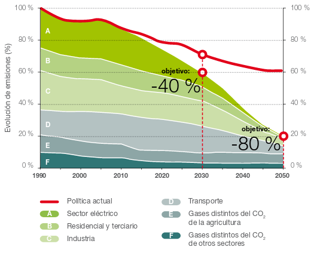

# 10.1 CONTEXTO ENERGÉTICO

## 10.1.1 Introducción

//El grado de desarrollo tecnológico es todavía insuficiente para hacer de ésta una fuente de obtención de energía eléctrica competitiva. Haciendo balance económico, se observa claramente que los mecanismos estudiados constan de una inversión inicial y costes asociados muy elevados frente a la baja eficiencia energética que proporcionan. A pesar de todo, la costa atlántica peninsular y el mar cantábrico presentan niveles energéticos factibles para el aprovechamiento eléctrico a largo plazo. //

## 10.1.2 Situación energética mundial 

En la última década han sido significativos los desarrollos en la eficiencia, fiabilidad y rentabilidad de los sistemas de generación ubicados en la costa y fuera de ella. Los avances en la tecnología de plataformas marinas de extracción de petróleo y gas, y, particularmente en el sector submarino, han eliminado muchas de las barreras técnicas de los primeros sistemas desarrollados entre los años 1974-84. Aparatos pilotos están ahora produciendo electricidad, tanto de forma aislada como conectada a la red, en muchos lugares alrededor del mundo. Esto sugiere que se dispone de la tecnología para generación eficiente, aunque todavía es necesario seguir investigando.

Aunque más compañías alrededor del mundo tuvieron un avance con respecto al uso de tecnologías de energía oceánica y de dispositivos nuevos y mejorados, la industria enfrenta constantes desafíos. Los mayores obstáculos son el financiamiento, debido al alto riesgo y a los altos costos iniciales; así como la necesidad de contar con un plan adecuado que avale y permita los procedimientos. En una situación similar a los primeros desarrollos de la tecnología eólica, en la actualidad, se está incrementando el nivel de inversión privada en el sector. 

**REN21** es la red mundial de políticas en energía renovable que conecta a un gran número de actores (gobiernos, organizaciones  no  gubernamentales,  instituciones  académicas  y  de  investigación, organismos internacionales e industrias), facilitando el intercambio de conocimiento, desarrollo de políticas y suma de esfuerzos para la transición hacia la energía renovable.  [Renewables 2017-Global Status Report](http://www.ren21.net/wp-content/uploads/2017/06/17-8399_GSR_2017_Full_Report_0621_Opt.pdf)

Anualmente, desde el 2005, se recopila información desde diferentes puntos de vista tanto del sector público como privado y es reflejada a través de 6 líneas: 

- **Reporte sobre la situación mundial de las energías renovables (Global Status Report, GSR)**: Se apoya en un red internacional de más de 800 autores, contribuidores y examinadores. Actualmente es el reporte más consultado en lo que respecta al mercado, a la industria y a las tendencias sobre políticas de energía renovable.
- **Reportes regionales**: Estos detallan el desarrollo regional de las energías renovables, así como los procesos de recolección de datos y toma de decisiones.
- **Mapa interactivo de las energías renovables**: Se trata de una herramienta de búsqueda para monitorear el desarrollo de la energía renovable a nivel mundial. Complementa las perspectivas y los hallazgos de los dos reportes anteriores, proporcionando infografías y datos  exportables. 
- **Reportes del futuro mundial**: REN21 ilustra las posibilidades fidedignas del futuro de las renovables dentro de áreas temáticas particulares.
- **Academia de energías renovables**: La Academia REN21 ofrece una oportunidad para el intercambio dinámico entre la creciente comunidad de contribuyentes. Representa un espacio para la tormenta de ideas orientada en encontrar soluciones políticas, permitiendo a los participantes contribuir activamente en asuntos centrales para la transición hacia energías renovables.
- **Conferencias internacionales sobre energías renovables (IREC)**: Son una serie de conferencias políticas de alto nivel. Dedicada exclusivamente al sector de energías renovables, la presentación bienal de IREC está a cargo de los gobiernos nacionales y convocado por REN21.

Figura X: Capacidades de energía renovable* en el mundo, EU-28,  BRICS y los 6 países líderes, 2016. [Avanzando en la transición mundial hacia la energía renovable](http://www.ren21.net/wp-content/uploads/2017/07/17-8399_GSR_2017_KEY-FINDINGS_Spanish_lowres.pdf)

La nueva capacidad de energía renovable instalada añadida marcaron un nuevo record en 2016. Además, los costos disminuyeron de manera vertiginosa, especialmente los relacionados a la energía solar FV y eólica. 

Ha habido un aumento importante en las ciudades, estados, naciones y grandes corporaciones que se están comprometiendo a contar con objetivos en materia de energía 100% renovable porque, además de los beneficios climáticos, ambientales y de salud pública, tiene más sentido en lo que a negocios y economía se refiere. En 2016, 34 negocios se unieron a RE 100, que es una iniciativa mundial de empresas comprometidas a realizar sus operaciones con electricidad 100% renovable. Mientras que algunas ciudades y comunidades han alcanzado este objetivo exitosamente (incluyendo Burlington, Vermont en Estados Unidos y más de 100 comunidades en Japón).

Adicionalmente, desde REN21 se está planteando un cambio de paradigma en los países en vías de desarrollo, en donde miles de millones de personas aún no cuentan con acceso a la electricidad y/o instalacines limpias para cocinar. 

"*El engorroso proceso de proporcionar acceso a la energía a través de la red eléctrica se está volviendo obsoleto, pues existen modelos de negocios y nuevas tecnologías que facilitan el desarrollo de mercados de sistemas aislados*".

Los desarrollos realizados en torno a la energía renovable muestran que el viejo paradigma de dotar acceso a la energía únicamente a través de la extensión de la red eléctrica se está volviendo obsoleto. Para acelerar el **acceso a la energía** es importante que la legislación mire hacia el futuro, con el fin de que se pueda formar un mercado estable, descentralizado y separado de la red, propiciando así el desarrollo industrial.

Una gran número de políticas pueden ser útiles para acelerar este cambio de paradigma: 

- establecer objetivos específicos en materia de energía renovable distribuida a la par de objetivos en materia de electrificación y energía renovable que se implementen dentro de un cierto periodo de tiempo; 
- integrar soluciones de sistemas autónomos a los planes nacionales de electrificación, en particular mini-redes; 
- establecer un marco normativo claro para tener acceso a finanzas que reflejen este nuevo enfoque; 
- así como medidas para mantener los estándares de calidad.

El Reporte sobre el futuro de las energías renovables en el mundo: **grandes debates sobre la energía 100% renovable**, lanzado en abril de 2017. Analiza las perspectivas de más de 110 reconocidos expertos en energía de todo el mundo, quienes fueron entrevistados en el transcurso de 2016. Cabe señalar que el reporte no predice el futuro, sino que tiene por objetivo estimular el debate sobre las oportunidades y desafíos de un futuro basado en energía 100% renovable  y, por consecuencia, ayudar a una mejor toma de decisiones.

Acceso a los reportes: www.ren21.net/GSR y www.ren21.net/GFR

# //10.2 FOMENTO Y MARCO NORMATIVO DE LAS ENERGÍAS RENOVABLES

//La UE viene marcando pautas en materia de medio ambiente desde hace más de 30 años. En 1972, se decidió en la Cumbre Europea de París, elaborar el primer programa de actuación. Las primeras Directivas, se centraron especialmente en la calidad del agua, los productos y sustancias químicas y la contaminación del aire. El papel de la UE es apoyar y coordinar los esfuerzos de los Estados miembros y comprobar que los gobiernos cumplen los compromisos adquiridos.

La acción de cada uno de los países por separado no es suficiente para mitigar el impacto en el medio ambiente, debido a que los animales, los vertidos en ríos y mares, atraviesan fronteras tal y como sucede con la contaminación del aire.

En este subapartado se describirá la situación actual de fomento de las energías renovables, y también, el recorrido de las decisiones tomadas a nivel europeo y nacional. Ya desde 1996 a nivel europeo, e incluso a nivel mundial con el Protocolo de Kioto en 1997, se han ido evolucionando las diferentes estrategias para adaptar las energías a un modelo sostenible. Estos diferentes decretos han ido marcando las metas a las que se debían llegar a nivel global y también nacional.//

## 10.2.1 Estrategia europea de desarrollo sostenible

La UE viene marcando pautas en materia de medio ambiente desde hace más de 30 años. En 1972, se decidió en la Cumbre Europea de París, elaborar el primer programa de actuación. Las primeras Directivas, se centraron especialmente en la calidad del agua, los productos y sustancias químicas y la contaminación del aire. El papel de la UE es apoyar y coordinar los esfuerzos de los Estados miembros y comprobar que los gobiernos cumplen los compromisos adquiridos.

**Desarrollo sostenible** se refiere al esfuerzo por garantizar que el crecimiento económico se lleve de tal manera que pueda ser compatible y viable en el futuro sin agotar los recursos o perjudicar a la sociedad. Este principio quedó ya reflejado en la Cumbre de Río de Janeiro de las Naciones Unidas de 1992 cuando se fijó el doble objetivo de trasformar las pautas contaminantes de consumo de los países industrializados y luchar contra la pobreza.

Ya desde 1996 a nivel europeo, e incluso a nivel mundial con el Protocolo de Kioto en 1997, se han ido evolucionando las diferentes estrategias para adaptar las energías a un modelo sostenible. Estos diferentes decretos han ido marcando las metas a las que se debían llegar a nivel global y también nacional.

Esta información, se va actualizando y se puede consultar en el Ministerio de Agricultura y pesca, alimentación y medio ambiente del Gobierno de España, en la sección del Cambio Climático, documentación y normativa del [Comercio de derechos de emisión](http://www.mapama.gob.es/es/cambio-climatico/temas/comercio-de-derechos-de-emision/documentacion-y-normativa/). 

//Asimismo, la Comisión Europea, en su [Libro Verde](http://www.mapama.gob.es/es/cambio-climatico/temas/comercio-de-derechos-de-emision/l_verde_come_dch_emision_gei_tcm30-178629.pdf) de noviembre de 2000, “Hacia una estrategia europea de seguridad del abastecimiento energético”, planteaba las debilidades estructurales a las que se enfrentaba Europa, apostando por objetivos de seguridad en el suministro, objetivos medioambientales, económicos y sociales. Proponía el fomento de las energías renovables y de la cogeneración como energías necesarias para lograr el doble objetivo de reducir la dependencia energética y de limitar la emisión de gases de efecto invernadero.

//En junio de 2003 se publicó la Directiva Europea 2003/54/CE, relativa al mercado eléctrico interno, cuyo artículo tercero se refería a la obligatoriedad de aportación de información por parte de los suministradores de electricidad acerca del origen y el impacto ambiental de su producto.

//La nueva [Directiva 2009/29/CE,](http://www.mapama.gob.es/es/cambio-climatico/temas/comercio-de-derechos-de-emision/dir_2009_29_ce_tcm30-178598.pdf) de 23 de abril, por la que se modifica la Directiva 2003/87/CE para perfeccionar y ampliar el Régimen Comunitario de Comercio de Derechos de Emisión de gases de efecto invernadero, forma parte del llamado "paquete verde" que la Unión Europea está llevando a cabo, desde el año 2007 para cumplir el compromiso 20/20/20. Se refiere a un triple objetivo para el año 2020 por el cual se debe conseguir que el 20% del consumo de energía final provenga de fuentes renovables, que se reduzcan las emisiones de gases de efecto invernadero en un 20% (con respecto a las de 1990) y que se produzca una mejora de la eficiencia energética del 20% respecto al consumo tendencial.

[Real Decreto 301/2011, de 4 de marzo](http://www.boe.es/diario_boe/txt.php?id=BOE-A-2011-4118), sobre medidas de mitigación equivalentes a la participación en el régimen de comercio de derechos de emisión a efectos de la exclusión de instalaciones de pequeño tamaño.

[Decisión nº 377/2013/UE del Parlamento Europeo y del Consejo](http://www.mapama.gob.es/es/cambio-climatico/temas/comercio-de-derechos-de-emision/Decision%20377_2013%20Stop%20the%20clock_tcm30-179019.pdf) de 24 de abril de 2013 que establece una excepción temporal a la Directiva 2003/87/CE por la que se establece un régimen para el comercio de derechos de emisión de gases de efecto invernadero en la Comunidad.

//[Decisión de la Comisión de 27 de octubre de 2014](http://www.mapama.gob.es/es/cambio-climatico/temas/comercio-de-derechos-de-emision/141027_Decision_COMFugasCarbono_2015-19_tcm30-179275.pdf) que determina, de conformidad con la Directiva 2003/87/CE del Parlamento Europeo y del Consejo, la lista de sectores y subsectores que se consideran expuestos a un riesgo significativo de fuga de carbono durante 2015-2019.

La política energética de la UE ([Unión Europea - Energía](https://europa.eu/european-union/topics/energy_es)) persigue tres objetivos principales: seguridad de abastecimiento, competitividad y sostenibilidad. A finales de 2013 la comisión puso en marcha un plan, [Unión de la Energía](ec.europa.eu/priorities/energy-union-and-climate_es), basado en la actual política energética de la UE. Parte del trabajo preliminar ya se ha llevado a cabo, Europa tiene un [marco de actuación energético y climático para 2030](https://ec.europa.eu/energy/en/topics/energy-strategy-and-energy-union/2030-energy-strategy) y una [estrategia de seguridad energética](https://ec.europa.eu/energy/en/topics/energy-strategy/energy-security-strategy). 

De este mismo modo, Europa se fijó los objetivos de clima y energía para 2020, 2030 y 2050:

- Objetivos para 2020:
  - reducir las emisiones de gases de efecto invernadero un **20%**, como mínimo, respecto a los niveles de 1990;
  - obtener un **20%** de la energía a partir de fuentes renovables;
  - mejorar la eficiencia energética en un **20%**.
- Objetivos para 2030:
  - reducción de las emisiones de gases de efecto invernadero en un **40%**;
  - al menos el **27%** de energías renovables;
  - aumento de la eficiencia energética en un **27-30%**;
  - **15%** de interconexión eléctrica, es decir, el 15% de la electricidad generada en la UE debe poder transportarse a otros Estados miembros.
- Objetivos para 2050:
  - el **80-95%** de reducción de las emisiones de gases de efecto invernadero respecto a los niveles de 1990. La [Hoja de Ruta de la Energía para 2050](http://eur-lex.europa.eu/legal-content/ES/ALL/?uri=CELEX:52011DC0885) muestra el camino para alcanzar esa meta.

Como se ha visto, el liderazgo de la Unión Europea no se centra únicamente en el ámbito de la mitigación. A finales del año 2013 la Comisión hizo pública la Estrategia Europea de Adaptación al Cambio Climático, con el objetivo de orientar las actuaciones de las regiones para reforzar la capacidad de adaptación de los sectores más vulnerables (la salud, los recursos marinos y costeros, las infraestructuras, la biodiversidad y los ecosistemas, la agricultura y el turismo) y mejorar su resiliencia. Las principales líneas de actuación marcadas para la adaptación al cambio climático se  orientan  hacia  su  integración  en  la  normativa y en las políticas financieras, y de forma paralela, continuar mejorando el conocimiento como base para la toma de decisiones.

Figura X: Hoja de ruta de la Unión Europea para la reducción de emisiones a 2050. Fuente: Comisión Europea

## 10.2.2 Estrategia nacional

La Directiva 2009/28/CE del Parlamento Europeo y del consejo, relativa al fomento del uso de energía procedente de fuentes renovables, también, estableció objetivos para cada uno de los Estados miembros. Además para junio de 2010 estableció la fecha  límite para entregar un Plan de Acción Nacional de Energías Renovables (PANER) para el periodo 2011-2020, con vistas al cumplimiento de los objetivos vinculantes que fija la Directiva. Dicho PANER, tal y como prevé la Directiva, debe ajustarse al modelo de planes de acción nacionales adoptado por la Comisión Europea a través de la Decisión de la Comisión.

Por su parte, el Real Decreto 661/2007, de 25 de mayo, por el que se regula la actividad de producción de energía eléctrica en régimen especial, prevé la elaboración de un Plan de Energías Renovables para su aplicación en el período 2011-2020 (PER 2011-2020).

El PER 2011-2020, incluye los elementos esenciales del PANER así como análisis adicionales no contemplados en el mismo y un detallado análisis sectorial que contendrá, entre otros aspectos, las perspectivas de evolución tecnológica y la evolución esperada de costes. 

El plan de energías renovables para el 2020 se puede desglosar sectorialmente y estimar la trayectoria de los objetivos nacionales:

- En el sector de la Calefacción y Refrigeración partiendo de un 11,3% en 2010 se quiere alcanzar un 18,9% en 2020.
- La electricidad producida a partir de FER en el año 2010 es de un 28,8% del total, buscando llegar a un 40% en 2020.
- En el transporte partimos de un 6,0% en 2010 para alcanzar un 13,6% en 2020.

//Como ya se ha mencionado, el principal impedimento para esta fuente de energía es la financiación. No obstante, en 2014 se puso en marcha un sistema de energía undimotriz en Gran Canaria, financiado por el Ministerio de Economía y Competitividad a través del programa INNPACTO 2011 y financiado con fondos FEDER de la Unión Europea. "Gracias a pequeños pasos como éste, seremos capaces de explotar los recursos que la naturaleza nos brinda y así minimizar nuestra huella ambiental."[Blog SI - soluciones integrales](https://www.solucionesintegralesendesa.com/blog/equipamiento-hogar/ahorro-hogar/energia-undimotriz-el-poder-de-las-olas/)

## 10.2.3 Medidas para alcanzar los objetivos marcados

Las medidas que marca el nuevo PANER 2011-2020 se puede dividir en cuatro bloques:

1. Medidas de carácter general dirigidas sobre todo a la Administración Pública y a centros tecnológicos encargados de desarrollar prototipos nacionales:
   - Desarrollar un marco adecuado para simplificar, homogeneizar y unificar los procedimientos administrativos de autorización de instalaciones de EERR (Energías Renovables) consiguiendo menor carga para la administración y la consiguiente agilización de trámites de autorización.
   - Apoyo I+D+i en sistemas de almacenamiento de energía para conseguir mayor capacidad de integración de las EERR en el sistema eléctrico.
   - Mantenimiento de la investigación y desarrollo en iniciativas industriales prioritarias de desarrollo tecnológico, para conseguir una reducción de los costes de generación, es decir, mejorar la competitividad de las energías renovables más maduras (en especial alcanzar la plena competitividad la energía eólica).
   - Apoyo financiero a la implantación de plataformas experimentales nacionales de primer nivel y alta especialización, con reconocimiento internacional.

2. Medidas referentes al campo de la generación eléctrica con energías renovables. En su mayoría serán medidas de tipo reglamentario y dirigido tanto a la Administración General del Estado como a los Operadores del sistema eléctrico:
   - Cambio hacia un sistema de “redes inteligentes” en el transporte y a distribución (SMART GRIDS), con el fin de conseguir mejorar la adaptación de la demanda y la oferta de la energía eléctrica.
   - Favorecer las instalaciones de generación eléctrica a partir de fuentes renovables destinadas al autoconsumo. Se tratará de conseguir mediante el establecimiento de sistemas basados en balance neto y compensación de saldos de energía.
   - Garantizar la evacuación de la generación eléctrica de origen renovable. Para ello es necesario la Revisión de la Planificación vigente para los sectores de Gas y electricidad, y gozar de un adecuado desarrollo de infraestructuras eléctricas de transporte.
   - Puesta en servicio de nuevas interconexiones internacionales (especialmente con Francia) alcanzando así una mayor capacidad de integración de EERR en el sistema eléctrico.
   - Aumento de la capacidad de almacenamiento energético, mediante la puesta en servicio de nuevas centrales de bombeo.
   - Potenciación de la gestión de la demanda en tiempo real, facilitando la participación del usuario eléctrico. Dicha potenciación estará encaminada al aplanamiento de la curva de la demanda.
   - Conseguir disminuir las barreras administrativas con una nueva regulación que facilite la conexión de instalaciones de generación eléctrica con EERR de pequeña potencia asociadas a centros de consumo interconectados con la red eléctrica, especialmente en baja tensión.

3.  Medidas relativas al aprovechamiento térmico de las energías renovables no solo dirigido a la Administración Pública, sino también al ámbito de constructores urbanísticos y arquitectos, así como al consumidor final, con el fin de introducir definitivamente a las energías renovables en los sistemas térmicos y de calefacción de los edificios. Se desarrollará un Sistema de Incentivos al Calor Renovable (ICAREN) para EERR térmicas.
4.  Por último, se detallan medidas específicas y concretas para el sector solar, hidroeléctrico, geotérmico, eólico, de biomasa, biogás y residuos, así como de biocarburantes y sin olvidar las energías de mar.
   - En el sector de las energías del mar está en proyecto la realización de un marco regulatorio específico para el desarrollo de proyectos. Destinado, principalmente, a facilitar la entrada a grupos inversores que apuestan por esta tecnología.
   - Una vez regulado este nuevo sector, se desarrollarán las líneas de investigación e innovación científica promoviendo la tecnología de prototipos, no sólo de energías renovables del mar, sino también de otras ya avanzadas y dominadas (como la eólica) que se pueden instalar en el mar. De igual manera, se dirigirá la investigación hacia el despliegue de tecnologías en aguas profundas.
   - En lo referente al campo de la generación eléctrica con energías del mar se pretende involucrar a la Administración General del Estado para que tome medidas de tipo reglamentario que doten a los proyectos marinos (eólico, de olas, mareomotriz, etc.) de las infraestructuras necesarias de evacuación eléctrica. Se debe dar la posibilidad de establecer corredores eléctricos marinos de transporte hasta las zonas de implantación de los proyectos a los que se hace referencia.

[El comercio de derechos de emisión en España](http://www.mapama.gob.es/es/cambio-climatico/temas/comercio-de-derechos-de-emision/el-comercio-de-derechos-de-emision-en-espana/) de gases de efecto invernadero está regulado por la Ley 1/2005, de 9 de marzo.  Se puso en marcha el 1 de enero de 2005, como medida fundamental para fomentar la reducción de emisiones de CO2 en los sectores industriales y de generación eléctrica. 

Real Decreto 216/2014, de 28 de marzo, por el que se establece la metodología de cálculo de los precios voluntarios para el pequeño consumidor de energía eléctrica y su régimen jurídico de contratación.

[Webs de Comercio de derechos de emisión de las comunidades autónomas](http://www.mapama.gob.es/es/cambio-climatico/temas/comercio-de-derechos-de-emision/el-comercio-de-derechos-de-emision-en-espana/enlaces-a-las-webs-de-comercio-de-derechos-de-emision-de-las-comunidades-autonomas/)

## 10.2.4 Tarifas y primas para instalaciones de régimen especial

Las normativas sobre tarifas eléctricas son competencia de la Secretaría de Estado de Energía, dentro del Ministerio de Energía, Turismo y Agenda Digital del Gobierno de España. Las que actualmente se encuentran en vigencia son:

- [Orden IET/2735/2015, de 17 de diciembre, por la que se establecen los peajes de acceso de energía eléctrica para 2016 y se aprueban determinadas instalaciones tipo y parámetros retributivos de instalaciones de producción de energía eléctrica a partir de fuentes de energía renovables, cogeneración y residuos.](https://www.boe.es/diario_boe/txt.php?id=BOE-A-2015-13782)
- [Orden IET/2444/2014, de 19 de diciembre, por la que se determinan los peajes de acceso de energía eléctrica para 2015 (BOE 26/12/2014).](http://www.boe.es/diario_boe/txt.php?id=BOE-A-2014-13475)
- [Resolución de 14 de mayo de 2014, de la Dirección General de Política Energética y Minas, por la que se determina el valor del término DIFp a aplicar por los comercializadores de referencia en la facturación del consumo correspondiente al primer trimestre de 2014 a los consumidores a los que hubieran suministrado a los precios voluntarios para el pequeño consumidor.](https://www.boe.es/diario_boe/txt.php?id=BOE-A-2014-5173)
- [Real Decreto 216/2014, de 28 de marzo, por el que se establece la metodología de cálculo de los precios voluntarios para el pequeño consumidor de energía eléctrica y su régimen jurídico de contratación. ](http://www.boe.es/diario_boe/txt.php?id=BOE-A-2014-3376)
- [Resolución de 31 de enero de 2014, de la Dirección General de Política Energética y Minas, por la que se revisa el coste de producción de energía eléctrica y los precios voluntarios para el pequeño consumidor (BOE 01/02/2014).](http://www.boe.es/diario_boe/txt.php?id=BOE-A-2014-1053)                                                                               

FiguraX: Tarificación de las diferentes tecnologías renovables (BOE)

En España la energía de las olas está contemplada en el Artículo 36 y 38 del Real Decreto RD 661/2007 (“por el que se regula la actividad de producción de energía eléctrica en régimen especial”), dentro del Grupo **b.3** (“Instalaciones que únicamente utilizan como energía primaria la de las olas...”), donde se especifican las siguientes tarifas y primas:

Tabla X: Tarifa de energía de las olas

|      **Plazo**       | Tarifa regulada c€/kWh | Prima de referencia c€/kWh |
| :------------------: | :--------------------: | :------------------------: |
|   Primeros 20 años   |         6,8900         |           3,8444           |
| A partir de entonces |         6,5100         |           3,0600           |

==Estrategia de cambio climático 2050 del País Vasco

La estrategia es el instrumento que permitirá consolidar una ciudadanía comprometida con una economía sostenible y competitiva. Tal y como se recoge en el documento [KLIMA 2050](http://www.euskadi.eus/contenidos/documentacion/klima2050/es_def/adjuntos/KLIMA2050_es.pdf), la visión de Euskadi al año 2050 está asentada sobre cinco premisas, cuya aplicación permitirá alcanzar los objetivos marcados:

1.  **Acción transversal**: Integrar la mitigación y adaptación al cambio climático en la planificación pública.
2.  **Administración ejemplar**: Impulsar la acción ejemplarizante y coordinada de la Administración para lograr la transformación hacia una sociedad baja en carbono y adaptada.
3.  **Innovación y oportunidades**: Apoyar la innovación y el desarrollo tecnológico, que permitan la reducción de emisiones de GEI en todos los sectores y reducir la vulnerabilidad del territorio al cambio climático.
4.  **Cultura cero emisiones**: Favorecer la corresponsabilidad de todos los agentes de la sociedad vasca en las acciones de mitigación y de adaptación.
5.  **Saber para transformar**: Adaptar el conocimiento local sobre cambio climático a la toma de decisión.

Euskadi se ha fijado al año 2050 el objetivo de alcanzar un consumo de energía renovable del 40% sobre el consumo final. Así como reducir las emisiones de GEI de Euskadi en al menos un 40% a 2030 y en al menos un 80 % a 2050, respecto al año 2005. Adicionalmente, en el mismo proyecto vienen descritas las metas de cambio climático y las líneas de actuación en euskadi.d

Figura X: Representación de la hoja de ruta de la Estrategia de Cambio Climático del País Vasco 2050

# 10.3 ANÁLISIS DE RENTABILIDAD

eia españa

renovable energy

- Pricipales ventajas del convertidor de [Oceantec](http://www.oceantecenergy.com/desarrollo-tecnologico/):
  - Supervivencia: Las boyas cilíndricas han demostrado su supervivencia por muchos años. Hay boyas de navegación con formas similares que han estado sometidas casi 100 años a las condiciones de mar abierto.
  - Bajo coste de mantenimiento asociado a su simplicidad: El convertidor de OCEANTEC tan solo tiene una parte móvil, la turbina, que es fácilmente accesible para trabajos de mantenimiento. Este hecho incrementa drásticamente la confiabilidad y reduce el coste de mantenimiento en comparación con otras tecnologías de captación de energía de las olas.
  - Coste de la energía: Tras un análisis conceptual de diferentes tecnologías podemos asegurar que esta tecnología ofrece los menores costes de energía para obtener energía de las olas.

Evolución mundial de las Energías Renovables

En la siguiente gráfica se pueede observar la potencia instalada 

-- PFC_C.caballero_

-- ren21

- [Agencia Insular de Energía de Tenerife](http://www.agenergia.org/index.php?section=20)

  En una región aislada geográficamente, como Tenerife, lograr una mayor diversificación energética resulta imprescindible, al disponer de recursos energéticos propios muy limitados y de una alta dependencia energética del exterior. 

  En este contexto, la Agencia Insular de Energía de Tenerife trabaja con el objetivo de aunar los esfuerzos de todos los agentes implicados para la racionalización del consumo energético de Tenerife y para lograr una mayor diversificación de fuentes energéticas.

  Para ello, encargaron un proyecto "Plan de desarrollo regional para el uso de la energía proveniente del oleaje atlántico" **Wave Energy**, publicado en 2007 por el Instituto Tecnológico y de Energías Renovables, SA (ITER, SA) con la participación de la UE y cofinanciado por el FEDER. El proyecto que consta de las siguientes acciones

  - [Estudio Comparativo de las diferentes fuentes de energía renovable marina](http://www.agenergia.org/index.php?action=view&id=53&module=resourcesmodule&src=%40random49140d138ac53)
  - [Estudio del estado del arte en cuanto a sistemas de generación undimotriz existentes](http://www.agenergia.org/index.php?action=view&id=54&module=resourcesmodule&src=%40random49140d138ac53)
  - [Informe sobre Corrientes Marinas - AIET](http://www.agenergia.org/index.php?action=view&id=276&module=resourcesmodule&src=%40random49140d138ac53)
  - [Presentación "La Energía del Océano" - ITER - Proyecto Wavenergy](http://www.agenergia.org/index.php?action=view&id=56&module=resourcesmodule&src=%40random49140d138ac53)

[COMMISSION OF THE EUROPEAN COMMUNITIES](http://eur-lex.europa.eu/LexUriServ/LexUriServ.do?uri=COM:2006:0848:FIN:EN:PDF)

http://www.ren21.net/wp-content/uploads/2017/06/17-8399_GSR_2017_Full_Report_0621_Opt.pdf

Energía renoveble sobre la producción total en los paises miembros de ENTSO-E EN 2016

Fuente: ENTSO-E. Data portal 24 de mayo de 2017. Gran Bretaña incluye 
los datos correspondientes a Irlanda del Norte. España REE.

http://www.ree.es/sites/default/files/11_PUBLICACIONES/Documentos/Renovables-2016-v3.pdf