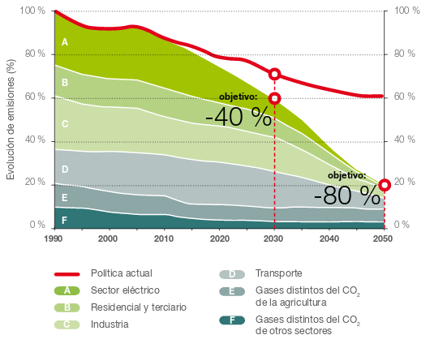
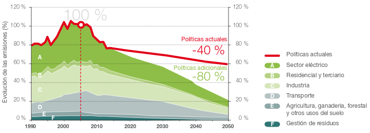

# 10 ASPECTOS ECONÓMICOS

## 10.1 CONTEXTO ENERGÉTICO

El grado de desarrollo tecnológico es todavía insuficiente para hacer de ésta una fuente de obtención de energía eléctrica competitiva. Haciendo balance económico, se observa claramente que los mecanismos estudiados constan de una inversión inicial y costes asociados muy elevados frente a la baja eficiencia energética que proporcionan. A pesar de todo, la costa atlántica peninsular y el mar cantábrico presentan niveles energéticos factibles para el aprovechamiento eléctrico a largo plazo. 

En este subapartado se describirá la situación actual de fomento de las energías renovables, y también, el recorrido de las decisiones tomadas a nivel europeo, nacional y regional. Adicionalmente, se describirá el grado de importancia de los diferentes costes asociados, así como, algunas de las noticias más relevantes de la última década.

### 10.1.1 Situación energética mundial 

En la última década han sido significativos los desarrollos en la eficiencia, fiabilidad y rentabilidad de los sistemas de generación ubicados en la costa y fuera de ella. Los avances en la tecnología de plataformas marinas de extracción de petróleo y gas, y, particularmente en el sector submarino, han eliminado muchas de las barreras técnicas de los primeros sistemas desarrollados entre los años 1974-84. Aparatos pilotos están ahora produciendo electricidad, tanto de forma aislada como conectada a la red, en muchos lugares alrededor del mundo. Esto sugiere que se dispone de la tecnología para generación eficiente, aunque todavía es necesario seguir investigando.

Aunque más compañías alrededor del mundo tuvieron un avance con respecto al uso de tecnologías de energía oceánica y de dispositivos nuevos y mejorados, la industria enfrenta constantes desafíos. Los mayores obstáculos son el financiamiento, debido al alto riesgo y a los altos costos iniciales; así como la necesidad de contar con un plan adecuado que avale y permita los procedimientos. En una situación similar a los primeros desarrollos de la tecnología eólica, en la actualidad, se está incrementando el nivel de inversión privada en el sector. 

**REN21** es la red mundial de políticas en energía renovable que conecta a un gran número de actores (gobiernos, organizaciones  no  gubernamentales,  instituciones  académicas  y  de  investigación, organismos internacionales e industrias), facilitando el intercambio de conocimiento, desarrollo de políticas y suma de esfuerzos para la transición hacia la energía renovable.  [Renewables 2017-Global Status Report](http://www.ren21.net/wp-content/uploads/2017/06/17-8399_GSR_2017_Full_Report_0621_Opt.pdf)

Anualmente, desde el 2005, se recopila información desde diferentes puntos de vista tanto del sector público como privado y es reflejada a través de 6 líneas: 

- **Reporte sobre la situación mundial de las energías renovables (Global Status Report, GSR)**: Se apoya en un red internacional de más de 800 autores, contribuidores y examinadores. Actualmente es el reporte más consultado en lo que respecta al mercado, a la industria y a las tendencias sobre políticas de energía renovable.
- **Reportes regionales**: Estos detallan el desarrollo regional de las energías renovables, así como los procesos de recolección de datos y toma de decisiones.
- **Mapa interactivo de las energías renovables**: Se trata de una herramienta de búsqueda para monitorear el desarrollo de la energía renovable a nivel mundial. Complementa las perspectivas y los hallazgos de los dos reportes anteriores, proporcionando infografías y datos  exportables. 
- **Reportes del futuro mundial**: REN21 ilustra las posibilidades fidedignas del futuro de las renovables dentro de áreas temáticas particulares.
- **Academia de energías renovables**: La Academia REN21 ofrece una oportunidad para el intercambio dinámico entre la creciente comunidad de contribuyentes. Representa un espacio para la tormenta de ideas orientada en encontrar soluciones políticas, permitiendo a los participantes contribuir activamente en asuntos centrales para la transición hacia energías renovables.
- **Conferencias internacionales sobre energías renovables (IREC)**: Son una serie de conferencias políticas de alto nivel. Dedicada exclusivamente al sector de energías renovables, la presentación bienal de IREC está a cargo de los gobiernos nacionales y convocado por REN21.

**Figura 10.1**: Capacidades de energía renovable* en el mundo, EU-28,  BRICS y los 6 países líderes, 2016. [Avanzando en la transición mundial hacia la energía renovable](http://www.ren21.net/wp-content/uploads/2017/07/17-8399_GSR_2017_KEY-FINDINGS_Spanish_lowres.pdf)

La nueva capacidad de energía renovable instalada añadida marcaron un nuevo record en 2016. Además, los costos disminuyeron de manera vertiginosa, especialmente los relacionados a la energía solar FV y eólica. 

Ha habido un aumento importante en las ciudades, estados, naciones y grandes corporaciones que se están comprometiendo a contar con objetivos en materia de energía 100% renovable porque, además de los beneficios climáticos, ambientales y de salud pública, tiene más sentido en lo que a negocios y economía se refiere. En 2016, 34 negocios se unieron a RE 100, que es una iniciativa mundial de empresas comprometidas a realizar sus operaciones con electricidad 100% renovable. Mientras que algunas ciudades y comunidades han alcanzado este objetivo exitosamente (incluyendo Burlington, Vermont en Estados Unidos y más de 100 comunidades en Japón).

Adicionalmente, desde REN21 se está planteando un cambio de paradigma en los países en vías de desarrollo, en donde miles de millones de personas aún no cuentan con acceso a la electricidad y/o instalacines limpias para cocinar. 

"*El engorroso proceso de proporcionar acceso a la energía a través de la red eléctrica se está volviendo obsoleto, pues existen modelos de negocios y nuevas tecnologías que facilitan el desarrollo de mercados de sistemas aislados*".

Los desarrollos realizados en torno a la energía renovable muestran que el viejo paradigma de dotar acceso a la energía únicamente a través de la extensión de la red eléctrica se está volviendo obsoleto. Para acelerar el **acceso a la energía** es importante que la legislación mire hacia el futuro, con el fin de que se pueda formar un mercado estable, descentralizado y separado de la red, propiciando así el desarrollo industrial.

Una gran número de políticas pueden ser útiles para acelerar este cambio de paradigma: 

- establecer objetivos específicos en materia de energía renovable distribuida a la par de objetivos en materia de electrificación y energía renovable que se implementen dentro de un cierto periodo de tiempo; 
- integrar soluciones de sistemas autónomos a los planes nacionales de electrificación, en particular mini-redes; 
- establecer un marco normativo claro para tener acceso a finanzas que reflejen este nuevo enfoque; 
- así como medidas para mantener los estándares de calidad.

El Reporte sobre el futuro de las energías renovables en el mundo: **grandes debates sobre la energía 100% renovable**, lanzado en abril de 2017. Analiza las perspectivas de más de 110 reconocidos expertos en energía de todo el mundo, quienes fueron entrevistados en el transcurso de 2016. Cabe señalar que el reporte no predice el futuro, sino que tiene por objetivo estimular el debate sobre las oportunidades y desafíos de un futuro basado en energía 100% renovable  y, por consecuencia, ayudar a una mejor toma de decisiones.

Acceso a los reportes: www.ren21.net/GSR y www.ren21.net/GFR

### 10.1.2 Estrategia europea de desarrollo sostenible

La UE viene marcando pautas en materia de medio ambiente desde hace más de 30 años. En 1972, se decidió en la Cumbre Europea de París, elaborar el primer programa de actuación. Las primeras Directivas, se centraron especialmente en la calidad del agua, los productos y sustancias químicas y la contaminación del aire. El papel de la UE es apoyar y coordinar los esfuerzos de los Estados miembros y comprobar que los gobiernos cumplen los compromisos adquiridos. [Fuente: PFC-C.Caballero Santos 2011](https://e-archivo.uc3m.es/bitstream/handle/10016/12153/PFC_Carlos_%20Caballero_Santos.pdf?sequence=1)

**Desarrollo sostenible** se refiere al esfuerzo por garantizar que el crecimiento económico se lleve de tal manera que pueda ser compatible y viable en el futuro sin agotar los recursos o perjudicar a la sociedad. Este principio quedó ya reflejado en la Cumbre de Río de Janeiro de las Naciones Unidas de 1992 cuando se fijó el doble objetivo de trasformar las pautas contaminantes de consumo de los países industrializados y luchar contra la pobreza.

Ya desde 1996 a nivel europeo, e incluso a nivel mundial con el Protocolo de Kioto en 1997, se han ido evolucionando las diferentes estrategias para adaptar las energías a un modelo sostenible. Estos diferentes decretos han ido marcando las metas a las que se debían llegar a nivel global y también nacional.

Esta información, se va actualizando y se puede consultar en el Ministerio de Agricultura y pesca, alimentación y medio ambiente del Gobierno de España, en la sección del Cambio Climático, documentación y normativa del [Comercio de derechos de emisión](http://www.mapama.gob.es/es/cambio-climatico/temas/comercio-de-derechos-de-emision/documentacion-y-normativa/). 

La política energética de la UE ([Unión Europea - Energía](https://europa.eu/european-union/topics/energy_es)) persigue tres objetivos principales: seguridad de abastecimiento, competitividad y sostenibilidad. A finales de 2013 la comisión puso en marcha un plan, [Unión de la Energía](ec.europa.eu/priorities/energy-union-and-climate_es), basado en la actual política energética de la UE. Parte del trabajo preliminar ya se ha llevado a cabo, Europa tiene un [marco de actuación energético y climático para 2030](https://ec.europa.eu/energy/en/topics/energy-strategy-and-energy-union/2030-energy-strategy) y una [estrategia de seguridad energética](https://ec.europa.eu/energy/en/topics/energy-strategy/energy-security-strategy). 

Europa se fijó los objetivos de clima y energía para 2020, 2030 y 2050:

- Objetivos para 2020:
  - reducir las emisiones de gases de efecto invernadero un **20%**, como mínimo, respecto a los niveles de 1990;
  - obtener un **20%** de la energía a partir de fuentes renovables;
  - mejorar la eficiencia energética en un **20%**.
- Objetivos para 2030:
  - reducción de las emisiones de gases de efecto invernadero en un **40%**;
  - al menos el **27%** de energías renovables;
  - aumento de la eficiencia energética en un **27-30%**;
  - **15%** de interconexión eléctrica, es decir, el 15% de la electricidad generada en la UE debe poder transportarse a otros Estados miembros.
- Objetivos para 2050:
  - el **80-95%** de reducción de las emisiones de gases de efecto invernadero respecto a los niveles de 1990. La [Hoja de Ruta de la Energía para 2050](http://eur-lex.europa.eu/legal-content/ES/ALL/?uri=CELEX:52011DC0885) muestra el camino para alcanzar esa meta.

Como se ha visto, el liderazgo de la Unión Europea no se centra únicamente en el ámbito de la mitigación. Cuando la Comisión hizo pública la Estrategia Europea de Adaptación al Cambio Climático, también tenía como objetivo orientar las actuaciones de las regiones para reforzar la capacidad de adaptación de los sectores más vulnerables (la salud, los recursos marinos y costeros, las infraestructuras, la biodiversidad y los ecosistemas, la agricultura y el turismo) y mejorar su resiliencia. Las principales líneas de actuación marcadas para la adaptación al cambio climático se  orientan  hacia  su  integración  en  la  normativa y en las políticas financieras, y de forma paralela, continuar mejorando el conocimiento como base para la toma de decisiones. 

Figura 10.2: Hoja de ruta de la Unión Europea para la reducción de emisiones a 2050. Fuente: Comisión Europea

### 10.1.3 Estrategia nacional

La Directiva 2009/28/CE del Parlamento europeo y del Consejo, relativa al fomento del uso de energía procedente de fuentes renovables, fijó como objetivo general conseguir un 20% de energía procedente de fuentes renovables en el consumo de la UE y un 10% de energía renovable en el sector del transporte para cada Estado miembro para el año 2020. 

Así mismo, para junio de 2010 estableció la fecha  límite para entregar un Plan de Acción Nacional de Energías Renovables (PANER) para el periodo 2011-2020, con vistas al cumplimiento de los objetivos vinculantes que fija la Directiva. Hasta una semana antes de remitirlo a la Comisión, estuvo abierto un proceso participativo para empresas, asociaciones y ciudadanos, que realizaron aportaciones y sugerencias para la elaboración del documento. El texto definitivo está a disposición en la web de la Secretaría del Estado de Energía [PANER 2011-2020](http://www.minetad.gob.es/energia/desarrollo/EnergiaRenovable/Paginas/paner.aspx), así como el anexo que contiene las normativas aplicables a las energías renovables por Comunidad Autónoma.

[El comercio de derechos de emisión en España](http://www.mapama.gob.es/es/cambio-climatico/temas/comercio-de-derechos-de-emision/el-comercio-de-derechos-de-emision-en-espana/) de gases de efecto invernadero está regulado por la Ley 1/2005, de 9 de marzo.  Se puso en marcha el 1 de enero de 2005, como medida fundamental para fomentar la reducción de emisiones de $CO_2$ en los sectores industriales y de generación eléctrica. 

Por otro lado, el otorgamiento del [régimen retributivo específico](http://www.minetad.gob.es/energia/electricidad/energias-renovables/Paginas/renovables.aspx) se establecerá con carácter general mediante un procedimiento de concurrencia competitiva, de acuerdo con lo dispuesto en el [artículo 14.7 de la Ley 24/2013, de 26 de diciembre](http://www.boe.es/buscar/act.php?id=BOE-A-2013-13645&tn=1&p=20140328&vd=#a14).

En el [Real Decreto 216/2014](http://www.boe.es/diario_boe/txt.php?id=BOE-A-2014-3376), de 28 de marzo, se establece la metodología de cálculo de los precios voluntarios para el pequeño consumidor de energía eléctrica y su régimen jurídico de contratación.

Mediante el [Real Decreto 413/2014](https://www.boe.es/diario_boe/txt.php?id=BOE-A-2014-6123), de 6 de junio, se regula la actividad de producción de energía eléctrica a partir de fuentes de energía renovables, cogeneración y residuos. La norma fundamental que ha regulado estos aspectos ha sido la Ley 54/1997, del Sector Eléctrico. Durante los últimos 20 años, junto con el desarrollo tecnológico para la producción de energía eléctrica, se ha ido produciendo una simultánea evolución de los marcos normativos de apoyo a fin de procurar su adaptación a las circunstancias concurrentes en cada momento.

[Orden IET/2444/2014](http://www.boe.es/diario_boe/txt.php?id=BOE-A-2014-13475), de 19 de diciembre, por la que se determinan los peajes de acceso de energía eléctrica para 2015.

La normativa sobre [tarifas eléctricas](http://www.minetad.gob.es/energia/electricidad/Tarifas/Paginas/index.aspx) que actualmente se encuentran en vigencia son:

- [Orden IET/2735/2015](https://www.boe.es/diario_boe/txt.php?id=BOE-A-2015-13782), de 17 de diciembre, por la que se establecen los peajes de acceso de energía eléctrica para 2016 y se aprueban determinadas instalaciones tipo y parámetros retributivos de instalaciones de producción de energía eléctrica a partir de fuentes de energía renovables, cogeneración y residuos.
- [Orden IET/2444/2014](http://www.boe.es/diario_boe/txt.php?id=BOE-A-2014-13475), de 19 de diciembre, por la que se determinan los **peajes de acceso de energía** eléctrica para 2015 (BOE 26/12/2014).
- [Resolución de 14 de mayo de 2014, de la Dirección General de Política Energética y Minas](https://www.boe.es/diario_boe/txt.php?id=BOE-A-2014-5173), por la que se determina el **valor del término DIFp** a aplicar por los comercializadores de referencia en la facturación del consumo correspondiente al primer trimestre de 2014 a los consumidores a los que hubieran suministrado a los precios voluntarios para el pequeño consumidor.
- [Real Decreto 216/2014](http://www.boe.es/diario_boe/txt.php?id=BOE-A-2014-3376), de 28 de marzo, por el que se establece la metodología de cálculo de los **precios voluntarios** para el pequeño consumidor de energía eléctrica y su régimen jurídico de contratación.
- [Resolución de 31 de enero de 2014, de la Dirección General de Política Energética y Minas](http://www.boe.es/diario_boe/txt.php?id=BOE-A-2014-1053) , por la que se revisa el **coste de producción de energía eléctrica y los precios voluntarios** para el pequeño consumidor (BOE 01/02/2014).

Según el informe de REE (Red Eléctrica de España) [Energía Renovable en 2016](http://www.ree.es/es/estadisticas-del-sistema-electrico-espanol/informe-de-energias-renovables), las renovables representaron más del 45% de la potencia instalada y casi el 39% de la generación nacional. En el sistema peninsular, que supone cerla del 95% de la generación nacional, la cuota de renovables alcanzó casi un 41%.

Figura 10.3: Potencia instalada y generada a nivel nacional. [Fuente: Informe de REE, [Energía Renovable en 2016](http://www.ree.es/es/estadisticas-del-sistema-electrico-espanol/informe-de-energias-renovables)]

Como se muestra en la siguiente gráfica, a lo largo de los últimos 10 años las tecnologías eólica y solar son las que más crecimiento han tenido.

Figura 10.4: Evolución del potencial instalado. [Fuente: Informe de REE, [Energía Renovable en 2016](http://www.ree.es/es/estadisticas-del-sistema-electrico-espanol/informe-de-energias-renovables)]

### 10.1.4 Estrategia de cambio climático 2050 del País Vasco

La estrategia es el instrumento que permitirá consolidar una ciudadanía comprometida con una economía sostenible y competitiva. Tal y como se recoge en el documento [KLIMA 2050](http://www.euskadi.eus/contenidos/documentacion/klima2050/es_def/adjuntos/KLIMA2050_es.pdf), la visión de Euskadi al año 2050 está asentada sobre cinco premisas, cuya aplicación permitirá alcanzar los objetivos marcados:

1.  **Acción transversal**: Integrar la mitigación y adaptación al cambio climático en la planificación pública.
2.  **Administración ejemplar**: Impulsar la acción ejemplarizante y coordinada de la Administración para lograr la transformación hacia una sociedad baja en carbono y adaptada.
3.  **Innovación y oportunidades**: Apoyar la innovación y el desarrollo tecnológico, que permitan la reducción de emisiones de GEI en todos los sectores y reducir la vulnerabilidad del territorio al cambio climático.
4.  **Cultura cero emisiones**: Favorecer la corresponsabilidad de todos los agentes de la sociedad vasca en las acciones de mitigación y de adaptación.
5.  **Saber para transformar**: Adaptar el conocimiento local sobre cambio climático a la toma de decisión.

Euskadi se ha fijado al año 2050 el objetivo de alcanzar un consumo de energía renovable del 40% sobre el consumo final. Así como reducir las emisiones de GEI de Euskadi en al menos un 40% a 2030 y en al menos un 80 % a 2050, respecto al año 2005. Adicionalmente, en el mismo proyecto vienen descritas las metas de cambio climático y las líneas de actuación en euskadi.d

Figura 10.5: Representación de la hoja de ruta de la Estrategia de Cambio Climático del País Vasco 2050

## 10.2 Costes

El coste de la energía undimotriz depende de muchos factores, entre ellos el coste capital y el coste de operación y mantenimiento. La cantidad de energía producida vendrá relacionada con el coste, ya que si un dispositivo trabaja proporcionando gran cantidad de energía, el coste ponderado será menor que en uno cuya eficiencia es escasa. El balance entre lo que supone económicamente producir y la cantidad que al final se obtiene determinará el coste de la energía y si su explotación es viable desde el punto de vista económico.

Es evidente, que dichos valores dependerán fuertemente de la localización y tamaño de la instalación, y que además irán variando año tras año. 

El **coste capital** viene definido por cinco puntos: 

- Coste de proyecto, incluyendo el dispositivo, cableado submarino, transporte de la energía y conexión. 
- Coste de la estructura, es decir, de los materiales, componentes, procesos, y todo aquello relacionado con el dispositivo en si mismo y el sistema de conversión de energía. 
- El coste de instalación del dispositivo. Cabe señalar que tanto los estudios terrestres como las obras civiles y de montaje, para las tecnologías undimotrices generalmente son menores, sobre todo, cuando son estructuras flotantes, debido a que sólo se deben instalar las líneas de amarre. 
- Coste de la cimentación y amarres. El cual, supone un porcentaje importante dentro del coste capital, por ello no se incluye en el coste de la estructura. 
- Coste de conexión a la red local. Varía en el caso de dispositivos onshore, nearshore o offshore, siendo éstos últimos los más costosos. 

Es importante destacar que el coste capital no es estático sino que va evolucionando a lo largo del tiempo. A medida que surgen mejoras tecnológicas y se gana experiencia, varían los precios de materiales, evoluciona el coste de otras energías y se construyen mayor número de dispositivos, reduciendo el coste capital. Sin embargo, hoy en día la inmadurez técnica, el riesgo asociado a ésta tecnología, la falta de economías de escala y la gran inversión inicial requerida, hacen que el coste capital sea elevado pero con expectativas de disminuir. 

Para poder comparar diferentes dispositivos, es frecuente distinguir entre grandes grupos que en su conjunto formen el coste capital. 

Debido a la falta de proyectos comerciales instalados en la actualidad para la mayoría de las tecnologías, es difícil conocer los **costos asociados a la instalación** del parque, por lo que, amenudo, se estiman en base al costo de inversión.

**Indicadores de costes**: En ocasiones se utiliza el valor del coste total por unidad de potencia instalada para, así, normalizar el valor del coste y poder compararlo con otras tecnologías o para estimar el coste en caso de querer cambiar la potencia instalada.

**Indicador ambiental**: Es posible construir un índice que caracterice a las tecnologías por su impacto al ambiente en base a los potenciales impactos. No obstante, si se consideran otros tipos, se pueden llegar a otras conclusiones, luego no es posible considerarlo como un indicador permanente.

**Coste de operación y mantenimiento**: Estos costes se deben incluir anualmente, dependerán del tipo de tecnología, teniendo que particularizarse para cada caso los riesgos que pudieran darse. En general, la tecnologia unimotriz, al estar en constante movimiento y expuesto a las condiciones variables del mar, deben analizarse estos riesgos con especial cuidado.

## 10.3 Avances destacables

- [Agencia Insular de Energía de Tenerife](http://www.agenergia.org/index.php?section=20)

  En una región aislada geográficamente, como Tenerife, lograr una mayor diversificación energética resulta imprescindible, al disponer de recursos energéticos propios muy limitados y de una alta dependencia energética del exterior. 

  En este contexto, la Agencia Insular de Energía de Tenerife trabaja con el objetivo de aunar los esfuerzos de todos los agentes implicados para la racionalización del consumo energético de Tenerife y para lograr una mayor diversificación de fuentes energéticas.

  Para ello, encargaron un proyecto "Plan de desarrollo regional para el uso de la energía proveniente del oleaje atlántico" **Proyecto Wave Energy**, publicado en 2007 por el Instituto Tecnológico y de Energías Renovables, SA (ITER, SA) con la participación de la UE y cofinanciado por el FEDER. El proyecto que consta de las siguientes acciones

  - [Estudio Comparativo de las diferentes fuentes de energía renovable marina](http://www.agenergia.org/index.php?action=view&id=53&module=resourcesmodule&src=%40random49140d138ac53)
  - [Estudio del estado del arte en cuanto a sistemas de generación undimotriz existentes](http://www.agenergia.org/index.php?action=view&id=54&module=resourcesmodule&src=%40random49140d138ac53)
  - [Informe sobre Corrientes Marinas - AIET](http://www.agenergia.org/index.php?action=view&id=276&module=resourcesmodule&src=%40random49140d138ac53)
  - [Presentación "La Energía del Océano" - ITER - Proyecto Wavenergy](http://www.agenergia.org/index.php?action=view&id=56&module=resourcesmodule&src=%40random49140d138ac53)

  En 2014, se puso en marcha un sistema de energía undimotriz en Gran Canaria, financiado por el Ministerio de Economía y Competitividad a través del programa INNPACTO 2011 y, también, con fondos FEDER de la Unión Europea. Como se ha mencionado, el principal impedimento para esta fuente de energía es la financiación, aunque gracias a pasos como éste, se podrá alcanzar el aprovechamiento de los recursos que brinda la naturaleza y así minimizar nuestra huella ambiental. [Blog SI - soluciones integrales](https://www.solucionesintegralesendesa.com/blog/equipamiento-hogar/ahorro-hogar/energia-undimotriz-el-poder-de-las-olas/)

- Asociación de Energía Renovable Portuguesa (APERN)

  Según los datos de REN (Redes Energéticas Nacionais)  Portugal generó en marzo más electricidad de origen renovable (4.812 GWh) que su consumo total (4.647 GWh). Unas cifras que se traducen en que **en términos netos las energías renovables generaron el 103,6% de la demanda eléctrica**.  Es decir, a pesar de haber tenido periodos en los cuales se ha necesitado de las centrales térmicas o importacon para abstecer la demanda eléctrica; en otros, la generación renovable ha estado por encima de la demanda.

  Los datos de generación más destacados fueron, publicados en [diario renovables](https://www.diariorenovables.com/2018/04/portugal-genero-100-electricidad-energias-renovables.html): las renovables registraron **un valor mínimo de cobertura del 86%**, ocurrido el 7 de marzo, y **un máximo del 143%**, el 11 de marzo. Además, durante el periodo de 70 horas (desde el día 9) y de 69 horas (empezando desde el día 12) el consumo se abasteció por completo con fuentes renovables. 

- Instituto Costarricense de Electricidad

  A lo largo de los primeros 75 días del año 2015, según el Instituto Costarricense de Electricidad fue innecesario el uso de hidrocarburos para alimentar la red del país. Una de las claves fue integrarse en el Programa de Energías Renovables y Eficiencia Energética de Centroamérica, implementado por la oficina para la Cooperación Internacional del Gobierno de Alemania, junto a la Secretaría General del Sistema de Integración Centroamericana (SG-SICA), que trabajan por fomentar una energía limpia en la región.

  Tabaré Arroyo, autor del estudio "Líderes en Energía Limpia" producido para la organización ambientalista World Wild Fund (WWF) destaca que el país centroamericano no solo invierte en energía hidroeléctrica, sino también en eólica y geotérmica, publicado por [BBC Mundo](http://www.bbc.com/mundo/noticias/2015/03/150323_costa_rica_energia_renovable_az_ep).

  En su informe para WWF, Arroyo califica a Costa Rica como "un líder regional en la implementación de políticas a favor de las energías renovables", siendo dos, los principales mecanismos establecidos para facilitar la inclusión de las renovables.:

  1. Un "sistema específico de subastas por tecnología" que permitió incrementar la contratación de capacidad adicional.
  2. Un programa para "fomentar la generación local a manos de consumidores, quienes pueden vender exceso de energía a la red".

  Gracias a esto, Costa Rica creó un atractivo ambiente para las inversiones en energía renovable, señala el documento de WWF. Entre 2006 y 2013, atrajo más de 1,700 millones de dólares para financiación de proyectos de energías renovables. En 2013, se alcanzó la cifra de 600 millones de dólares americanos invertidos en energías renovables.

  En 2015, produjo el 98,95% de su electricidad con energías renovables, publicado en [uni vision noticias](https://www.univision.com/noticias/energias-renovables/costa-rica-ha-producido-el-99-de-su-electricidad-con-renovables-en-2015), como especificó Carlos Obregón Quesada, presidente ejecutivo del ICE, el reparto exacto de la producción fue la siguiente: energía hidroeléctrica (75,53%), geotérmica (12,88%), eólica (9,81%), biomasa (0,72%), solar (0,01%) y combustibles fósiles (1,05%). 

  Desde mayo del 2016, el 100% de la energía en Costa Rica es de fuentes renovables. Según el presidente ejecutivo del ICE, la expectativa es concluir el año con al menos un 98% de generación eléctrica a partir de fuentes renovables. [Fuente: [el espectador noticias](http://www.elespectador.com/noticias/medio-ambiente/mayo-el-100-de-energia-costa-rica-de-fuentes-renovables-articulo-647158)]

- Oceantec Marmok

  Respecto a la tecnología desarrollada en la actualidad, a modo de ejemplo, se pueden destacar las pricipales ventajas del convertidor de [Oceantec](http://www.oceantecenergy.com/desarrollo-tecnologico/), explicado con más detalle en la sección de (Alternativas para el aprovechamiento del océano):

  - Supervivencia: Las boyas cilíndricas han demostrado su supervivencia por muchos años. Hay boyas de navegación con formas similares que han estado sometidas casi 100 años a las condiciones de mar abierto.
  - Bajo coste de mantenimiento asociado a su simplicidad: El convertidor de OCEANTEC tan solo tiene una parte móvil, la turbina, que es fácilmente accesible para trabajos de mantenimiento. Este hecho incrementa drásticamente la confiabilidad y reduce el coste de mantenimiento en comparación con otras tecnologías de captación de energía de las olas.
  - Coste de la energía: Tras un análisis conceptual de diferentes tecnologías podemos asegurar que esta tecnología ofrece los menores costes de energía para obtener energía de las olas.

