# 6. ALTERNATIVAS PARA EL APROVECHAMIENTO DEL MAR 

## 6.1 INTRODUCCIÓN

La energía procedente del mar es un recurso que presenta en la actualidad muchos retos tecnológicos y sociales a superar. Principalmente, su desarrollo depende de un apoyo institucional en inversiones I+D+I, que permita el estudio de un prototipo, teniendo las infraestructuras necesarias para ensayar y demostrar su funcionamiento, hasta llegar a la explotación comercial.

En este apartado se tratará de ofrecer una perspectiva general de las diferentes fuentes de obtención disponibles en el océano, y junto con ello, algunos de los mecanismos utilizados para la extracción de energía. 

## 6.2 TIPOS DE INFRAESTRUCTURAS

Existen diferentes [tipos de infraestructuras](http://www.udc.es/iuem/documentos/doc_xornadas/anaeco/APROVEITAMENTODAENERXIADASOLAS.pdf) que permiten estudiar los sistemas de captación de energía antes de su explotación comercial:

**Canales de pruebas:** Utilizados para analizar el comportamiento hidrodinámico de prototipos iniciales a pequeña escala y validar su diseño conceptual.

**Infraestructuras de test:** Prototipos a escala 1/10 o 1/3, en esta fase, las pruebas se realizan en el medio marino, en zonas protegidas, con oleaje restringido y de fácil acceso.

**Infraestructuras de demostración:** Prototipos pre-comerciales, probados en mar abierto y conectados a la red eléctrica, para su demostración y operación. 

Algunos de los laboratorios de experimentación marítima son:

- El Centro de Estudios y Experimentación de Obras Públicas, [CEDEX](http://www.cedex.es/CEDEX/LANG_CASTELLANO/ORGANISMO/CENTYLAB/), en Madrid, se estructura en varios órganos especializados en diferentes materias, entre ellos están el Centro de Estudios Hidrográficos (CEH) y el  Centro de Estudios de Puertos y Costas (CEPYC). El primero, se centra en temas de planificación hidráulica, hidrología, ingeniería de las aguas continentales, así como en los aspectos relacionados con la calidad del recurso. Por otro lado, el CEPYC, está especializado en tareas de asistencia técnica, investigación y desarrollo tecnológico e innovación en materia de transporte. 

   

  Figura 6.1: Fotografía del laboratorio [CEPYC](http://www.cedex.es/CEDEX/LANG_CASTELLANO/ORGANISMO/CENTYLAB/CEPYC/EQUIPAMIENTO/LEM0.htm)

- El Laboratorio de Dinámica de Flujos Ambientales, en la Universidad de Granada (UGR), consta de cuatro instalaciones principales, dos situadas en CEAMA, y las otras dos en la ETS de Ingenieros de Caminos, Canales y Puertos. Entre ellas, se puede encontrar un Canal de Generación de Ola-Corriente, un Tanque de Oleaje Multidireccional, un Canal Basculante y un Tanque de difusión. Así mismo, desde el 2002, trabajan con sistemas de monitorización costera, habiendo realizado instalaciones en el Faro de Sacratif (Carchuna, Granada), Faro de Trafalgar (Cádiz), desembocadura del río San Pedro (Cádiz) y desembocadura del río Guadalquivir. La finalidad, reside en el control ambiental, estudios de parámetros morfodinámicos, gestión integral de zonas costeras, entre otras.

  

  

  [^footnote Figura 6.2]: Fotografía del laboratorio de la [UGR](http://doctorados.ugr.es/dinamicaambiental/pages/investigacion/recursos_instalaciones)

También existen empresas como [Boch Rexroth](https://www.boschrexroth.com/es/mx/industrias/aplicaciones-e-ingenieria-de-maquinaria/investigacion-hidrodinamica/hydrodynamic-research-1), que ofrecen soluciones de sistemas para laboratorios de investigación hidrodinámica. Ante las diferentes condiciones como el viento, las corrientes, la profundidad del agua y las temperaturas, que influyen en el oleaje, se dedican a la generación controlada de olas. Dando lugar a sistemas personalizados de accionamiento y control para generadores y absorbedores de olas, así como fijaciones para piscinas con suelo móvil ajustable. Además, suministran programas de cálculo y análisis y recogida de datos.  

Figura 6.3: Laboratorio de investigación [https://www.boschrexroth.com/es/mx/industrias/aplicaciones-e-ingenieria-de-maquinaria/investigacion-hidrodinamica/hydrodynamic-research-1] 

Se han patentado prototipos de todo tipo que utilizan diferentes técnicas para la captación de energía de las olas. Aun así, pocas son las instalaciones que se han ensayado en el mar a escala natural, por lo que falta experiencia operativa con prototipos. 

## 6.3 CLASIFICACIÓN DE SISTEMAS DE CAPTACIÓN

Los diseños de los captadores difieren entre sí, sobre todo, por el origen de la energía que son capaces de aprovechar, así hasta el momento se han estudiado formas para la extracción de:

- **La energía de las mareas o mareomotriz**: Aprovecha los movimientos de las masas de agua que se producen entre la pleamar y la bajamar, para convertir dicha energía en electricidad. 

  La central de energía mareomotriz más conocida, por ser la primera planta en el mundo en construirse, es la situada en el río Rance, al norte de Francia, en funcionamiento desde 1967 y con desniveles de mareas más altas de toda Europa (alturas habituales de unos 10-12 metros).  Dispone de 24 turbinas, cada una con un alternador de 10MW, que funcionan para ambas mareas, obteniendo una potencia de 240 MW y 552,7 millones de kilovatios al año de forma renovable y barata. No obstante, esta central, costó 620 millones de francos de la época y se necesitaron 20 años de funcionamiento para amortizar la inversión. Además, supuso un cambio del ecosistema existente, por el hecho de adaptar los ciclos de mareas y convertir la zona en un pantano. El río, al no verse afectado por las mareas, fue acumulando sedimentos y cada año el estuario pierde un 1% de su volumen por los fangos.

  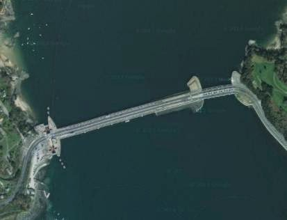

  Figura 6.4: Imagen de la central Mareomotriz de [La Rance](http://ireneu.blogspot.com.es/2014/07/la-ecologica-y-desastrosa-central.html)

  En 2011, [la central de Rance pasó a ser la segunda planta más grande del mundo](https://www.blogenergiasostenible.com/central-energia-mareomotriz-rance-mas-grande-mundo/), tras inaugurarse la central mareomotriz de Sihwa Lake en Korea del Sur, con 10 turbinas de 25,4 MW y diámetro de 14 metros. Con una variación de nueve metros del nivel de las costas, la planta produce [554 millones de kilovatios al año](http://world.kbs.co.kr/spanish/archive/program/news_issue.htm?no=22473). 

- **La energía térmica oceánica o maremotérmica (OTE)**: La diferencia de temperaturas entre la superficie de los océanos calentados por el sol y las profundidades más frías, constituyen otra fuente de energía.

  Las zonas térmicamente favorables se encuentran en las regiones ecuatoriales y subtropicales. El Instituto de Energía del Océano de la Universidad de Saga en Japón es el mayor centro investigador de esta tecnología del mundo, en 1981 desarrolló e instaló una planta de 100kW en la isla de Nauru. Asimismo, Hawaii es uno de los emplazamientos idóneos para el aprovechaimento de esta energía, por las altas temperaturas superficiales y grandes profundidades alcanzables , es allí donde el gobierno americano tiene un laboratorio de investigación y una planta piloto de 10 MW, que pretenden ampliar a 100 MW para el año 2020. (https://www.blogenergiasostenible.com/plantas-energia-maremotermica-mas-grandes-mundo/)

- **La energía del gradiente salino**: Se basa en el aprovechamiento de la energía por la diferencia en la concentración de sal entre el agua dulce y el agua del mar, mediante una membrana osmótica. 

  Respecto a esta técnica, en 2016, [Carnegie, clean energy](https://www.carnegiece.com/wave/), instaló la tecnología CETO, primera mundialmente, convierte la energía cinética del oleaje y desaliniza el agua a través de la osmosis inversa.

  [CETO 6](https://www.carnegiece.com/project/ceto-6-garden-island/), ubicado en la costa de Garden Island, al oeste de Australia, tiene una capacidad de 1 MW. Está respaldado por el gobierno federal a través de una subvención de la Agencia Australiana de Energía Renovable (ARENA) de 11 millones de dólares, así como de un préstamo del Commonwealth Bank of Australia. 

  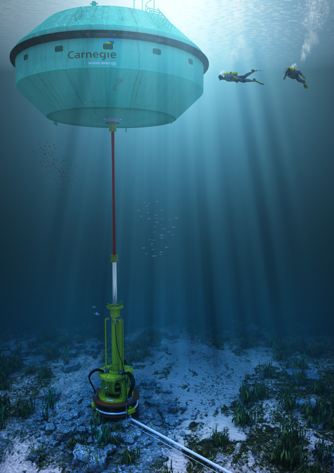

  Figura 6.5: By Carnegie Wave Energy Limited - Supplied by Carnegie Wave Energy Limited., CC BY-SA 3.0, [https://commons.wikimedia.org/w/index.php?curid=31753495]

  El concepto del diseño es la es la culminación del trabajo que comenzó en 2013 e incorpora lecciones aprendidas del Perth Wave Energy Project (CETO 5), pruebas de tanques de olas en Escocia, así como estudios internos de diseño y modelado. Carnegie cuenta con numerosos proyectos de colaboraciones I+D, [Research Partners](https://www.carnegiece.com/partner/research-partners/).

- **La energía de las corrientes**: Mediante turbinas hidráulicas se aprovecha la energía que llevan las corrientes submarinas para crear energía eléctrica.

- **La energía de las olas o undimotriz**: Las olas producidas, en gran medida, por el viento también resultan una fuente de energía. 

Cada una de estas corresponden a técnicas de estudio diferentes. Ya que en las costas del mar cantábrico se dispone de un alto potencial en energía de las olas, se optará por el análisis más en profundidad de esta última.

### 6.3.1 Según el principio de captación

El aprovechamiento de la energía de las olas puede analizarse en base al principio de funcionamiento y de captación de energía:

- Sistemas pasivos o estáticos: son aquellos en los que la estructura está inmóvil durante todo el proceso de conversión, de modo que la energía se genera sólo con el propio movimiento de las partículas de agua [Pinilla Martín, 2007]. 
- Sistemas activos u oscilantes: aprovechan el movimiento relativo entre las partes fijas y las móviles del dispositivo. Existen dos tipos: 
  - El oleaje actúa directamente sobre el cuerpo móvil. La convesión primaria se basa en el movimiento relativo entre dos cuerpos.
  - En la conversión secundaria, el oleaje actúa sobre una interfaz agua-aire, de modo que la ola desplaza al aire, que desplaza a su vez al cuerpo móvil. [Fernández Díez, 2002] 

Figura 6.4: Sistemas de aprovechamiento del oleaje [www.aquaret.com]

### 6.3.2 Según la orientación respecto al oleaje

Los captadores pueden clasificarse de diferentes formas, una de ellas es según la orientación respecto al oleaje y la forma:

- **Absorbedores puntuales**: Son estructuras de tamaño reducido en comparación a el oleaje incidente. Generalmente se colocan varios dispositivos agrupados siguiendo una línea. Concentran el oleaje en un punto. 
- **Atenuadores**: Tienen forma alargada y se colocan paralelos a la dirección de avance de la ola. Captan la energía de manera progresiva. Las fuerzas a ambos lados de la estructura se compensan, de manera que requieren un sistema de amarre menos resistente que en el caso de los totalizadores. 
- **Totalizadores o terminadores**: de forma alargada, se colocan perpendiculares a la dirección de avance de las olas. Requieren un sistema de amarre más resistente que los atenuadores. [Cavia del Olmo]

Figura 6.5: Clasificación de dispositivos de energía de las olas por su forma [P. Ibáñez, 2008]

### 6.2.3 Según la localización

En general, a medida que aumenta la distancia a la costa la densidad de energía es mayor, pero la supervivencia está más comprometida y existe una mayor complicación para el transporte de la energía generada, por lo que hay que encontrar un compromiso entre la supervivencia del dispositivo y la densidad de energía. Se reconocen tres zonas:

Figura 6.6: Clasificación de dispositivos según su ubicación [https://revista-anales.icai.es/web/n_14/seccion_8.html]

####6.2.3.1 En la costa (onshore)

Presentan la ventaja de tener un coste de instalación y mantenimiento  menor, puesto que son de fácil accceso, además, el transporte de la energía a la red presenta menos impedimentos. Sin embargo, disponen de un potencial energético menor que el explotable mar adentro, aunque se pueda ver compensado por efectos de concentración de energía por refracción o difracción. Un solo convertidor puede ser suficiente para cubrir determinadas necesidades a pequeña escala.

Los dispositivos que se pueden encontrar son:

- Columna de agua oscilante (Ozcillating Water Column, OWC)

  Constan de una estructura parcialmente sumergida hueca por la parte de abajo, dentro de la cual hay una cámara de aire por debajo del nivel del mar. El movimiento del oleaje se traduce en presión sobre el aire situado en el interior, que se expansiona y comprime accionando turbina que a su vez acciona el generador. 

  Los rendimientos suelen ser del 30-50% y pueden estar instalados en estructuras fijas, móviles o flotantes, o bien sobre el lecho rocoso de la costa o aprovechando instalaciones portuarias. La potencia a la que operan oscila entre los 100 y 500 KW. 

  Esta técnica ha sido una de las más utilizadas: 

  - LIMPET (Land Installed Marine Powered Energy Transformer) 

    El dispositivo fue desarrollado por la compañía británica **WaveGen Ltd.** en diciembre del 2000 en la Isla de Islay en la costa oeste de escocia, donde existe un flujo de energía disponible de entre 15 y 25 KW/m. Consta de dos turbinas tipo Wells cada una de las cuales tiene una capacidad instalada de 250 kW. Dicho dispositivo se encuentra conectado a la red, ha demostrado ser estructuralmente resistente a condiciones extremas de temporal con mantenimiento mínimo y en la actualidad sirve como base experimental para desarrollar nuevas tecnologías. Esta planta ha estado operando con éxito durante once años como un proyecto de demostración.

    En 2005, **Voith Hydro Power Generation**, filial de Voith ,compró Wavegen. 

    

    Figuras 6.7 y 6.8: Fotografía y esquema de componentes de Limpet. [www.wavegen.co.uk] 

    El diseño consta de tres compartimentos iguales y cuadrados inclinados 40º respecto a la horizontal que actúan como columna de agua. Se ha optimizado para reducir el impacto visual por su baja coronación y para ser de fácil instalación y mantenimiento.

  - OWC Unión Fenosa (La Coruña)

    Es un sistema promovido por **Unión Fenosa** e instalado en Galicia, en la central térmica de Sabón. En 1990 se empezó la investigación del dispositivo que funciona no con una turbina accionada por aire como los anteriores, sino con medios mecánicos por flotación de un cuerpo sobre la columna de agua. Está situado en un pozo existente que se comunica con el mar, consta de un flotador de 6m de diámetro conectado a un dispositivo mecánico que transforma el movimiento ascendiente y descendiente de las olas en un giro que acciona el generador eléctrico. 

  - Pico OWC (Portugal)

    Situada en la isla de Pico en las Azores, fue construida en 1998 sobre un lecho rocoso a 8 metros de profundidad. Aunque en un principio no operaba correctamente debido a problemas técnicos y financieros, finalmente, de 2003 a 2006 se llevó a cabo un proyecto para recuperar el sistema. La potencia máxima de salida es de 400 KW, se encuentra equipada con una turbina tipo Wells, con una cámara de 12x12 metros a cota del nivel medio del mar. Actualmente cubre parte de la demanda energética de la isla.

    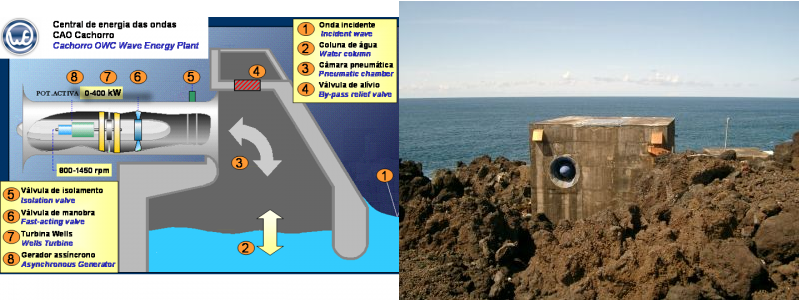

    Figura 6.9 y 6.10: Esquema de componentes y fotografía de la planta OWC de Pico [www.pico-owc.net] 

  - Mutriku, País Vasco

    Después de la exitosa demostración de LIMPET, en 2011 Voith Hydro Wavegen vendió la primera planta de energía comercial al **Ente Vasco de Energía**, conectada a la red española. [Inverness-news 16/11/2011](https://www.inverness-courier.co.uk/News/Inverness-firm-alunches-first-tidal-wave-project-16112011.htm)

    Ubicada en el dique del puerto, consta de 16 turbinas de 18,5 kW, con una potencia máxima de 480kW, genera unos 600 MWh/año.

    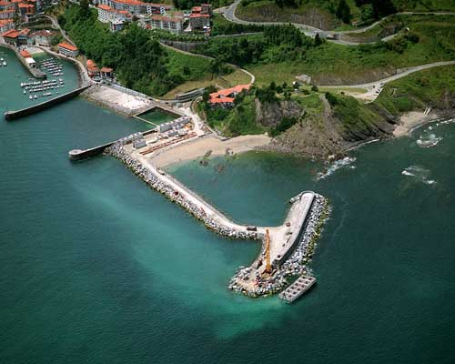

    Figura 6.11: Fase de construcción del sistema OWC [http://www.interempresas.net/Energia/Articulos/101717-Energia-undimotriz-un-inmenso-potencial-aun-por-desarrollar.html]

    La planta de energía utilizó tecnología desarrollada y suministrada por Voith Hydro Wavegen con un contrato por valor de 1,2 millones de euros (£ 1 millón). La inversión total del proyecto asciendió a 6,7 millones, de los cuales 2,3 millones correspondieron a la instalación energética y fueron aportados por el Ejecutivo autonómico, [eitb-noticias 08/07/2011.](http://www.eitb.eus/es/noticias/sociedad/detalle/698089/mutriku-tiene-primera-planta-suministra-energia-olas/) El proyecto, también recibió asistencia financiera del Séptimo Programa Marco de la Comisión Europea, [Power-technology: Mutriku Wave Energy Plant](https://www.power-technology.com/projects/mutriku-wave/).

    En 2013 Voith Hydro decidió cerrar Wavegen por centrarse en proyectos de energía mareomotriz, [Inverness-news 04/03/2013](https://www.inverness-courier.co.uk/News/City-job-losses-as-giant-utility-firm-pulls-out-04032013.htm).

  - Sanze o boya Masuda (Japón)

    En 1983 se coloca un dispositivo en Sanze destinado a la investigación. La potencia máxima de generador era de 40 kW, formado por una boya con un sistema que actúa por el principio de la cavidad resonante en su interior, y acciona una turbina de aire comprimido. Funcionó durante muchos años hasta que se decidió examinar su respuesta a la corrosión y fatiga.

  - Kvaerner (Noruega)

    En 1985 se instala en Toftestallen un dispositivo de captación de energía de potencia 500 kW, que fue destruido por una tormenta en 1988. Se diseñó sobre un acantilado vertical de 30m, con base de hormigón y tubo metálico de 10 m de diámetro. La olas entraban por la parte inferior del cilindro desplazando la columna de aire y accionando la turbina Wells instalada en el extremo superior. Daba servicio a una comunidad próxima de 50 casas.

- TAPCHAN (TAPered-CHANnel)

  Consta de una estructura en canal que se hace cada vez más estrecho de forma gradual, desde el nivel medio del mar hasta un depósito más elevado. A medida que el oleaje se propaga por el canal, la altura de ola se amplifica hasta que sobrepasa la estructura y entra al depósito de reserva, el cual proporciona un flujo continuo de agua a una turbina tipo Kaplan. Finalmente, el agua se devuelve al mar mediante una turbina convencional hidroeléctrica que genera electricidad. 

  - Toftestallen (Noruega) 

    Prototipo promovido por **Norwave A.S.** y finalizadao en 1985. Su potencia máxima es de 400 kW, consta de un canal de 170 m de longitud con un desnivel de 4m por encima del nivel medio del mar. Desemboca a un depósito de *8500* $m^3$ de capacidad, que a su vez alimenta una turbina Kaplan de *0,35 MW*. La instalación estuvo funcionando durante tres años hasta que fuera destruida por una tormenta. Una segunda planta estuvo en funcionamiento hasta 1991, con el mismo final. Hoy en día solo quedan las ruinas de lo que fueron, siendo un ejemplo de lo difícil que puede resultar lidiar con las fuerzas de la naturaleza. Noruega fué líder mundial en la investigación de la energía de las olas en la década de los 80, pero la falta de apoyo financiero golpeó al sector. [https://coastlight.net/detaljer/4283/Toftestallen/]

    

    Figuras 6.12 y 6.13: Fotografías de la planta de Toftestallen. [https://www.pinterest.co.uk/pin/196539971214291734/] y [https://coastlight.net/detaljer/4283/Toftestallen/]

-  Pendulor

  Es un dispositivo de captación que se puede situar tanto en la costa como cerca de ella, basado en un péndulo oscilante movido por el oleaje. Japón ha sido el país pionero en el desarrollo de este tipo de tecnología, llevando a cabo modelos a escala real. Consiste en una cámara de hormigón armado de forma rectangular con un lado abierto al mar. En éste lado se dispone de una compuerta de acero articulada en la parte superior que recibe el empuje del oleaje. El movimiento oscilatorio de dicha compuerta acciona una bomba hidráulica conectada a un generador. 

  - Mururoa (Japón) 

    Sistema desarrollado por **JAMSTEC**, prototipo instalado en el puerto de Mururoa. Presenta una eficiencia total del 55%. Consta de un cajón de 8 metros de altura con dos cámaras de (2,3x7,5)m, el péndulo tiene una altura de 7,5 metros y un ancho de 2 metros que entra en funcionamiento al alcanzar los 14º, oscilando como máximo a 30º. Su potencia máxima es de 15 kW. 

    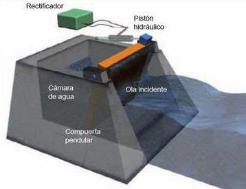

    Figura 6.14: Esquema del dispositivo pendulor. [http://energyprofessionalsymposium.com/?p=36743] 

#### 6.2.3.2 Cerca de la costa (nearshore)

Son aquellos dispositivos situados a una distancia máxima de 500 metros de la costa y a una profundidad deentre 20 y 30 metros, pueden estar o bien apoyados en el fondo o bien ser flotantes. Igualque en el caso de los aparatos en la costa, presentan la ventaja detener un coste deinstalación y mantenimiento menor que en aguas profundas. El mayor inconveniente es, además del impacto visual, que su instalación implica la modificación de la dinámica costera.

- OWC Port Kembla, Australia

  Proyecto desarrollado por **Energetech** en 2005, situado a 200 metros de Port Kembla. Prototipo de columna de agua oscilante que utiliza una pared parabólica para focalizar la energía de las olas, alcanzando alturas de 2,5 a 3 veces superiores. Con olas de 2 m y periodos de 7 segundos, genera 320 kW, de los cuales una parte se emplea para desalinizar agua a bordo del dispositivo. Tiene unas dimensiones de 36x35 metros y 18 metros de profundidad, genera una potencia máxima de 500kW. Además, desarrollaron una turbina de palas orientables (Denniss-Auld) para transformar el flujo ascendente y desdendente en giro unidireccional. Debido a las condiciones climáticas extremas imprevistas en 2010, el prototipo MK3 se liberó de sus amarres. La unidad se recuperó con éxito para ser conectada nuevamente a la red. Posteriormente, en ese mismo año, la unidad fue eliminada de manera segura.[https://en.wikipedia.org/wiki/Oceanlinx]

  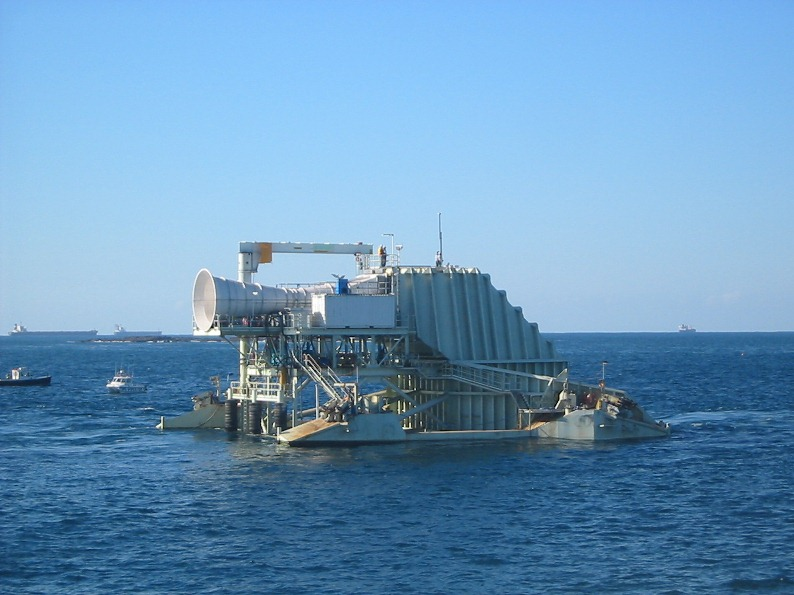

  Figura 6.15: Proyecto de Oceanlix greenWAVE en Port MacDonnell. [https://www.offshorewind.biz/2013/09/04/australia-construction-starts-on-oceanlinxs-wave-energy-project/]

  En 2007, la compañía cambió su nombre por Oceanlinx y la tecnología siguió en desarrollo. En 2014, la estructura greenWAVE quedó varada en la bahia de Yankalilla después de que surgieran dificultades mientras la remolcaban desde Port Adelaide hasta Port MacDonnell, [Business Guide](https://www.offshorewind.biz/2015/04/14/greenwave-still-stranded-off-south-australia/). Esto llevó a la compañía Oceanlinx a ingresar en la administración judicial antes de que su tecnología, propiedad intelectual y marca comercial fueran vendidas a **Wave Power Renewables Limited** en Hong Kong. Desde entonces estos han seguido desarrollando la tecnología, habiendo logrado 15 patentes  y 18 en proceso. La versión más avanzada a gran escala se lanzará en el primer trimestre de 2018.  

- Oyster WEC (Wave Energy Converter), Reino Unido.

  Aquamarine Power, fundada en 2005 en Edinburgo, implementó y probó dos dispositivos Oyster a gran escala en EMEC (European Marine Energy Centre): el Oyter 1 de 315kW y el Oyster 800 de 800kW. Trabaja con un módulo anclado al fondo marino que con el movimiento oscilatorio mueve unos pistones, que a su vez entregan el agua a presión a una unidad de transformación hidroeléctrica ubicada en la costa. Trabaja a profundidades de 10 a 12 metros, dando una potencia máxima de entre 300 y 600 kW.  

  Oyster 800 se conectó a la red en 2012 en la zona de pruebas de Billia Croo (EMEC), hasta el cierre del programa que finalizó en 2015, cuando la empresa dejó de operar. (http://www.emec.org.uk/about-us/wave-clients/aquamarine-power/)

  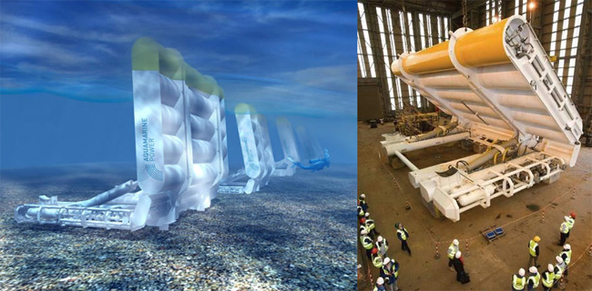

  Figuras 6.16: Esquema y fotografía del sistema Oyster [www.aquamarinepower.com]

- Wave Roller

  Sistema desarrollado por AW Energy Oy a escala de laboratorio entre los años 1999 y 2004. En 2005 se construyó un prototipo a escala (1:3) que probó la viabilidad del dispositivo. En la actualidad existe un prototipo a escala real instalado en Peniche (Portugal). 

  Consiste en una placa anclada al fondo del mar por la parte inferior, la cual se mueve por el movimiento oscilatorio de las olas en el fondo. Se coloca a una profundidad de aproximadamente 7 a 15 metros, proporcionando una potencia nominal de 13 kW por placa (se disponen de 3 a 45 placas). Puesto que se encuentra sumergido, no presenta problemas de impacto visual y acústico.

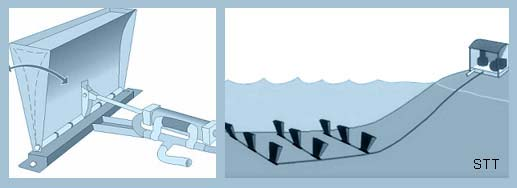

Figura 6.17: Esquema del funcionamiento de WaveRoller.[[School of Engineering and Energy, Murdoch University](http://www.see.murdoch.edu.au/resources/info/Tech/wave/)]

[www.aw-energy.com](http://www.aw-energy.com/)]

- Mighty Whale

  El dispositivo fue desarrollado en Japón en 1998, y se puso en funcionamiento en mayo del 2002 en la bahía de Gocazo. Es una estructura de 50 x 30 metros capaz de generar con un frente de 30m y 40m de longitud una potencia de 110kW, con una eficacia del 60% aproximadamente. El principio por el cual genera la electricidad es debido a las presiones y succiones de aire que provoca la agitación del oleaje.

  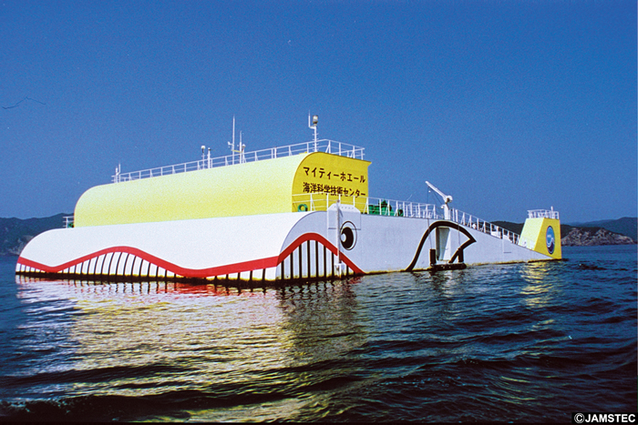

  

  Figura 6.18: Imagen del Mighty Wave.[[www.jamstec.go.jp](http://www.jamstec.go.jp/)]

#### 6.2.3.3 Mar a dentro (offshore)

La principal ventaja que representan respecto a los anteriores dispositivos es que en aguas profundas (>40m) existe un potencial energético mayor, ya que el oleaje todavía no ha experimentado pérdidas. Sin embargo, al ser a profundidades mucho mayores, aparecen otras dificultades añadidas como: el coste y la complejidad de instalación, difícil accesibilidad para mantenimiento y reparación, la esctructura y los sistemas de amarre deben resistir grandes esfuerzos e interferencias con el tráfico marítimo.

Los prototipos estudiados para esta ubicación son, entre otros:

- Archimedes wave swing (AWS) 

  Se trata de un sistema de conversión que se encuentra totalmente sumergido entre los 40 y 100m de profundidad. Está formado por dos cilindros: el primero se encuentra fijado al fondo y el otro hace la función de flotador, desplazándose verticalmente debido a la incidencia del oleaje. 

  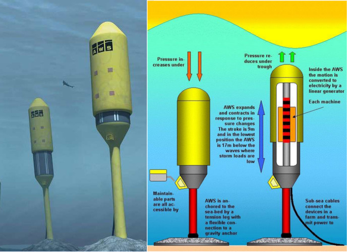

  Figuras 6.19 y 6.20: Esquema de funcionamiento. [Luc Hamilton, 2006](www.awsocean.com) y [https://www.researchgate.net/figure/Archimedes-Wave-Swing-by-AWS-Ocean-Energy_fig9_283368443]

  - Viana do Castello (Portugal) 

    Fué la primera planta piloto instalada, en 2004. En este prototipo el sistema de sujeción era mediante un pontón con 4 torres que se llenaban de agua al sumergirse. La carrera nominal era 7 m (subida y bajada del flotador), y la velocidad nominal 2,2 m/s. El prototipo se probó durante 7 meses a una profundidad de 43 m y con una potencia máxima de 2 MW, conectado a la red.

    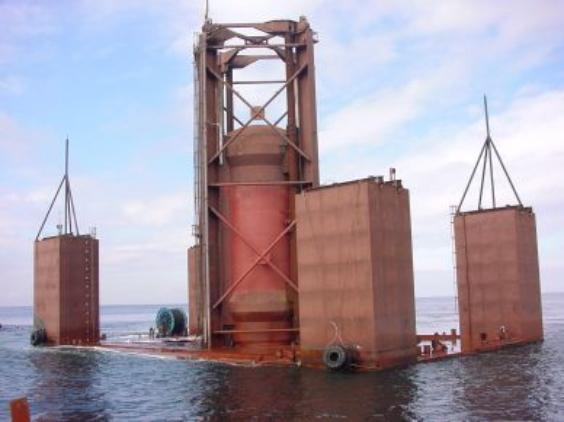

    Figura 6.21: Sistema AWS en Viana do Castello (Portugal)[www.awsocean.com] 

  - Lyness, Orkney

    En 2014, **AWS Ocean Energy Ltd** finalizó la instalación a gran escala del generador de energía AWS-III en el muelle de Lyness. Con el objetivo de demostrar su funcionamiento, durabilidad, impacto ambiental, ruido y vibraciones. Los resultados de las pruebas fueron muy positivos y están trabajando en la siguiente etapa de desarrollo dentro de una viabilidad comercial. [http://www.awsocean.com/projects.html]

- Powerbuoy

  Tecnología desarrollada por **OPT** (Ocean Power Technologies) de Estados Unidos. El sistema consiste en aprovechar el movimiento vertical y pendular del oleaje a través de una boya de unos 2 a 5 metros de diámetro abierta por la parte inferior. Las boyas obtienen la energía mediante un sistema hidráulico que aprovecha el movimiento relativo entre el flotador y el mástil de la boya. El sistema bombea un fluido (aceite) a alta presión que a su vez acciona un generador eléctrico. El rango de potencias de salida depende de la ubicación, de 3 Kw hasta 15 kW.

  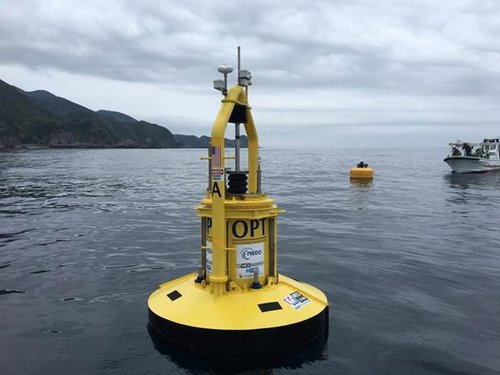

  Figura 6.22: Dispositivo PowerBuoy de Atlantic City [www.oceanpowertechnologies.com] 

  Se han llevado a cabo tres proyectos situados en el Atlántico y en el Pacífico: 

  - Oahu (Hawai) 

    Desarrollado entre 2004 y 2007 con el objetivo de utilizar la energía del oleaje para las bases de la marina norteamericana. El parque de olas estaba situado a una profundidad de 30 metros con una potencia de hasta 1MW. 

  - Atlantic City (New Jersey) 

    Parque operativo desde octubre del 2005 para demostrar la viabilidad del sistema de captación energética en el estado de Nueva Jersey. La boya es de 5 metros de diámetro y 14 metros de longitud. Se encuentra situada a una profundidad de 18 metros con una potencia nominal de 40kW.

  - Santoña (España) 

    El proyecto se empezó a desarrollar en 2006 para **Iberdrola S.A.**, con el objetivo de evaluar la viabilidad del sistema en la costa norte de España. En 2008, fué la primera planta de este tipo operativa en Europa. Participada por Iberdrola (60%), TOTAL (10%), OPT (10%), el Instituto para la Diversificación y el Ahorro Energético, IDAE (10%) y la Sociedad para el Desarrollo de Cantabria, SODERCAN (10%). En la primera fase, que incluye la infraestructura eléctrica marina costó unos 3 millones de euros. Se dispuso una boya de 40 kW sin conexión a la red eléctrica, suministrada por OPT, formada por un flotador de unos siete metros de diámetro, un fuste (compartimento cilíndrico estanco) donde se aloja el sistema de transformación de la energía de unos 20 metros de largo y un estabilizador de aproximadamente 10 metros. Constando de un sistema de amarre de tres boyas ancladas al lecho marino a 50 metros de profundidad, situada a 4 kilómetros de la costa e inicialmente se puso una potencia nominal de 1,35 MW.

    El sistema de transformación de la energía, denominado Power Take Off (PTO), está compuesto por una serie de módulos internos, a través de los cuales se capta y transforma la energía de las olas para almacenarla y, posteriormente, evacuarla en condiciones óptimas.

    ["La energía undimotriz se abre paso entre las renovables" La fuerza de las olas 2008](https://www.scribd.com/document/328163965/La-Fuerza-de-Las-Olas)  

- Aquabuoy

  Sistema desarrollado por Aquaenergy Group. Consta de una boya flotante que transforma el movimiento de subida y bajada provocado por el oleaje para transmitirlo a un pistón. Éste está unido a dos mangueras flexibles que funcionan como bombas de agua, impulsando el agua a presión a través de un tubo hacia el acumulador que se encuentra en la parte superior del dispositivo. El interior de la boya aloja un sistema turbina-generador que produce la electricidad. Renovables Finavera, actualmente, tiene proyectos de energía undimotriz en Portugal, Canadá, Estados Unidos y Sudáfrica.

  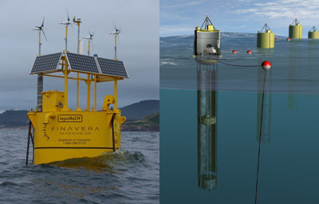

  Figura 6.23: Dipositivo Aquabuoy de Finavera Renewables http://www.global-greenhouse-warming.com/Finavera-aquabuoy.html]

  - Bahia de Maca (EEUU)

    Fue impulsado debido a que presentaba condicionantes favorables: profundidad cerca de la costa, buen clima de oleaje y demanda energética en la zona. Una boya piloto se instaló en 2003 a una profundidad de más de 50 metros y diámetro y longitud de 6 y 30 metros respectivamente. La potencia máxima de dicho dispositivo fué de 250kW.

- Pelamis wave power

  Sistema desarrollado por la empresa británica **Pelamis Wave Power Ltd**, anteriormente conocida como Ocean Power Delivery Ltd. La idea partía de uno de los primeros dispositivos en estudiarse, el Salter Duck [Salter, 1974]. A lo largo de los años la idea ha ido evolucionando para dar paso a nuevos sistemas como la tecnología Pelamis.

  El dispositivo Pelamis está formado por una estructura cilíndrica semisumergida cuyo eje está orientado paralelamente a la dirección de propagación del oleaje. Se encuentra articulada en varios puntos que conforman nodos móviles con dos grados de libertad: vertical y horizontal. El movimiento relativo entre las partes articuladas acciona un sistema hidráulico de 4 pistones que alimenta un depósito a presión que, a su vez, actúa sobre un generador eléctrico. Se encuentra anclado al fondo por un sistema de pesos y flotadores que impide que vaya a la deriva sin restringir la oscilación del artefacto.

  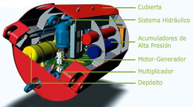

  Figura 6.24: Esquemas de funcionamiento del dispositivo Pelamis [http://www.eve.eus/La-energia/Infografias/La-energia-del-mar/La-energia-del-mar.aspx?lang=es-ES]

  - Aguaçadoura (Portugal)

    El proyecto empezó en 2005 y consiste en tres dispositivos Pelamis situados a 5 km de la costa norte de Portugal con capacidad de 2,25 MW en total (cada uno de 750 kW). Es el primer parque de olas con pretensiones comerciales, se planificaron otros 28 convertidores, como parte de la segunda fase, para generar 22,5 MW para la empresa energética estatal Energías de Portugal. Sin embargo, los primeros tres  generadores tuvieron que ser remolcados al puerto, tras cuatro meses de su puesta en servicio debido a problemas técnicos. La crisis financiera mundial del 2008 hizo que la reinstalación fuera aún más difícil y desde entonces ha permanecido cerrada.

    https://www.power-technology.com/projects/pelamis/

  - Orkney (Escocia)

    Pelamis Wave Power (PWP), fundada en 1998, con sede en Edimburgo, en 2004 demostró su primer prototipo a escala real. Se construyó con cuatro dispositivos Pelamis situados a 2 km de la costa oeste de escocia en el parque de pruebas del Centro Europeo de Energías Marinas (European Marine Energy Centre, EMEC), con una capacidad de 3 MW. Entre 2004 y 2007 se llevó a cabo el dispositivo de segunda generación, el cual comprende 5 convertidores. En 2010 se llevó a Orkney y se instaló con éxito en el sitio de prueba de olas Billia Croo de EMEC. En 2014 PWP ingresó en administración y Wave Energy Scotland se hizo con sus activos, el dispositivo fué desmantelado.

    

    Figura 6.25: Imagen del convertidor pelamis P2-001 [http://www.emec.org.uk/about-us/wave-clients/pelamis-wave-power/]

    EMEC adquirió el convertidor pelamis de ScottishPower Renewables, que estuvo desarrollando la tecnología antes de que PWP ingresara en administración. Actualmente con sede en Lyness, EMEC está explorando opciones para utilizar el dispositivo pelamis como plataforma de prueba, previendo que podría usarse para probar materiales, componentes u otras pruebas en mar abierto.(http://www.emec.org.uk/press-release-emec-seeks-feedback-from-industry-for-p2-002/)

- Wave Dragon

  Sistema desarrollado por la compañía danesa Wave Dragon ApS. Empezó a estudiarse en 1998 a partir de modelos numéricos y ensayos en laboratorio. 

  El corazón de la unidad es un gran depósito flotante, dos alas reflectoras concentran la potencia de las olas hacia una rampa, la cual conduce el agua al depósito. El agua vuelve al mar a través de una turbinas Kaplan de baja presión. 

  Entre otros beneficios, cabe destacar que es el único convertidor bajo desarrollo que puede ser libremente escalado.

  - Nissum Brending (Dinamarca)

    En 2003 un [proyecto Europeo]([http://www.wavedragon.net/sea-testing-and-optimisation-of-power-production-on-a-scale-14-5-test-rig-of-the-offshore-wave-energy-converter-wave-dragon/), con Wave Dragon ApS. (Denmark) y 5 entidades más de diferentes paises europeos, lanzó un prototipo a escala 1:4.5 en Nissum Bredning (the Danish Wave Energy Test Center), al norte de Dinamarca. 

    En 2006 se instaló un prototipo modificado en otro sitio de pruebas con olas más energéticas. En mayo del 2008, se realizaron tareas de mantenimiento y reparación, y en 2009 el prototipo volvió a su lugar de origen para las pruebas finales. El prototipo fué diseñado a escala real para el oleaje de la zona cuya potencia media es de 24kW/m, valor que corresponde a una escala de 1:5.2 para un clima de 36 kW/m. La capacidad correspondiente a cada clima sería de 4 y 7 MW respectivamente. 

    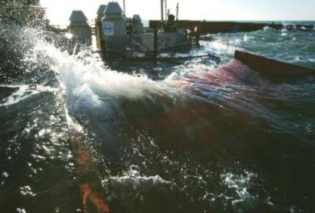

    Figura 6.26: Wave Dragon en Nissum-Bedding (Earth Vision) [http://www.wavedragon.net/prototype-testing-in-denmark/]

    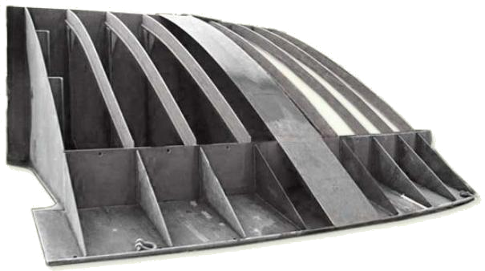

    Figura 6.27: Diseño de rampa que optimiza la captura de agua [www.wavedragon.net] 

  - TecDragon (Portugal)

    Proyecto desarrollado por TecDragon (Tecnologia da Energia das Ondas SA), compañía del Grupo Wave Dragon, ApS., en cooperación con investigadores portugueses y alemanes, cuyo objetivo es la instalación de un parque de olas de 50 MW.

     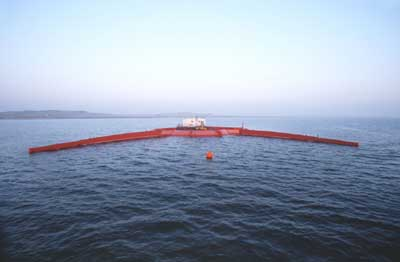

    Figura 6.28: http://www.tecdragon.pt

  - Milford Haven

    Wave Dragon Wales Ltd. planeó instalar la demostración pre-comercial a gran escala del Wave Dragon ApS. en Gales en 2011/2012, con una capacidad de 7 MW, ubicada a dos o tres millas de St Ann's Head. Con el fin de obtener, durante tres a cinco años, experiencia operacional y análisis de las deficiencias en el tansporte de energía.

    Sin embargo,  la crisis financiera causó retrasos en los planes de despliegue del primer dispositivo a gran escala y Wave Dragon Ltd. actualmente está buscando capital de riesgo. [http://www.wavedragon.net/timetable/]

    En 2015, Wave Dragon cerró la aplicación de la Sección 35 y dejó de trabajar en este sitio. Como sitio de pruebas, esta ubicación nunca habría sido comercialmente viable y desde 2013 comenzó a trabajar a gran escala comercial en 'Milla Fjord'. [https://tethys.pnnl.gov/annex-iv-sites/wave-dragon-pre-commercial-demonstration-project]

## 6.3 ACTUALIDAD DEL DESARROLLO TECNOLÓGICO EN ESPAÑA

La gran disponibilidad de energía de oleaje de algunos países ha llevado a gobiernos y empresas a financiar e impulsar programas de investigación y desarrollo. Anteriormente, se ha visto como países europeos como Dinamarca, Irlanda, Noruega, Reino Unido y Portugal apuestan fuertemente en sus investigaciones en energía undimotriz. También a nivel mundial se han llevado a cabo programas en sitios donde existe un gran potencial como Australia, Canadá, Japón y Estados Unidos entre otros.

A nivel nacional, se han mencionado algunos proyectos, a continuación se detalla su estado actual:

- Bimep

  Centro de ensayos en mar abierto, localizado en Armintza-Lemoiz (Bizkaia), cuenta con una superficie total de $5,3 km^2$. En 2009 se instaló una boya oceanográfica en la zona, para medir parámetros como la altura y dirección del oleaje, velocidad y dirección de las corrientes y del viento, temperatura, etc. y transmitir los datos por satelite.

  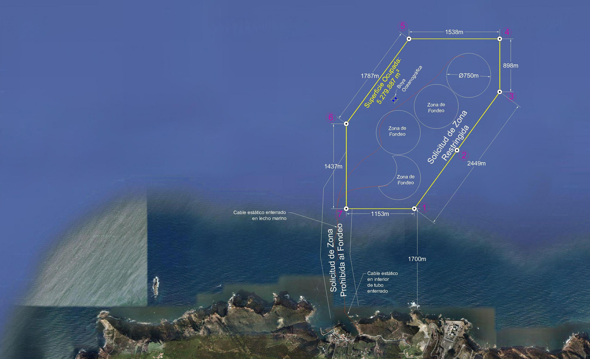

  Figura : Fotografía de la disposición general, [Localización de bimep](http://bimep.com/sobre-bimep/localizacion-de-bimep/)

  Se han realizado varios estudios detallados, medoambiental, de energía de las olas del País Vasco y de rutado del cable submarino, tal y como se detalla en el [Desarrollo del Proyecto](http://bimep.com/sobre-bimep/desarrollo-del-proyecto/). Además, se listan las empresas adjudicadas desde concursos públicos, para llevar a cabo cada tarea o suministrar equipamientos. 

  **bimep** cuenta con [instalaciones](http://bimep.com/sobre-bimep/instalaciones/) abiertas que permiten que los fabricantes de sistemas de generación renovable marina instalen sus equipos en ella, bien para explotación-demostración (generación de 
  energía eléctrica) o bien para pruebas. Las características básicas de la infraestructura son:

  - 20 MW de potencia total.
  - 4 puntos de conexión para WECs.
  - Facilidad de instalación, ensayo, pruebas y explotación.
  - Centro de investigación asociado.

- Iberdrola Energías Marinas de Cantabria, S.A.

  El proyecto de investigación del convertidor Powerbuoy que mantenían en Santoña desde el 2008 y que estudiaban cómo desarrollar un enramado de 10 boyas que generasen potencia suficiente como para abastecer a 2.500 viviendas quedó sin concluir. [Ref.: El Diario Montañés](http://www.eldiariomontanes.es/20131116/local/castro-oriental/abandono-proyecto-iberdrola-santona-201311161639.html) -> [Way Back Machine](https://web.archive.org/web/20170904012830/http://www.eldiariomontanes.es/20131116/local/castro-oriental/abandono-proyecto-iberdrola-santona-201311161639.html)

  En un momento tenso en las relaciones entre Iberdrola y el Gobierno por los recortes aplicados por el Ministerio de Industria al sector para intentar atajar el déficit tarifario, la empresa decidió bajarse de la iniciativa. La multinacional continuó su apuesta por la tecnología marina en Escocia, en las Islas de Orkney a través de la sociedad Scottish Power Renewables. En 2011 participó en la instalación del prototipo Pelamis P-2 en el EMEC en Orkney y, también, desarrollaron el proyecto Sound of Islay, de 10 MW de capacidad.

  La renuncia abocó a la desaparición de la empresa, Iberdrola Energías Marinas de Cantabria, S.A. en 2013, aunque, según fuentes de la eléctrica, la liquidación de esa sociedad no supone el fin del proyecto, que, aseguran, continúa, porque otros accionistas lo han "heredado".  [Ref.: Voz Populi](https://www.vozpopuli.com/economia-y-finanzas/empresas/Iberdrola-Energia_marina-Cantabria_0_642535793.html)

- Mutriku wave plant, propiedad del EVE.

  En 2016 la central completó [5 años de funcionamiento](https://tidalenergytoday.com/2016/07/19/mutriku-wave-plant-generates-over-1gwh-of-clean-power/), durante los cuales ha suministrado 1,3 GWh de potencia a la red eléctrica. A parte de producir energía de las olas, la planta también actúa como centro de pruebas para nuevas tecnologías de turbinas y sistemas de control.

  En mayo del 2017, se envió a la planta una turbina de aire bi-radial de Kymaner, después de haber sido ensayada en el laboratorio de la Universidad IST en Lisboa, para validarla en condiciones reales. Además, como parte del proyecto de energía de las olas  de OPERA (Open Wave Experience to Reduce Energy Cost), también se realizaron pruebas en el convertidor de olas flotante de Oceantec en Bimep. 

  Las leyes de control se personalizaron para ambos emplazamientos, así como para las pruebas de laboratorio en Portugal, España e Irlanda. Así mismo, se implementaron varios algoritmos de control avanzado para ser comparados. 

  El proyecto OPERA, busca desarrollar una tecnología que reduzca el coste de operación, acelerar el desarrollo de estándares internacionales y reducir las incertidumbres y los riesgos tecnológicos asociados. [https://tidalenergytoday.com/2017/05/22/kymaner-turbine-hits-full-power-at-mutriku-wave-plant/]

- Oceantec Energías Marinas S.L.

  La empresa vasca, promovida por la Corporación Tecnológica TECNALIA y por Iberdrola a través de su programa de capital riesgo corporativo *Perseo*, en 2016 realizaron las maniobras de transporte e instalación de su primer dispositivo para el aprovechamiento de la energía de las olas, MARMOK-A-5 en la [Plataforma de Ensayos de BiMEP](http://bimep.com/), para ser ensayado durante al menos un año. 

  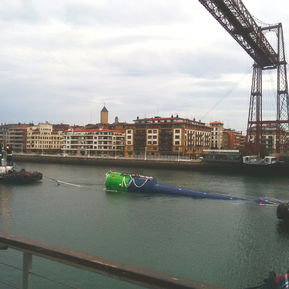

  Figura : Fotografía del traslado de MARMOK-A-5, [Teclania>Noticias](https://www.tecnalia.com/es/energia-medioambiente/noticias/oceantec-instala-en-bimep-su-primer-dispositivo-para-el-aprovechamiento-de-la-energia-de-las-olas.htm)

  El MARMOK-A-5 tiene la forma de una boya gigante y se trata de un primer dispositivo de baja potencia (30kW) de unas dimensiones de 5 metros de diámetro, 42 metros de alto y un peso aproximado de 80 toneladas.

  El principio de generación eléctrica se consigue gracias a que en el interior de la estructura central de la boya se crea una columna de agua, que con el movimiento desacompasado de las olas, ejerce de pistón, comprimiendo y descomprimiendo una cámara de aire que queda en el interior de la parte superior, siendo este flujo bidireccional aprovechado por unas turbinas que giran siempre en la misma dirección.

  A finales de 2017, el dispositivo [cumplió](https://tidalenergytoday.com/2017/12/15/wave-device-at-bimep-marks-power-export-anniversary/) su primer año de implementación en bimep y gracias al proyecto europeo Opera, financiado con fondos públicos, se dispone de datos de funcionamiento en condiciones reales de mar, lo que permitirá diseñar un dispositivo pre-comercial de gran potencia, 300 kW. Paralelamente se está avanzando en el diseño del sistema de fondeo, el desarrollo de la electrónica de control y el diseño del sistema de extracción (PTO) incluidas las turbinas, información recogida en el [desarrollo tecnolóligo de Oceantec](http://www.oceantecenergy.com/).

  En marzo del 2018, el organismo de certificación de renovables [DNV GL](https://www.dnvgl.com/energy/generation/renewables-certification/index.html) emitió la declaración de conformidad para el convertidor Marmok-A5, tras haber evaluado su diseño y sistema de amarre. Para lograr esta calificación, también se identificó el modelo de falla y clasificación de riesgos del convertidor. El convertidor se descompuso en sistemas, subsistemas y componentes, con la intención de considerar diferentes fases como, operación, fabricación, transporte e instalación; y así, lograr identificar tipos nuevos de fallo y acciones de mitigación, tal y como se establece en el proyecto OPERA. 

  DNV GL, además de proporcionar el proceso de calificación de la tecnología, también está guiando en la aplicación de métodos de evaluación que permitan identificar de forma sistemática y priorizada novedades, incertidumbres y riesgos.

  El proyecto OPERA, coordinado por Tecnalia y 12 socios más entre académicos e industriales, [[realizó una evaluación inicial de la configuración base de Marmok-A5, seguida de un monitoreo periódico de datos para evaluar y actualizar los riesgos específicos. Además, este proyecto]] tiene como objetivo desarrollar y eliminar los riesgos de las tecnologías que operan para extraer la energía de las olas, reduciendo el coste de operación en un 50% y, consecuentemente, acelerar el despliegue de energía marina renovable.

  https://tidalenergytoday.com/2018/03/05/oceantecs-wave-energy-device-breaks-de-risking-ground/

- Pelamis, Galicia

  Estructura muy resistente, pensada para zonas con condiciones muy adversas. Se estima que 30 de estos sistemas podrían cubrir las necesidades energéticas de unos 20.000 hogares europeos, [endesa 2015](https://www.solucionesintegralesendesa.com/blog/equipamiento-hogar/ahorro-hogar/energia-undimotriz-el-poder-de-las-olas/).

  Norvento experimenta con tecnología Pelamis, en un emplazamiento *offshore* en las costas de Galicia, [interempresas-Proyecto Fahemar](http://www.interempresas.net/Energia/Articulos/126331-Generar-energia-a-partir-de-energia-undimotriz.html). Aunque, recientemente su actividad, se ha centrado en la energía eólica, su especialidad siendo la mayor empresa eólica de galicia. En abril de 2018, se anunció la construción del primer parque experimental de I+D+i en España vinculado a la energía eólica, [economia-en-galicia](http://www.economiaengalicia.com/articulo/empresa/norvento-construira-primer-parque-experimental-idi-espana-vinculado-energia-eolica/20170404180131003321.html).

  ¿¿¿¿Narvantia es Norvanto? han hecho o no algun parque eólico en el océano? http://renews.biz/110374/navantia-dispatches-ea1-jackets/

- Prototipo (J+B) 2B, Galicia

  El promotor Galicia Mar Renovables (La Coruña) fue fundada con el objeto de construir, instalar, comprobar el funcionamiento y explotar el sistema (J+B) 2B, para producir energía electrica a partir de las olas del mar, cuya boya preserie está fondeada en la Ría de Ares (La Coruña). [interempresas-Proyecto Fahemar](http://www.interempresas.net/Energia/Articulos/126331-Generar-energia-a-partir-de-energia-undimotriz.html)

  En enero de 2017, se publicó que la nave de Galicia Mar Renovables podría pasar a la Xunta al no haber comprador; construcción finalizada en 2013 pero que nunca tuvo actividad. Ni en la subasta del 16 de junio, con una valoración de salida de 889.651,50 euros, ni en el proceso de adjudicación directa abierto ese mismo día, sin un precio mínimo de venta establecido. [La voz de Galicia, 19/01/2017](https://www.lavozdegalicia.es/noticia/ferrol/carino/2017/01/19/nave-galicia-mar-carino-pasar-xunta-haber-comprador/0003_201701F19C7994.htm). Hoy en día, la empresa, con sede en Ferrol (A Coruña), aún está activa. Aunque, tanto en 2010 como en el 2012 realizó cambios en su objeto social, ampliando su campo en actividades de investigación y consultoría en energías renovabes de las mareas, solar, y eólica, [infoEmpresas](https://www.infoempresa.com/es-es/es/empresa/galicia-mar-renovables-sl).

- Pipo System, Galicia

  El Consorcio de Portos de Galicia, Sogama, Cetmar, Inega e Igape, está ensayando su prototipo en un emplazamiento offshore y con tecnología Pipo System, el sistema **APC-Pisys** consta de dos boyas (una en superficie y otra sumergida de volumen variable que transmiten su movimiento lineal y lo convierte en rotativos, que finalmente son convertidos a una sola dirección. Las boyas siempre se mueven en direcciones opuestas, incrementando sus fuerzas y carreras simultáneas. Una tercera boya mantiene una profundidad constante mediante sus amarres al fondo marino. En esta boya de posicionamiento, están alojados los sistemas de control, generación y medición de la potencia. Los sistemas de medición oceanográficos disponen de un habitáculo ubicado en el interior de la boya de superficie y de soportes específicos externos. [interempresas-Proyecto Fahemar](http://www.interempresas.net/Energia/Articulos/126331-Generar-energia-a-partir-de-energia-undimotriz.html)

  La empresa patentó a nivel mundial el sistema, contó con el apoyo financiero del Ministerio de Economía y Competitividad y la Comunidad Europea (Fondos Feder), y su desarrollo se traduce en diez años de trabajo, 14 millones de inversión y la colaboración de importantes centros científicos como es el caso de la Plataforma Oceánica de Canarias y las universidades de Zaragoza y Politécnica de Cataluña. [Diario de Las Palmas](http://www.laprovincia.es/sociedad/2012/10/21/carrera-boya-inteligente/491794.html)

  A una escala 1:5 y mediante un oleaje intermedio como el que se da en las Islas Canarias (Boyas Las Palmas I y II de Puertos del Estado), el sistema APC-PISYS, puede alcanzar potencias de entre 100 y 150 Kw.

  En 2012 durante las maniobras de amarre no se previó unas corrientes que llevaron la boya a la deriva, pero se recuperó sin problema y quedó listo para su comercialización. Para ello cuentan con el apoyo del Ministerio de Economía, y precisan de una gran empresa que ponga el capital para crear la industria para la fabricación, previsiblemente en Canarias.

  Desde entonces no hay constancia de que se esté comercializando energía obtenida mediante este dispositivo, así mismo la página oficial de Pipo System ya no está operativa, [WayBackMachine, piposystem](https://web.archive.org/web/20170427103046/http://www.piposystems.com/welcome.html).

- Proyecto "Wavenergy", Santa Cruz de Tenerife (Canarias) 

  La Unión Europea (EU) aprobó este proyecto concebido para generar energía con el impacto de las olas en el muelle del futuro puerto de Granadilla (Tenerife), iniciativa en la que la Autoridad Portuaria de Santa Cruz de Tenerife es uno de los socios que, junto con el Cabildo de Tenerife, INGEMAR, ITER, EIGSI y WAVEGEN desarrollará el citado proyecto. 
  El proyecto contará con un presupuesto total de 400.000 euros, y ha sido aprobado por Bruselas en la convocatoria 2006 de ayudas del Fondo Europeo de Desarrollo Regional (FEDER), correspondiente al “Espacio Atlántico-Interreg IIIB”. Su redacción fue coordinada por la Oficina de Representación del Cabildo ante el Estado y la UE, junto con técnicos de las entidades participantes, durante los tres meses que duraron los trabajos para su elaboración. Asimismo, en un hecho insólito en este tipo de convocatorias, la Unión Europea ha concedido el 91,4% de la subvención total a la que se aspiraba. [Proyecto santoña, dic 2008](http://www.mapama.gob.es/ministerio/pags/Biblioteca/Revistas/pdf_AM%2FAM_2008_83_26_31%5B1%5D.pdf)

- En Sant Feliu (Girona)

  Abencis Seapower está promoviendo un captador puntual onshore, consistente en una boya que mediante un brazo rígido a modo de palanca, transmite la energía de la ola a un árbol rotativo que mueve el rotor del generador.

- En Madrid y promovido por un consorcio formado por Cedex, Elytt y Neures TEC se está desarrollando el proyecto Undigen, cuyo objetivo es el diseño de un generador Wedge, lineal de alta reluctancia, para su posterior aplicación a dispositivos de olas.  [interempresas-Proyecto Fahemar](http://www.interempresas.net/Energia/Articulos/126331-Generar-energia-a-partir-de-energia-undimotriz.html)

  ​

