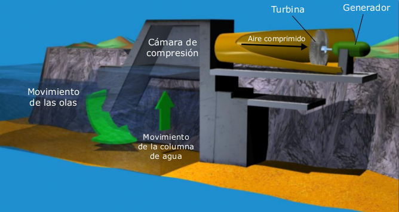

# 7. DESCRIPCIÓN DEL SISTEMA OWC

El sistema para la captación de energía undimotriz que se pretende estudiar, funciona por medio del sistema OWC (Oscillating Water Column) o Columna de Agua Oscilante. 

Constan de una estructura parcialmente sumergida hueca por la parte de abajo, dentro de la cual hay una cámara de aire, en algunos casos por debajo del nivel del mar. El movimiento del oleaje se traduce en presión sobre el aire situado en el interior, que se expansiona y comprime accionando una turbina que a su vez acciona el generador. La turbina que se suele instalar, está diseñada para girar en la misma dirección para ambos sentidos del flujo, ya que posee álabes de perfil simétrico.

La estructura suele ser una cavidad cilíndrica o rectandular (con inclinación), y a medida que se acerca a la turbina se va estrechado con el fin de amplificar la presión y que el sistema turbina – generador funcione correctamente. La velocidad en la turbina es máxima cuando el sistema entra en resonancia, es decir cuando la frecuencia natural de la turbina y del generador coinciden con la de la ola. Los rendimientos suelen ser del 30-50% y pueden estar instalados en estructuras fijas o en estructuras móviles o flotantes, o bien sobre el macizo rocoso de la costa aprovechando instalaciones portuarias. La potencia a la que operan oscila entre los 100 y 500 KW.

[img lab]

En general todos los prototipos presentan los mismos retos tecnológicos : 

- Mejora de los rendimientos de las turbinas, del sistema de conversión hidráulica a alta presión y del funcionamiento a nivel general. 
- Difícil integración a la red debido a las fuertes fuctuaciones de potencia.
- ​

