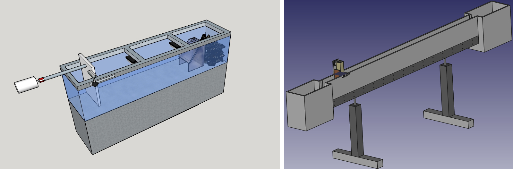

# 1 DESCRIPCIÓN DE FASES

## 1.1 FASES DE UNA SIMULACIÓN

Todos los problemas de CFD presentan la siguiente estructura: un módulo de preproceso, otro de procesado  y uno final de postproceso. Cada uno de ellos responde a las siguientes funciones:

- PREPROCESO: 
  - Definición de la geometría a modelizar (el dominio compuacional).
  - Generación de la malla o división del dominio en un número suficiente de celdas o elementos que no se superpongan y que cubran toda la geometría.
  - Identificación de los fenómenos físicos y químicos que pretenden modelarse.
  - Definición de las propiedades del fluido (o fluidos).
  - Especificación de las condiciones iniciales y de contorno del problema.

La generación de la malla es muy importante, porque condicionará definitivamente la calidad de los resultados. En principio, cuanto más fina sea la malla, más próxima a la solución real será la simulación. Sin embargo, mallas extraordinariamente finas aumentan considerablemente el tiempo de cálculo, por lo que siempre es necesario llegar a una elección de compromiso. Además, un mallado eficiente siempre ha de ser más fino en aquellas zonas donde se prevé un mayor gradiente en las variables del flujo.

- PROCESADO: 

  Constituye la parte central del programa de resolución y es el encargado de resolver de forma iterativa las ecuaciones que se han activado previamente en el preproceso (los modelos). Aun siendo la parte más importante, definido el código que se va a emplear y configuradas las funciones adicionales para obtener los parametros deseados durante la simulación (Ej. fuerza de arrastre, capa límite, caudal de salida...), el usuario sólo tendrá que lanzar la ejecución y esperar que los recursos computacionales de los que dispone resuelvan el caso. Las ejecuciones, en función de los modelos y del tamaño de la malla, pueden durar desde minutos hasta semanas o meses de cálculos en tiempo real.

- POSTPROCESO: 

  Es una parte fundamental por cuanto permiten gestionar la ingente cantidad de información que el código es capaz de generar. No sólo se trata de disponer una interfaz gráfica, sino de una herramienta que permita proporcionar variables integradas y promedidas para ofrecer resultados globales. Esta fase Incluye una serie de herramientas gráficas que permiten analizar los resultados:

  - Representación gráfica del dominio y la malla (Salome, ParaView).
  - Mapas de contornos de las variables, planos de corte, trazas vectoriales, líneas de corriente, entre otras opciones de vista (ParaView). 
  - Gráficas y distribuciones de las mediciones de las variables (Paraview con Python y Octave).
  - Renderizados de los resultados, animaciones con aparencia más realista (Blender).

## 1.2 HERRAMIENTAS PARA CADA FASE

Las referencias para la elección de las herramientas más convenientes para usuarios de OpenFOAM, depende de muchos factores, entre ellos el critério personal y si el uso para el que están diseñadas es el más acorde a lo que se requiere. A continuación, se presenta una breve guía sobre las herramientas más comunes, teniendo en cuenta las siguientes referencias:

- [Meshing Toools that Interface with OpenFOAM](https://github.com/NanoSim/CoursesAndTrainingPortfolio/blob/master/3_EulerianModels/meshingTools.md)
- [Codes](https://www.cfd-online.com/Wiki/Codes)
- [Links - Software](https://www.cfd-online.com/Links/soft.html)
- [Best open-source mesh program for use with openFOAM](https://www.reddit.com/r/CFD/comments/18ydig/best_opensource_mesh_program_for_use_with_openfoam/)

### 1.2.1 Preproceso

#### 1.2.1.1 Generación del modelo

#####1.2.1.1.1 [blockMesh](https://cfd.direct/openfoam/user-guide/blockmesh/)

Utilidad provista con OpenFOAM, apropiado para geometrías sencillas. El usuario tendrá que definir los vértices, bloques y contornos del modelo; así como, el número de celdas y la relación de grosores que tendrán. Esto se define en un fichero con el nombre de **blockMeshDict**, ubicado en la carpeta <./system> del caso. Se complica cuando se quieren superficies curvas, [OpenFOAM User Guide: 2.2 Stress analysis of plate with hole](https://cfd.direct/openfoam/user-guide/plateHole/#x6-400002.2.1). 

Adicionalmente, es posible automatizar la generación del fichero y también se pueden utilizar otras herramientas que dispongan de interfaz gráfica para visualizar y editar el contenido [OpenFOAM Wiki/BlockMesh](https://openfoamwiki.net/index.php/BlockMesh).

##### 1.2.1.1.2 [dynamicMeshDict](https://es.slideshare.net/fumiyanozaki96/openfoam)

En OpenFOAM, se pueden implementar movimientos en la malla y cambios en la topología, con la funcionalidad *Dynamic Mesh*, localizado en <./constant>. En este diccionario, se define una velocidad constante sobre el contorno que se quiere desplazar; y habiendo definido los demás parámetros de entrada para el control del movimiento de la malla, el movimiento se generará de manera automatizada a lo largo del tiempo.

##### 1.2.1.1.3  [snappyHexMesh](https://cfd.direct/openfoam/user-guide/snappyhexmesh/)

Herramienta incluida en OpenFOAM, diseñada para generar mallas hexaédricas sobre geometrías más complejas en fotmato STL. El proceso de esta utilidad implica: crear una malla de base con blockMesh (tamaño de celdas de nivel 0); sobre este dominio se incrusta la geometría del caso (en STL); se lleva a cabo un refinado local de la malla base, en la región comprendida por el modelo; después, se mueven los vertices de las celdas, cercanas a los contornos de superficie; por último, eliminar las celdas redundantes (el usuario deberá especificar un punto dentro del modelo si es el flujo por el interior lo que se quiere estudiar, o fuera si se quiere analizar el comportamiento del flujo entorno al modelo) y descomponer en más capas (*layers*) los contornos determinados. 

Se dispone de una amplia documendación por la comunidad de usuarios, [snappyWiki](https://sites.google.com/site/snappywiki/snappyhexmesh/snappyhexmeshdict#TOC-geometry) detallando las instrucciones contenidas en el diccionario y los parámetros a establecer, este fichero definirá el proceso al ejecutar la utilidad `snappyHexMesh`. 

- [OpenFOAM SnappyHexMesh Tutorial](https://www.youtube.com/watch?v=ObsFQUiVi1U)
- [A Comprehensive Tour of snappyHexMesh](https://openfoamwiki.net/images/f/f0/Final-AndrewJacksonSlidesOFW7.pdf)
- [Mesh generation](http://hmf.enseeiht.fr/travaux/projnum/book/export/html/1467)

#### 1.2.1.2 Geometría
Para generar el arcivo **STL** se disponen varias alternativas:

#####1.2.1.2.1 [OpenSCAD](www.openscad.org)

Se trata de un lenguaje declarativo, multiplataforma, ofrece una interfaz mínima y sencilla donde introducir un conjunto limitado de funciones primitivas para generar sólidos en 3D de forma paramétrica. Programa basado en la construcción de sólidos (*Constructive Solid Geometry*, CSG), lo cual evita errores de superficies mal conectadas.

Su estructura puede simplificarse en 3 categorías: formas (cubos, cilindros, esferas); transformaciones (trasladas, girar, escalar, simetría); y operaciones CSG (unión, diferencia, intersección). [Know only 10 things to be dangerous in OpenSCAD](https://cubehero.com/2013/11/19/know-only-10-things-to-be-dangerous-in-openscad/)

- [Cheat Sheet](http://www.openscad.org/documentation.html)
- [How to use OpenSCAD](http://www.tridimake.com/2014/11/howto-openscad-iteration-extrusion.html)

#####1.2.1.2.2 [FreeCAD](http://www.freecadweb.org/)

Programa para el modelado en 3D, paramétrico, dividido en áreas de trabajo, permitiendo trabajar con las utilidades necesarias para el desarrollo del modelo (partes sólidas, diseño de partes, bocetos).

Multiplataforma (Windows, Mac and Linux), capaz de leer y escribir cantidad de formatos como STEP, IGES, STL, SVG, DXF, OBJ, IFC, DAE y otros muchos.

- La elaboración del dibujo se puede definir en consola a partir de la definición de los puntos, ejemplo:

  - `30,20`: coordenadas absolutas;

  - `@0,-40`: coordenadas relativas;
  - `50<30`: coordenadas polares;
  - `@80<30`: coordenadas polares relativas.

- Los parámetros de acotación de pueden editar desde `Current Drawing Preferences`, o desde el panel de la derecha, donde se definen la lista de capas, editando por capa las características de grosor de los trazos. 

  ​

#####1.2.1.2.3 [Blender](https://www.blender.org/)

Herramienta de código abierto usada para crear modelos y animaciones en 3D, bajo licencia GNU GPL.
Se necesita tiempo de entrenamiento para entender cómo manejarlo, así como, para hallar las opciones y atajos de teclado más útiles para realizar el diseño. 

Está desarrollada para artistas, por ello la mayoría de tutoriales se centran en el renderizado. No obstante, siempre será necesario partir por un modelo, luego resulta una herramienta útil para ambos fines.

Guía detallada sobre la herramienta: 

- [Blender 3D en la Educación](http://blender-fish.blogspot.com.es/2014/04/manual-de-blender-en-espanol-modulo-1.html)

Para crear imágenes o animaciones renderizadas, que se aproximen a la visualización real del agua, a partir de los datos obtenidos del caso:

- [Blender Dynamic Paint: Make Real Time water](https://www.youtube.com/watch?v=1zPxogcS3V4&list=PLmKCiG2w8fxdUljIme1Qkw5lEkwYKsuhf&index=41&t=216s)
- [Blender Tutorial - Everything You NEED to Know About Fluid Simulation!](https://www.youtube.com/watch?v=3o9E2t0cTCchttps://www.youtube.com/watch?v=3o9E2t0cTCc)
- [Holzmann CFD :: Training :: #8.1 Advanced Post-Processing Introduction :: Blender](https://www.youtube.com/watch?v=p1YLo5ZWnkI)
- [Blender Coupling Scripts](https://holzmann-cfd.de/openfoam/openfoam-tutorials/blender-coupling)

Complementos para Blender (escritos en lenguaje de Python) que permiten generar automáticamente el modelo (geometría y mallado) compatible para OpenFOAM v2.6x: 

[Blender with OpenFOAM](https://openfoamwiki.net/index.php/Blender)

- [Contrib/SwiftBlock]
  Complemento añadido en Blender para crear el diccionario `blockMeshDict`, permite al usuario crear la estructura de bloques hexaédrica como un objeto dentro de la interfaz ofrecida en Blender.
- [Contrib/SwiftSnap]
  Otro complemento para Blender que actúa como guía para crear el diccionario snappyHexMesh, permitiendo al usuario total control sobre como y qué líneas proporcionar en los contornos, así como especificar el nombre de cada área, la configuración de resolución y las capas de malla.
- [SwiftSnap and SwiftBlock, GUIs for OpenFOAM's meshers](https://www.cfd-online.com/Forums/openfoam-meshing/100604-swiftsnap-swiftblock-guis-openfoams-meshers-2.html) y [GitHub nogenmyr/swiftSnap](https://github.com/nogenmyr/swiftSnap) estas dos referencias aportan más información del uso de los complementos y detalles sobre la compatibilidad de la versión de OpenFOAM.
  ​

####1.2.1.3 Generación del mallado

OpenFOAM acepta la generacion de la malla mediante una gran variedad de aplicaciones (mesh generators and CAD systems), con una orden directa ejecutada desde la terminal. La tabla de software para los que se dispone la conversion de la malla están enunciados en el siguiente enlace: 

- [Mesh converters](http://www.openfoam.org/features/mesh-conversion.php) 

Entre ellos, los más destacables son:

#####1.2.1.3.1 [Netgen](https://ngsolve.org/)

Software de código abierto para la generación de mallas teraédricas. No está dirigido directamente para el CFD.

- [User Manual](http://www.netgen-toolbox.org/netgen_usermanual.pdf)
- [CME-Netgen](http://www.asc.tuwien.ac.at/~schoeberl/wiki/index.php/Netgen)
- [Meshing with Netgen](http://www.vmtk.org/tutorials/NetgenWay.html)
- NGSolve, librería de elementos finitos para crear diferentes geometrías y mallas que podrán visualizarse con Netgen: [Netgen/NGSolve Manual, 2013](https://www.math.uzh.ch/compmath/fileadmin/user/stas/compmath/Abschlussarbeiten/Arnold_Noam/myManual.pdf)

#####1.2.1.3.2 [enGrid](http://engits.eu/en/engrid)

Software de código abierto para la generación de mallas para el CFD. Este utiliza las librerías de Netgen para mallas tetraédricas; y un método desarrollado internamente para celdas prismáticas en la capa límite.

#####1.2.1.3.3 [Salome](www.salome-platform.org)

Licencia GNU LGPL. Software que proporciona una plataforma genérica para el pre- y postprocesado de simulaciones numéricas. Se basa en una arquitectura abierta y flexible hecha con componentes reutilizables.

- [Salome to OpenFOAM mesh conversion tutorial](http://staff.um.edu.mt/__data/assets/pdf_file/0016/106144/Salome_to_OpenFOAM.pdf)
- [CFD Online: mesh conversion Salome to OpenFOAM](http://www.cfd-online.com/Forums/openfoam-meshing-open/73971-mesh-conversion-salome-openfoam.html)
- [CFD Online: boundary conditions and mesh exporting](http://www.cfd-online.com/Forums/openfoam-meshing-open/76222-boundary-conditions-mesh-exporting.html)
- [Video Tutorial: Meshing With Body Fitting](https://www.youtube.com/watch?v=4xmSjjoioxI)
- [Salome body fitting for OpenFOAM case](https://www.cfd-online.com/Forums/openfoam-meshing/142435-salome-body-fitting-openfoam-case.html)
  - [Exporting a salome mesh to OpenFOAM](http://www.salome-platform.org/forum/forum_12/23863165#686106)
    - [python script that exports a mesh to OpenFOAM](https://github.com/nicolasedh/salomeToOpenFOAM)
- [Salome OpenFOAM Tutorial-CAD model to Solution Complete](https://www.youtube.com/watch?v=1zQbU-E4k1U)
- [CFMesh: feature definition or extraction in the .stl file](https://www.cfd-online.com/Forums/openfoam-meshing-snappyhexmesh/142250-cfmesh-feature-definition-extraction-stl-file.html): Salome gets too much time for boolean operations on native .stl files

#####1.2.1.3.4 [cfMesh](http://www.c-fields.com/cfmesh)

Proyecto extendido desde la Universidad de Zagreb. El proceso para generar la malla es automatizado, controlado por el diccionario `meshDict`, similar a la utilidad `snappyHexMesh` pero permite definir refinados en los contornos de forma más simple.
Está desarrollado bajo licencia GPL, y compatible con todas las versiones recientes de OpenFOAM.
Los formatos aceptados para la geometría de entrada son: fms, ftr, and stl.

- [Frequently Asked Questions](http://cfmesh.com/support-faq/)
  cfMesh está diseñado como una librería de algoritmos que realizan las tareas de mallado y permiten la personalización e implementación de varias características de mallado:
  - Capaz de generar varios tipos de malla: Cartesiana (hexaedros) en 3D y 2D, poliédrica y tetraédrica.
  - Requiere mucho menos esfuerzo manual que snappyHexMesh, y es 4-5 veces más rápido. Permite una cobertura del 100% de la capa límite.
  - También está capacitado para generar mallas con +20 capas, activando la optimización de capas. 

#####1.2.1.3.5 [Gmesh](http://gmsh.info/)

Generador de mallas tridimensionales de elementos finitos, integrando utilidades para el preproceso y postproceso.

#####1.2.1.3.6 [meshLab](http://www.meshlab.net/)

Código abierto para procesar y editar mallas tridimensionales. Proporciona un conjunto de herramientas para editar, limpiar, corregir, inspeccionar, renderizar, texturizar y convertir mallas. Ofrece características para procesar datos producidos por otras herramientas y sirve para preparar modelos para impresiones en 3D.
(2016 Released)

### 1.2.2 Procesado

####1.2.2.1 [OpenFOAM](https://openfoam.org/)

OpenFOAM es un código CFD, de fuentes abiertas, de uso general. Está escrito en C++, orientado a objetos, que lo hace más fácil de extender. El paquete incluye módulos para una amplia gama de aplicaciones. FOAM fue escrito por Henry Weller y otros en el Imperial Collage. Durante unos años FOAM fue un código comercializado por la compañía Nabla. No obstante, en 2004 decidieron lanzar el código bajo licencia GPL con el nuevo nombre de OpenFOAM. Este se distribuyó por OpenCFD durante varios años, pero en 2011 SGI compró OpenCFD. Después, SGI vendió OpenCFD y la marca OpenFOAM a ESI Group en 2012. Henry y su equipo de OpenCFD ahora trabajan para ESI Group y el código de OpenFOAM se sigue distribuyendo gratuitamente bajo licencia GPL. 

####1.2.2.2 [IHFOAM](https://openfoamwiki.net/index.php/Contrib/IHFOAM)

Es un resolvedor desarrollado por el Instituto de Hidráulica Ambiental de la Universidad de Cantabria ["IHCantabria"](http://www.ihcantabria.com/es/), para flujos bifásicos en 3D. Especialmente diseñado para simular procesos de ingeniería hidráulica, costeros y offshore. 

El paquete de IHFOAM incluye: 

- La librería *libIHWaveGeneration.so*, que añade condiciones de contorno individuales, *alpha.water* y *U*, para la generación de las olas. 
- La librería *libIHwaveAbsorption.so*, que introduce las condiciones de contorno para la absorción pura de las olas aplicable al campo de velocidades. Fundado en teorías 2D o 3D, aplicables a casos en 3D.

####1.2.2.3 [SU2](https://www.cfd-online.com/Wiki/SU2)

Código abierto creado en la Universidad de Stanford, es una colección de herramientas de software escritas en C++ para realizar análisis de Ecuaciones Diferenciales Parciales (Partial Differencial Equation, PDE) y resolver problemas de optimización del límite PDE. El conjunto de herramientas está diseñado pensando en la dinámica de fluidos comutacional y la optimización de formas aerodinámicas, pero es extensible para tratar conjuntos arbitrarios de ecuaciones de gobierno como para la electrodinámica, flujos de reacciones químicas y muchos otros.

####1.2.2.4 [REEF3D: Open-Source Hydrodynamics](https://reef3d.wordpress.com/)

Enfocado a la ingeniería hidráulica, costera, mar abierto y ingeniería ambiental. El uso del método de ajuste de niveles le permite calcular la superficie libre de flujos complejos. El modelo se implementa en C ++ altamente modular y el código fuente está disponible bajo la licencia GPL. La biblioteca MPI se usa para la paralelización. El modelo se encuentra actualmente en desarrollo y se agregan características adicionales a un ritmo acelerado. El objetivo es hacer la transición completa de una herramienta de investigación a un poderoso software de ingeniería. 

### 1.2.3 Post-procesado

####1.2.3.1 [ParaView](http://www.paraview.org/)

Un postprocesador de vanguardia diseñado para poder manejar conjuntos de grandes cantidades de datos. Distribuido como software de código abierto, es altamente recomendable.

- [Kitware Blog: Using the Color Map Editor in ParaView-Annotations](http://www.kitware.com/blog/home/post/578)
- [Kitware Blog: Using the Color Map Editor in ParaView- Basic](http://www.kitware.com/blog/home/post/573)
- [Using ParaView to Visualize Scientific Data](www.bu.edu/tech/support/research/training-consulting/online-tutorials/paraview/)
- [Multiphase 3D free wave surface post-processing visualization in paraview](https://www.cfd-online.com/Forums/openfoam-paraview/106846-multiphase-3d-free-wave-surface-post-processing-visualization-paraview.html)
- [Volume & Flow Visualization with ParaView](http://www.wangbo.info/volume-flow-visualization-with-paraview.html)

####1.2.3.2 [gnuplot](http://www.gnuplot.info/)

Este software es una utilidad para graficar a través de línea de comandos, portable para Linux, OS/2, MS Windows, OSX, VMS entre muchas otras plataformas. El código fuente está protegido por derechos de autor pero distribuido libremente. Originalmente fue creado para permitir a científicos y estudiantes visualizar funciones matemáticas y datos de forma interactiva, pero ha crecido para soportar muchos usos no interactivos como el scripting web. También se utiliza como motor de trazado para aplicaciones de terceros como Octave. Gnuplot ha sido apoyado y ha estado en desarrollo activo desde 1986.

- [Demos for gnuplot](http://gnuplot.sourceforge.net/demo/)
- [Demo scripts for gnuplot](http://gnuplot.sourceforge.net/demo_4.2/)
- [GNUPLOT 4.2 - A Brief Manual and Tutorial](http://people.duke.edu/~hpgavin/gnuplot.html)

####1.2.3.3 [python](https://openfoamwiki.net/index.php/Contrib/PyFoam)

Python es un lenguaje interpretado, que permite crear aplicaciones para controlar o modificar procesos. Existen unas librerías desarrolladas para el control de la ejecución *OpenFOAM-runs* y manipulación de datos *OpenFOAM-data*, de entre las que destacan las siguientes utilidades:

- analizar los archivos de registro producidos por los resolvedores de OpenFoam;
- ejecutar el resolvedor y las utilidades, analizando, simultáneamente, las salidas;
- manipular los parámetros y condiciones iniciales de los archivos de forma no destructiva;
- graficar los residuos del resolvedor.

Estas librerías se reunen en el paquete de *PyFoam*, desarrolladas para controlar las simulaciones de OpenFoam con script decentes para realizar variaciones de parámetros o analizar resultados.

Referencias de interés para conocer más sobre el lenguaje:

- [Utilities for logfiles](https://openfoamwiki.net/index.php/Contrib/PyFoam#Utilities_for_Logfiles)
- [Training](http://www.learnpython.org/es/)
- [File:ElevationVsTime.tar.gz](https://openfoamwiki.net/index.php/File:ElevationVsTime.tar.gz)
- ["Happy Foaming with Python"](https://openfoamwiki.net/images/d/de/HappyFoamingWithPyFoam.pdf)
- ["Automatization with pyFoam"](http://web.student.chalmers.se/groups/ofw5/Advanced_Training/pyFoamAdvanced.pdf)

####1.2.3.4 [PGFPlots](http://pgfplots.sourceforge.net/)

Se trata de un paquete de LaTeX para crear gráficos de alta calidad con escala normal o logarítmica en dos y tres dimensiones.
Mediante unas instrucciones sencillas, se define un gráfico con los datos del caso contenidos en un archivo con formato *dat*. Soporta gráficos de líneas, de barras, áreas, diagramas de dispersión, histogramas, ejes polares, diagramas ternarios, entre otros.

###1.2.4 Herramientas para el trabajo

####1.2.4.1 [helyx-os](http://engys.com/es/services/training)

HELYX-OS es una interfaz gráfica de usuario de código abierto, diseñada para trabajar de forma nativa con OpenFOAM v4.1 and OpenFOAM v1606+.

En Engys combinan sus conocimiento de códigos comerciales con la amplia experiencia de trabajo con herramientas de Código Abierto, para ofrecer un portafolio variado de servicios de software CAE para la industria.

- [Ppales ventajas de HELYX-OS](http://engys.com/es/products/helyx-os)
  - Soporte nativo para librerías de archivos OpenFOAM.
  - Plataformas para Linux y Windows.
  - Control de la utilidad de mallado snappyHexMesh, incluyendo visualización de la geometría y ejecución de la utilidad a través de la interfaz.
  - Módulo específico para la definición de modelos, incluyendo controles para turbulencia, transferencia de calor, condiciones de contorno, inicialización del flujo, ejecución del solver a través de la interfaz gráfica, etc.
- [HELYX-OS installation](http://engys.github.io/HELYX-OS//installation/)
  - El código fuente, los archivos binarios para Linux y las instrucciones de instalación para HELYX-OS.

####1.2.4.2 [docker](https://www.docker.com/)

Se trata de una herramienta desarrollada para crear aplicaciones en contenedores que luego se borrarán del sistema, ofreciendo la posibilidad de arrancar la imagen del programa requerido, en el sistema operativo seleccionado:  

- Imágenes creadas por la comunidad y por los propios desarrolladores de algunos programas, las cuales se pueden descargar desde [Docker Hub](https://hub.docker.com).

- Artículo que describe la imagen de OpenFOAM, para poder ser ejecutada desde Docker: [How to install OpenFOAM anywhere with Docker](https://www.cfdengine.com/blog/how-to-install-openfoam-anywhere-with-docker/).

- [Dockerfile](https://hub.docker.com/r/quantumhpc/openfoam/~/dockerfile/) es donde se guardan las instrucciones de lo que contiene el contenedor para crear la imagen a ejecutar. Es un archivo equivalente a un *script*.

- [Docker can write to directory mounted](http://stackoverflow.com/questions/32001523/docker-cant-write-to-directory-mounted-using-v-unless-it-has-777-permissions): Para compartir una carpeta del anfitrión con el contenedor, se necesita arrancar la imagen con el argumento `:Z`, de forma que se puedan saltar los permisos de seguridad de linux.

####1.2.4.3 Travis

Travis CI es un servidor que se sincroniza con los proyectos subidos a GitHub para realizar automáticamente las pruebas del código que se hayan implementado y guardarlas de forma comprimida en el repositorio.

Comunmente se usa para comprobaciones de códigos o cambios concretos en el mismo, así como para revisar la compatibilidad con diferentes entornos. Es decir, para la integración continua de modificaciones que requieran verificar la ausencia de errores (*test early*). 

## 1.3 FASES DEL EXPERIMENTO

En un comienzo, se analizan las opciones existentes para ensayar el caso con las maquetas disponibles del laboratorio, realizando varias hipótesis sobre la definición del caso:

Figura 1.1: Tanque para la generación del oleaje y canal de corriente de agua.

Como el tanque no disponía, en su momento, del control del oleaje debidamente caracterizado, y tampoco se conocían las posibilidades de implementarlo en el modelo a analizar computacionalmente, se fue desarrollando el caso de interés añadiendo modificaciones a los ejemplos diseñados para resolverse desde OpenFOAM.

Asimismo, dada la complejidad que implica abordar cada fase de la simulación, se descartó la posibilidad de incluir un oleaje continuo, sustituyendose por una columna de agua retenida en el instante inicial por una compuerta. Por  ello, finalmente se optó por adaptar el canal a una simulación del caso. 

La representación del prototipo OWC, se lleva a cabo con la fabricación de unas planchas de policarbonato, a medida del canal para crear la cámara. Además, se coloca una tubería para que haga de chimenea, por donde circulará el flujo de aire a compresión y succión, en función de si el agua entra o sale de la cámara. 

Por otro lado, se analizan las opciones de implementar una turbina del tipo WELLS, comunmente utilizadas en estos casos para aprobechar el flujo bidireccional. No obstante, como primer contacto con la ejecución del CFD se consideró demasiado laborioso. Ya que computacionalmente implicaría realizar un caso aparte, para venificar la aerodinámica de la turbina, así como, caracterizar su funcionamiento para ciertas condiciones de entrada. Del mismo modo, experimentalmente, también resultaría una tarea complicada hallar la potencia real que se podría obtener de ella. Por lo tanto, se sustituye por un diafragma del cual se extraiga una potencia equivalente al punto de funcionamiento de una turbina en concreto.

Con esta disposición, las mediciones que se realizan para hallar el caudal del flujo de aire de salida y la potencia extraída, parten por conocer el *Coeficiente de caudal* en función de la relación de áreas considerando el diámetro del diafragma entre el diámetro interior del tubo (chimenea) y del número de Reynolds en el que se esté trabajando. Debido a que el diámetro considerado para la chimenea es más pequeño que lo que la norma establece para considerar un coeficiente ya normalizado, se procede a caracterizar los diafragmas que se usarán en el ensayo final.

Teniendo este valor, con conocer la presión estática aguas arriba del diafragma, explicado con más detalle en el apartado /R/[4.Mediciones experimentales], será suficiente para hallar la potencia. Para medir este valor en el ensayo final, se dispone de un *Transductor de presión* con un rango de mediciones de $100Pa$ y $\pm 25 Pa$, este instrumento está conectado a un *display* del cual no se conoce cada cuánto realiza las lecturas. Sólo se sabe que estará condicionado por l que el ojo humano es capaz de apreciar. Por ello, se realizará la captura a través de una tarjeta de adquisición *Labjack U3*, para transferir estos valores a un ordenador. Las conexiones de la tarjeta de adquisición se realizan con la ayuda de un profesor del laboratorio, así como, la programación de estas lecturas a traves de *LabVIEW*.

El desarrollo de las pruebas, implican establecer, primero, la condición inicial del llenado de agua, midiendo con una regla la altura estimada. Tras esto, se ejecuta el programa de *LabVIEW* para accionar la subida de la compuerta y capturar la presión estática máxima, lograda cuando el agua entra en la cámara. Dadas, las fuertes reflexiones que se experimentan y al no disponer de una generación continua de oleaje, la energía de la primera ola originada, se reparte hasta estabilizarse. Es por ello que sólo se analizará el primer ciclo de compresión del aire dentro de la cámara y, no, el se succión. 

