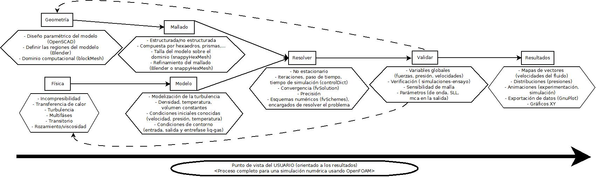
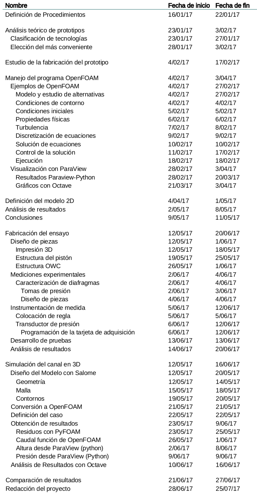
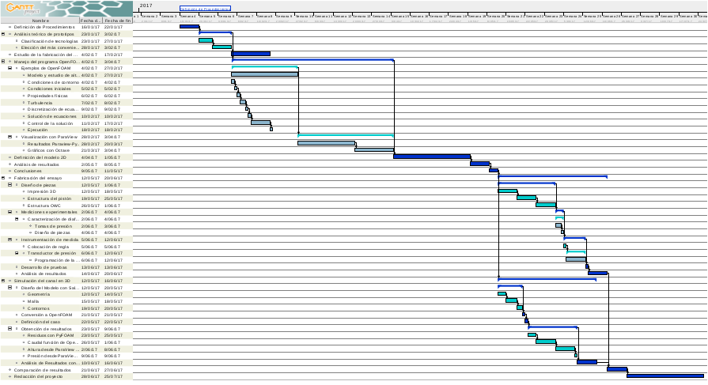

#2 DIAGRAMA DE GANT

Al comienzo de este Trabajo de Fin de Grado, se organizan las tareas de forma coherente, definiendo cada procedimiento. Sin embargo, los conflictos encontrados a la hora de disponer de la herramienta *Star CCM+*, supuso un cambio de planteamiento, sustituyendo esta herramienta comercial por la alternativa libre *OpenFOAM*. 

Tras consultar a algún profesor, conocedor de la herramienta, por la viabilidad de utilizarlo en este estudio, confirman las garantías del código. También, advirten que es un software muy completo pero complejo. El cual exige una curva de aprendizaje notable e implica adquirir ciertos conocimientos en ingeniería de software, trabajar con sistemas operativos de Linux y no tener barreras para trabajar por línea de comandos.

A continuación se presenta un diagrama donde se resumen las fases desarrolladas para abordar un problema de dinámica de fluidos a través de *OpenFOAM*:  

**Figura 2.1**: Diagrama de proceso completo para una simulación numérica usando OpenFOAM.

Teniendo una idea de cómo proceder con las simulaciones, se realizará el estudio de selección de un prototipo para el aprovechamiento de la energía undimotriz. Se prosigue con la fabricación de la maqueta para la experimentación en el laboratorio de fluidos de la escuela. Y para finalizar, se realiza una comparación de los resultados de las simulaciones por ordenador, con las mediciones reales ensayadas. 

Entonces, las tareas a completar para la elaboración del proyecto se pueden desglosar en las siguientes:

**Tabla 2.1**: Proceso del proyecto, exportado desde *GanttProject*.

De la tabla anterior se obtienen un total de 52 tareas a realizar entre el 16 de enero de 2017 y el 26 de julio de 2017. Asimismo, en la siguiente imagen se representa el diagrama de estas tareas:

**Figura 2.2**: Diagrama de Gantt del proceso del proyecto.

Los plazos establecidos son orientativos, ya que tanto en alguna de las tres fases de las simulaciones (preproceso, procesado y postproceso), como en las adaptaciones del ensayo, es muy probable encontrarse con dificultades. Además, dada la temprana madurez de estas técnicas la información, a veces, resulta difícil de encontrar y, en otras, se da con la solución por prueba y error.