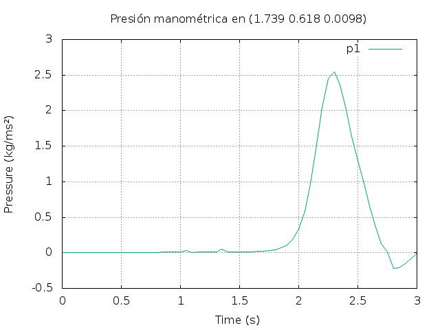

CANAL 2-D
===

Este caso, como ya se ha mencionado, es el resultado de las pruebas realizadas con anterioridad, tanto en el laboratorio como con la simulación de varios casos, donde se fueron implementando utilidades y funciones de ejemplos de OpenFOAM. A continuación se presenta la estructura del caso: 

```
+ <case>
-+ 0
--- alpha.water
--- alpha.water.orig
--- epsilon
--- k
--- nut
--- nuTilda
--- p_rgh
--- U
-+ constant
--- g
--- transporProperties
--- turbulenceProperties
-+ system
--- blockMeshDict
--- topoSetDict1
--- topoSetDict2
--- topoSetDict3
--- setFields
--- fvSchemes
--- fvSolution
--- controlDict
--- singleGraph
--- probes
```


## Definición del caso

- Objetivos planteados:

  - Llenar el canal hasta sobrepasar la altura de la entrada de agua a la cámara. Esto hará que la caida de agua y entrada en la cámara no sea tan brusca y se pueda medir adecuadamente la presión a la salida.
  - Obtener la altura media del volumen de agua, dentro de la cámara.
  - Hallar el flujo de salida a través del diafragma.
  - Calcular el valor de la presión manométrica aguas arriba del diafragma.

- Preparación del modelo/Definición de *blockMeshDict*

  - En este caso la malla definida, es estructurada y hexaédrica, compuesta por 7 bloques y una anchura de celda de aproximadamente $2 mm$. 

  - Se definen los siguientes contornos: *leftWall, rightWall, lowerWall, atmosphere, aoutflow, topWall, defaultFaces*.

  - Las dimensiones expresadas por las posiciones de los vértices se multiplican por 0,001 para convertirlas a metros, el orden también es importante, ver [User Guide: 5.3 Mesh generation with clockMesh](https://cfd.direct/openfoam/user-guide/blockmesh/), a continuación se definen las medidas consideradas:

    

    **FiguraX**: Imagen con la representación de las medidas mínimas necesarias.

    ​

- Propiedades físicas:

  - Las propiedades del agua se mantienen como en el caso *"damBreak"* donde la *viscosidad cinemática `nu`* se definía como $1\times10^{-6} m^2/s$ y la *densidad (`rho`)* de $1000 kg/m^3$. 
  - En cambio para el aire se establece una $\nu=1,5 \times ^{-5} m^2/s$ y una $\rho=1.2kg/m^3$.

- Condiciones iniciales:

  - Se comprueba que los contornos definidos en *blockMeshDict* correspondan con los definidos para cada variable principal implicada en el caso.

  - Para no tener que complicar el modelo en exceso, se incluye la utilidad [TopoSet](https://openfoamwiki.net/index.php/TopoSet), que permitirá añadir la pared que delimitará la cámara (con una abertura de $25mm$ en *"y"* para dejar pasar el agua) y el diafragma (representado por una rendija rectangular de $19,6mm$ en *"x"*) en la parte superior de la chimenea. 

    Por tanto, se generan tres diccionarios, ubicados en <./system/>, de forma que las celdas comprendidas en los prismas definidos (como en el diccionario *setFieldsDict*) se conviertan en paredes (medidas expresadas en metros):

    - Pared vertical: `(1.693 0.1 0) (1.699 0.325 1)`.  

    - Pared diafragma izquierda: a=`(1.7292 0.639 0)` b=`(1.73275 0.641 1)`.

    - Pared diafragma derecha: c=`(1.74525 0.639 0)` d= `(1.7488 0.641 1)`.

      

      **FiguraX**: Representación del diafragma, colocado en la parte superior del tubo de salida.

      ​

  - La condición inicial del volumen de agua se define mediante dos prismas, uno hasta la compuerta (a $600mm$ en *"x"* y $220mm$ en *"y"*); y el otro sobrepasando la entrada de agua a la cámara (hasta una altura en el canal de $45mm$), expresado en el diccionario *setFieldsDict* (en metros):

    - Volumen1= `(0 0 -1) (.60 .22 1)`.
    - Volumen2= `(.60 0 -1) (1.779 .12 1)`.

- Obtención de resultados:

  - Las funciones introducidas en <./system/controlDict> servirán para hallar un fichero con los valores de la presión en un punto a lo largo del tiempo; así como, el flujo a través del diafragma.

    - El punto para medir la presión se obtiene del ensayo, más adelante se detallará. Por otro lado, el centroide más aproximado que corresponda a la ubicación se puede hallar con la función `singleGraph`, donde se estima un punto de inicio y otro final para hallar los valores en los centroides intermedios (se guardan en directorios separados por el paso del tiempo). En este caso el punto definido en el diccionario <./system/probes>, expresado en metros, es: `(1.739 0.618 0.0098)`.

      

      FiguraX: Boceto que representa el punto de medición de la presión.

      ​

    - La función para hallar el flujo de salida (*outletFlux*) se determina en el propio *controlDict*, donde se define el campo a calcular `rhoPhi`($\frac {kg}{m^3} \frac {m}{s}= \frac {kg}{s} · \frac {1}{m^2}$) y sobre qué región `outflow`. Estos resultados se guardarán a lo largo del tiempo en un solo fichero.

  - La altura del agua dentro de la cámara se determina una vez simulado el caso, a partir de un *script* generado en lenguaje de *Python* y ejecutado desde ParaView. Este *script*, completamente explicado en [ali-ramezani/OpenFOAM-Tips](https://github.com/ali-ramezani/OpenFOAM-Tips), se genera desde la opción *Tools/Start Trace* del menú de ParaView; realizando los pasos de acontinuación; y volviendo al menú, a *Tools/Stop Trace*. 

    - Abrir desde *ParaView* el fichero *a.foam* del caso (fichero vacio que sirve para post-procesar los resultados de las carpetas de cada paso del tiempo desde ParaView. Al ejecutar `paraFoam` este fichero se genera automáticamente para mostrar los resultados; en cambio, si se abre *ParaView* se tendrá que crear a parte).
    - Trasladar la información a los puntos usando el filtro *CellDataPointData*.
    - Se realiza un corte en el plano *"y"* en la posición [1.699, 0.3, 0.05] donde comienza la cámara.
    - Crear un contorno para *alpha.water=0.5*, donde se encuentra la interfase.
    - Añadir un nuevo escalar que almacene los datos del nivel del agua.
    - Integrar el contorno de la superficie 3D para obtener un valor promedio del nivel del agua.

    Se dejan los campos mínimos necesarios para obtener la altura de la SLL, ya que no se requiere la visualización gráfica. Finalmente, se añaden al *script* las ordenes convenientes para guardar en un fichero CSV el resultado de la división *ylevel/Area* a lo largo del tiempo. 


## Ejecución del caso

El procesado se puede realizar ejecutando el *script* `Allrun` donde se describen las siguientes instrucciones:

1. Mediante la orden `blockMesh`, se descompone el dominio en sus tres ejes por hexaedros y se escriben los datos de los puntos, caras, celdas de la malla. 

   

   **FiguraX**: Representación de los vértices y bloques del modelo.

   ​

2. ​La adición de las diferentes paredes se implementa como en el ejemplo de <$FOAM_run/multiphase/interFoam/les/nozzleFlow2D>:

   ```
   for i in 1 2 3
   do
       runApplication -s $i \
           topoSet -dict system/topoSetDict${i}

       runApplication -s $i \
           subsetMesh -overwrite c0 -patch internalWalls
   done
   ```

3. La condición inicial del agua se agrega mediante la orden: `setFields`

4. Finalmente, se ejecuta `interFoam &` en segundo plano para lanzar, al mismo tiempo, la orden `pyFoamPlotWatcher.py log.interFoam`, la cual obtiene del registro los residuos de las variables principales.

   

   **FiguraX**: residuos del caso ejecutado. [/gea-waves/of-run/canal2Dowc19-12-19]


**FiguraX**: Imágenes de la visualización del caso desde *ParaView*. [/gea-waves/of-run/canal2Dowc19-12-19]

////les añado el filtro Glyph-U???????

## Resultados obtenidos

Una vez ejecutado el caso se pueden obtener los siguientes resultados:

1. Del fichero <./log.blockMesh> se puede hallar:

   - Número de celdas: 121.190
   - Dominio (*boundingBox*) en [m]: (0 0 0) (1.779 0.641 0.0196)

2. Para ejecutar el script de *Python* y hallar la altura del nivel de agua en la cámara:

   - Completar de forma adecuada los datos de entrada, al comienzo del *script*.
   - Ejecutar el *script* desde ParaView en *Herramientas/Python Shell/Ejecutar script*.

   El archivo de salida se guarda en la carpeta del caso, listo para trazar el gráfico desde una herramienta indicada para ello, en este caso se utiliza un *script* <./RunWL> para generarlo automáticamente desde Gnuplot: 

   

   **Gráfica/FiguraX**: Representación gráfica del nivel del agua dentro de la cámara a lo largo del tiempo.

   ​

3. La presión manométrica en el punto mencionado, se escribe en el fichero <./portProcessing/probes/0/P>. No obstante, el valor de ésta es negativo, con lo que se utiliza un *script*  generado en *ParaView* para hallar esta medida. 

   De forma análoga al proceso de obtención del nivel de agua dentro de la cámara, desde ParaView se guardan los siguientes pasos en un *script* <./prgh.py> que luego, habrá que ejecutar, para escribir la solución a lo largo del tiempo:

   - Desde el menú de *ParaView* *Tools/Start Trace*.
     - Abrir el fichero *a.foam*.
     - Trasladar la información a los puntos con el filtro *cellDataToPointData*.
     - Crear un punto de muestreo *probeLocation* en {1.739, 0.618, 0.0098}.
     - Aplicar el filtro *Calculator* a la variable *p_rgh*.
   - Volver al menú y seleccionar *Tools/Stop Trace*, para guardar estos pasos en el *script*.

   Para guardar los resultados a lo largo del tiempo se modifica la parte final del *script* teniendo como referencia el anterior y resolviendo los errores con las respuestas del foro de la comunidad.

   

   Gráfica/Figura X: Medida de la Presión manométrica a lo largo del tiempo. [/gea-waves/of-run/canal2Dowc19-12-19]

4. Los resultados del caudal a través del diafragma se escriben durante la simulación en <./postProcessing/outletFlux/0/surfaceRegion.dat>, para gráficarlos se puede ejecutar el *script* <./RunPlotFlow>:


​	Gráfica X: Medida del caudal a través del diafragma.


## Conclusiones

Los valores del caudal y presión manométrica obtenidos, resultan muy bajos, con lo que se realiza una segunda prueba, variando la anchura del modelo de $19,6 mm$ a $80 mm$. Logrando un aumento del caudal y una disminución en la presión manométrica, como se puede apreciar en la siguiente imagen:


**Gráficas XX y XX**: Presión manométrica aguas arriba del diafragma y flujo de aire a través del mismo.


Aunque sea un caso en 2-D, OpenFOAM siempre opera en 3-D, las variaciones del volumen de agua al modificar la anchura del modelo resultan significativas para la solución. Junto con esto, también, se han realizado diversas simplificaciones en el modelo (p.e. las superficies curvas son convertidas a rectangulares), por ello los resultados no resultan muy convincentes. En vez de tratar de adaptar estos valores, se concluye que será necesario realizar el modelo en 3-D, para que la solución, a la hora de compararla con la obtenida en el ensayo, no difiera en exceso.


