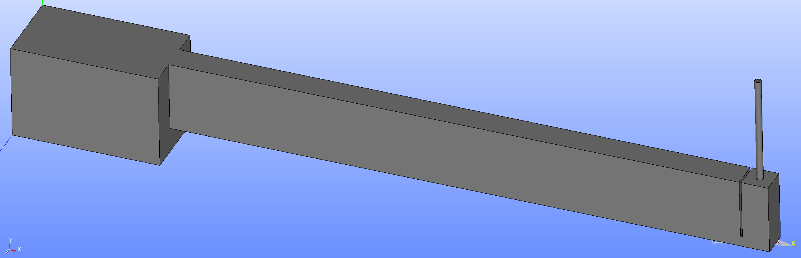
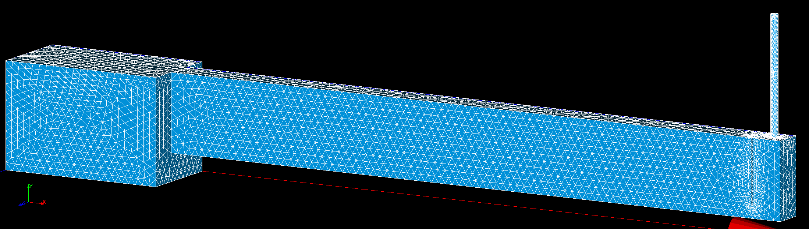
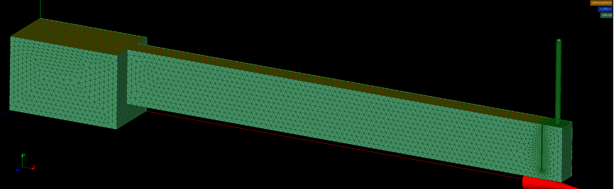
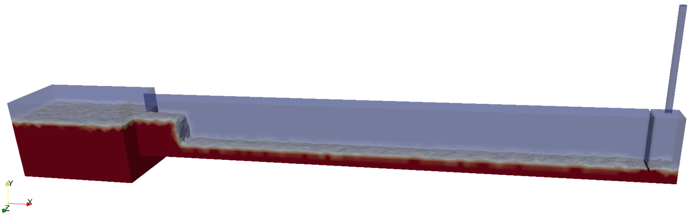

# CANAL 3-D

Tal y como se ha descrito anteriormente, el caso en 2-D no puede emplearse para comparar los resultados con los experimentales, puesto que el modelo generado contiene varias simplificaciones (p.e. las superficies curvas se supusieron rectangulares) y, además, al tratarse de un modelo a pequeña escala, las variaciones del volumen de agua resultan significativas al modificar la anchura del modelo. En vez de tratar de adaptar estos resultados, se concluye que será necesario realizar el modelo en 3-D.

Entre las herramientas descritas en el apartado [XXDescripción de herramientas] se experimenta con "snappyHexMEsh" "cfMesh" y "Salome", los tres ofrecen mallados automatizados, los dos primeros están escritos en el mismo lenguaje que OpenFOAM, en cambio el tercer software se asemeja a un programa de CAD, dispone de interfaz gráfica e implementa diferentes algoritmos para realizar el mallado.

En un primer lugar se trató de alcanzar la solución con los dos primeros, dado que por el lenguaje en el que están escritos los archivos ocupan menos, una vez definidos tardan menos en procesar la solución y consumen menos memoria. No obstante, resulta más complicado detectar los errores que se produzcan. Por ello, *1, finalmente se generó a partir de Salome.

*1 a pesar de que se hubieran ejecutado exitósamente para casos más sencillos

El caso final se obtiene una vez alcanzado el modelo de ensayo deseado, adaptando las medidas lo máximo posible a la disposición real del ensayo, a parte se realizan diferentes pruebas variando el diámetro del diafragma (8-9,5-11-12,5-14-15,5)mm.

Dado que el aparáto de medida de la presión está limitado a 100Pa, para preservar su funcionamiento se ensayarán los diafragmas que no sobrepasen dicha medición.

A partir de las simulaciones, se comprueba que para el diafragma de diámetro 12,5 mm se obtiene una presión por encima de 120Pa. Por ello, se añade el caso para un diafragma de diámetro 13 mm.


## Generación del modelo

Para comenzar, se genera un modelo que sirva de base para realizar las diferentes pruebas variando el diámetro del diafragma.

Aunque se pueda importar la geometría generada en STL, como se tienen superficies curvas, el número de fragmentos en los que se descompone es demasiado alto para procesar tanta información.¿? donde apunte esto mismo//


- Geometría creada desde la misma herramienta:

  tank (.44 .285 .236)

  canal (1.786 .21 .08) -> translate (.44 .075 0.078<0.236/2-0.08/2>)

  chamberWall (.006 .178 .08) -> translate (2.14<2.146-0.006> 0.107<0.075-0.032 > 0.078)

  chimney (R=0.0098 H=.321) -> rotate (-90 0 0) 90º reverse, axis 'X'; translate (2.186<2.226-0.08/2> .285 .118<0.236/2>)

  diafragma (R=0.00625 H=0.002) -> rotate(-90 0 0); translate (2.186 .604<0.285+.321-.002> .118)

   Boolean operation: 

  - Cut (Main obj-> canal; Tool Obj-> chamb. wall)
  - Cut (Main obj-> chimney; Tool Obj-> diaf)
  - Fuse (Tank, cut1, cut2)













geometría

mallado

contornos


setFields: nivel de agua al inicio


water_level.py

en vez de probeLocation -> p_rgh.py

flowRate


canal3D-salome
===

- Geometría creada desde la misma herramienta:

  tank (.44 .285 .236)

  canal (1.786 .21 .08) -> translate (.44 .075 0.078<0.236/2-0.08/2>)

  chamberWall (.006 .178 .08) -> translate (2.14<2.146-0.006> 0.107<0.075-0.032 > 0.078)

  chimney (R=0.0098 H=.321) -> rotate (-90 0 0) 90º reverse, axis 'X'; translate (2.186<2.226-0.08/2> .285 .118<0.236/2>)

  diafragma (R=0.00625 H=0.002) -> rotate(-90 0 0); translate (2.186 .604<0.285+.321-.002> .118)

   Boolean operation: 

  - Cut (Main obj-> canal; Tool Obj-> chamb. wall)
  - Cut (Main obj-> chimney; Tool Obj-> diaf)
  - Fuse (Tank, cut1, cut2)


- Definición de contornos:

  Primero obtener las caras del modelo -> mediante la opción de `Explode`. 

  Después, crear los grupos de caras que conformarán cada contorno ->`Create new Group` (atmosphere, outflow, allwall). Se aconseja guardar tras este paso.

- Generar el mallado:

  **Tetrahedral**

  `Create Mesh`:

  Mesh type: Netgen 1D-2D-3D.

  Algorithim: Netgen 3D Parameters -> Max=20; Min =2.

  Tetrahedrons: 90991

  Export unv

  - 5-2 -> 1848014
  - 10-2 -> 237880

  Grupos de malla 

  - [Salome to OpenFOAM mesh conversion tutorial](http://staff.um.edu.mt/__data/assets/pdf_file/0016/106144/Salome_to_OpenFOAM.pdf)

------

  **Hexahedral**

- [Body Fitting 3D meshing algorithm](http://docs.salome-platform.org/latest/gui/SMESH/cartesian_algo_page.html)
  - Minimal size of a cell truncated by the geometry boundary. If the size of a truncated grid cell is **Threshold** times less than a initial cell size, then a mesh element is not created.
  - **Implement Edges** check-box activates incorporation of geometrical edges in the mesh.
- [Video Tutorial: Meshing With Body Fitting](https://www.youtube.com/watch?v=4xmSjjoioxI)
  - Mesh type: Hexahedral.
  - Algorithim: Body Fitting.
  - Hipotesis Construction: Body Fitting Parameters. x->f(t)=0.125; y->f(t)=0.125; z->f(t)=0.125 Treshold=1000 and active Orthogonal Axes.
  - Remove > Elements > Set Filter > Add: Geometry type, equal to polyhedra (poliedros en CFD se pueden usar).
  - Conver to/from quadratic.
- [Body fitting mesh forum](http://www.salome-platform.org/forum/forum_10/142218492)
  - A mesh generated by Body Fitting also can be (if Threshold=1 or geometry is a box) structured. Depending on geometry being meshed and on used node spacing the mesh can be Cartesian. In a general case the mesh is **unstructured**.
- [Convert to/from Quadratic Mesh](http://docs.salome-platform.org/latest/gui/SMESH/convert_to_from_quadratic_mesh_page.html)
  - If it is necessary to convert a linear mesh to quadratic or a quadratic mesh to linear. **Convert to bi-quadratic** creates some types of quadratic elements with additional central nodes: TRIA7, QUAD9 and HEXA27 elements instead of TRIA6, QUAD8, and HEXA20 elements respectively. 
  - If it is necessary to place **medium nodes** of the quadratic mesh **on the geometry** (meshed shape). This option is relevant for conversion to quadratic provided that the mesh is based on a geometry (not imported from file). 
- [Does anyone know the different between linear and quadratic elements]https://www.researchgate.net/post/Does_anyone_know_the_different_between_linear_and_quadratic_elements_in_abaqus)
  - *The quad element refers to quadratic shape function and it means as when between 2 points this type of element has been used deformation along the edge follows a quadratic function(ax^2+Bx+c). On the other hand the linear shape function will result in a linear deformation(ax+b) along element. In case of large deformation the quad element has more accurate answer.*
- [Salome body fitting for OpenFOAM case](https://www.cfd-online.com/Forums/openfoam-meshing/142435-salome-body-fitting-openfoam-case.html)
  - [Exporting a salome mesh to OpenFOAM](http://www.salome-platform.org/forum/forum_12/23863165#686106)
    - [python script that exports a mesh to OpenFOAM](https://github.com/nicolasedh/salomeToOpenFOAM)
  - [SketchUp Meshkit extension](http://extensions.sketchup.com/en/content/sketchy-tetgen-tools)
    - [Video Tutorial: Meshkit Tutorial - How to Mesh a Cylinder with SketchUp, MeshKit, and Gmsh](https://youtu.be/On3tg4kCchw)

------

- Convert mesh to openFOAM

  ```
  ideasUnvToFoam filename.unv
  //transformPoints -scale '(0.001 0.001 0.001)'//change from mm to m
  ```

  **NOTE**: change manually constant/polyMesh/boundary: *allwall* `patch -> wall`

- Comprobar si la malla es correcta:

  ```
  checkMesh | tee log.checkMesh
  ```

  ​