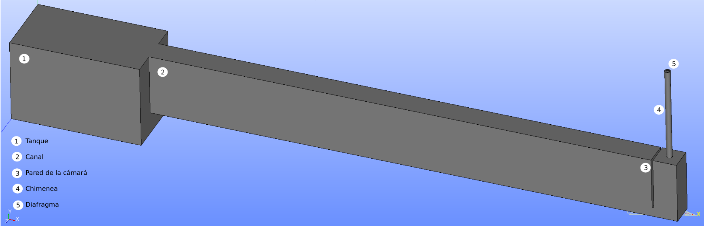
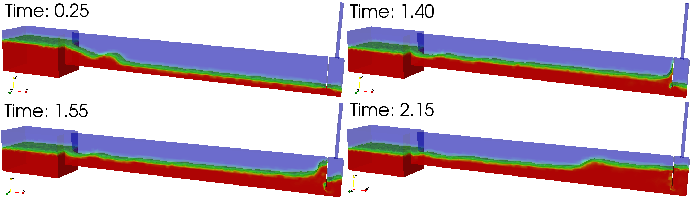
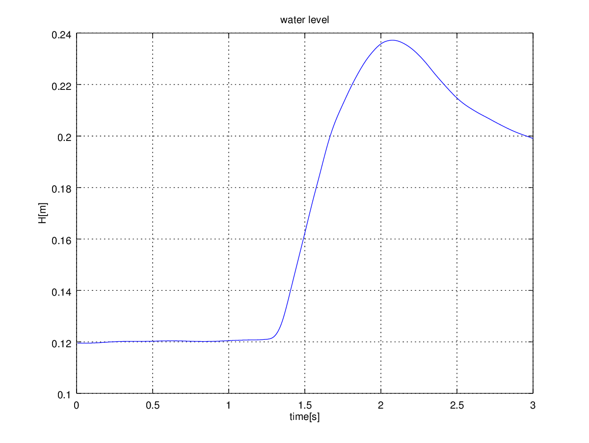
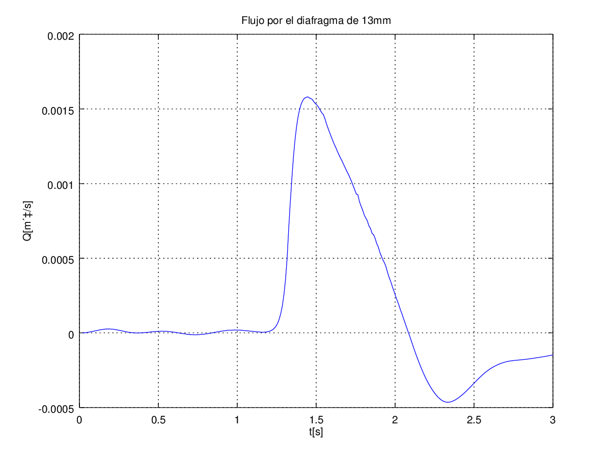
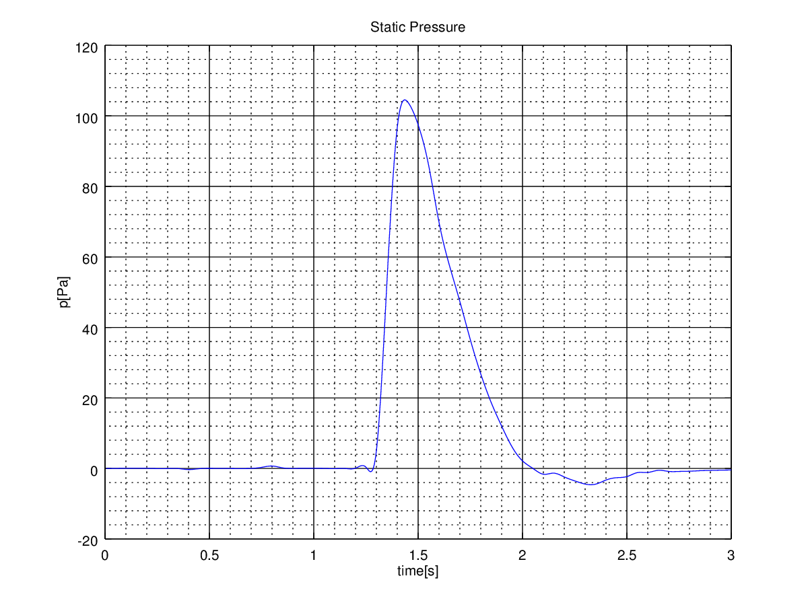
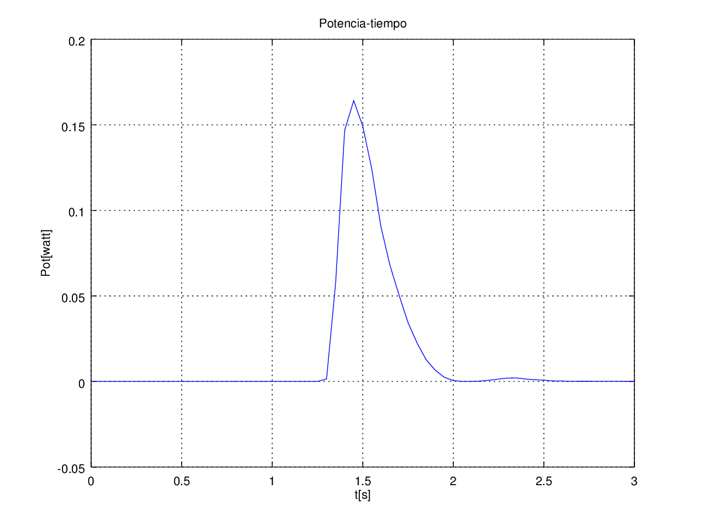
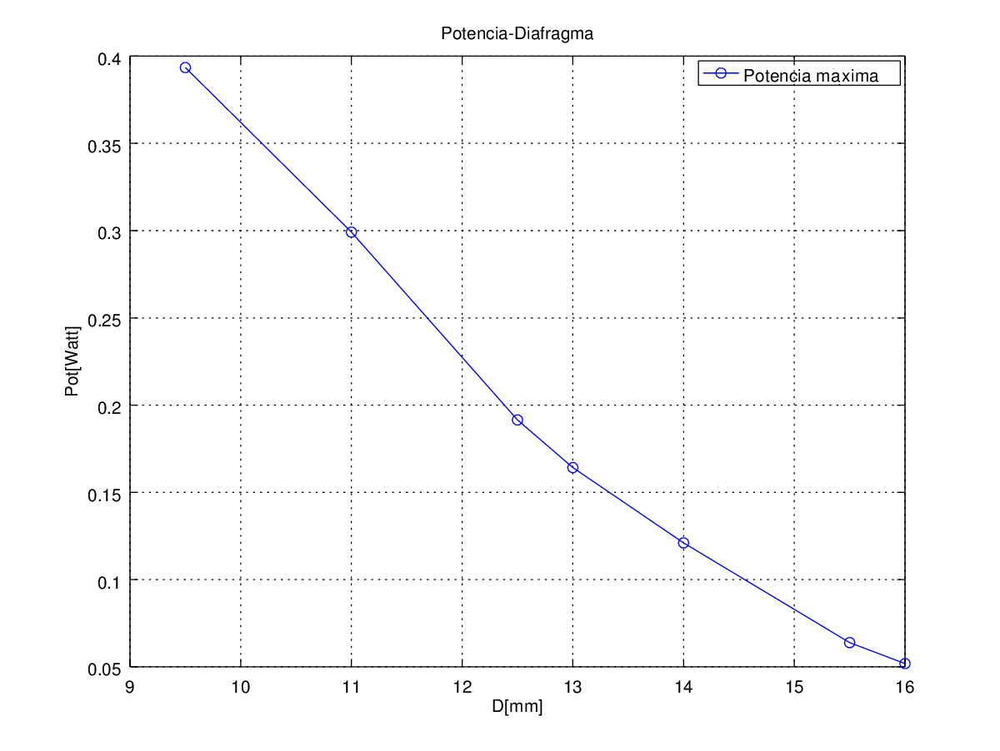
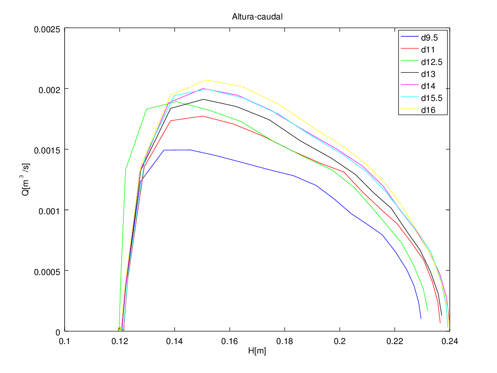

# CANAL 3-D

Partiendo por la definición del caso anterior, se realizan cambios en la geometría para adecuar el modelo a un estudio en 3-D. Entre las herramientas descritas en el apartado [XXDescripción de herramientas] se experimenta con *snappyHexMEsh*, *cfMesh* y *Salome*. Las tres ofrecen mallados automatizados, los dos primeros están escritos en el mismo lenguaje que OpenFOAM, en cambio el tercer software se asemeja a un programa de CAD, dispone de interfaz gráfica e implementa diferentes algoritmos para realizar el mallado.

En un primer lugar, se trató de alcanzar la solución con los dos primeros, dado que por el lenguaje en el que están escritos los archivos ocupan menos, una vez definidos tardan menos en procesar la solución y consumen menos memoria. No obstante, resulta más complicado detectar los errores que se producen. Por ello, a pesar de que se hubieran ejecutado exitósamente para casos más sencillos, finalmente se genera a partir de *Salome*.

La geometría del caso final se obtiene una vez alcanzado el modelo de ensayo deseado, tomando las medidas lo más exactas posibles a la disposición real del ensayo. A parte de esto, se realizan diferentes pruebas variando el diámetro del diafragma **(8-9,5-11-12,5-14-15,5-16)mm**. 

Sin embargo, dado que el aparato de medida de la presión que se va a utiliza en el laboratorio está limitado a 100Pa, para preservar su funcionamiento se ensayarán los diafragmas que no sobrepasen dicha medición. A partir de los resultados que a continuación se describen, para el diafragma de diámetro 12,5 mm se obtiene una presión por encima de 120Pa. Por ello, se añade el caso para un diafragma de diámetro **13 mm**, y así disponer de cuatro pruebas diferentes para comparar con el experimento.

La estructura del caso, que se mantiene del problema anterior realizado en 2-D, es la siguiente:

```
+ <case>
-+ 0
--- alpha.water
--- alpha.water.orig
--- epsilon
--- k
--- nut
--- nuTilda
--- p_rgh
--- U
-+ constant
--- g
--- transporProperties
--- turbulenceProperties
-+ system
--- setFields
--- fvSchemes
--- fvSolution
--- controlDict
```

A esta se le añade el modelo generado a partir de Salome y convertido a formato OpenFOAM a través de una orden por terminal, detallada en [User Guide: 5.5 Mesh conversion](https://cfd.direct/openfoam/user-guide/mesh-conversion/); así como, los ficheros necesarios para extraer los resultados.


## Definición del caso

- Objetivos del caso:
  - Obtener una solución que se aproxime lo máximo posible al ensayo real que se realizará en el laboratorio.
  - Hallar la altura del agua dentro de la cámara; la presión manométrica aguas arriba del diafragma; y el caudal a través del diafragma. A partir de estos valores, se define la potencia para cada diafragma, como una forma equivalente de representar lo que resultaría colocando una turbina.

- Generación del modelo a partir de *Salome*:

  1. Para comenzar, se genera un modelo que sirva de base para realizar las diferentes pruebas variando el diámetro del diafragma. Aunque se permita importar un modelo en STL, como se tienen superficies curvas, el número de fragmentos en los que se descomponen estas superficies es demasiado alta para asociarlas a una misma región o contorno. Por ello, se guarda la geometría <gea-waves/of-dsgn/salome/modl-d.hdf>, generada desde la misma herramienta, hasta la definición del diafragma. A continuación se representan las medidas (en metros) de los objetos definidos: 

     - Tanque: (0.44 0.285 0.236).
     - Canal: (1.786 0.21 0.08), con una translación de (0.44 0.075 0.078<0.236/2-0.08/2>).
     - Pared de la cámara: (.006 .178 .08), con una translación de (2.14<2.146-0.006> 0.107<0.075-0.032 > 0.078).
     - Chimenea: (R=0.0098 H=0.321), con una rotación de (90 0 0) y revertido 90º respecto del eje 'x'; y una translación de (2.186<2.226-0.08/2> 0.285 0.118<0.236/2>).

  2. A partir de aquí, se repeten los pasos para cada diafragma, tomando como ejemplo el de diámetro **13mm**. Por un lado, se termina la geometría del modelo con la definición del diafragma y, por otro, se realizan las operaciones de cortes y uniones necesarias:

     - Diafragma: (R=0.0065 H=0.002), con una rotación de (-90 0 0); y una translación de (2.186 .604<0.285+0.321-0.002> 0.118).

     Operaciones booleanas:

     - Corte para definir la pared de la cámara: Cut (Main object- canal; Tool Object-> chamber wall).
     - Corte para implementar el diafragma: Cut (Main object-> chimney; Tool Object-> diaf).
     - Unión: Fuse (Tank, cut1, cut2).

     Dando como resultado la siguiente imagen:

     

     ​

     **FiguraX**: Representación del modelo del caso. [gea-waves/of-dsgn/salome/modl-d13.hdf]

     ​

  3. Definición de contornos:

     En este caso, la definición de los contornos que conformarán el modelo, también se definen desde la propia herramienta:

     - Primero se obtienen las caras del modelo, mediante la opción `Explode`. 
     - Después, se crean los grupos de caras, que conformarán cada contorno (*atmosphere, outflow, allwall*) desde el menú seleccionando `Create new Group`. Se aconseja guardar tras este paso <gea-waves/of-dsgn/salome/modl-d13.hdf>.

  4. Generación de la malla:

     Se analizan diferentes alternativas para el mallado, implementadas en la herramienta. De entre ellas, como el dominio tiene partes curvas, la descomposición más sencilla, resulta la tetraédrica, la cual se realiza mediante el algoritmo *Netgen*. Accediendo desde el menú a la opción `Create Mesh`, se define con los siguientes parámetros:

     - Tipo de malla: Tetraédrica.
     - Algoritmo: Netgen 1D-2D-3D.
     - Hipótesis: Netgen 3D Parameters; con unas dimensiones de las celdas Max=0.020 y Min =0.002; y un refinado fino.

     Tras computar la malla para el caso de ejemplo, el número de celdas es de: **90710 tetraedros**. 

  5. Exportar la malla junto con los contornos:

     Antes de exportar la malla, será necesario reconocer los contornos antes definidos, con la creación de grupos de malla desde la geometría, tal y como se explica en el tutorial [Salome to OpenFOAM mesh conversion tutorial](http://staff.um.edu.mt/__data/assets/pdf_file/0016/106144/Salome_to_OpenFOAM.pdf).

     Entonces, para definir estos contornos sobre la malla creada, se selecciona desde el menú, la opción `Create Groups from Geometry` y se especifica el grupo de caras correspondiente a cada contorno, el resultado final se puede apreciar en la siguiente imagen:  

     

     **FiguraX**: Mallado y contornos del modelo (*atmosphere, allwall, outflow*). [Fuente: gea-waves/of-dsgn/salome/mesh-d13.hdf]

     ​

     Una vez hecho esto, en el árbol de objetos se puede observar que dentro de la malla definida, se encuentran los contornos generados. Finalmente, se exporta la malla, junto con los contornos, a formato UNV, el cual es compatible con OpenFOAM.

  6. Se añade al caso el modelo exportado a UNV y se convierte a formato de OpenFOAM mediante la siguiente orden por terminal:

     ```
     ideasUnvToFoam filename.unv
     //transformPoints -scale '(0.001 0.001 0.001)'//change from mm to m
     ```

     Tras este paso, hay que modificar manualmente la característica de la pared desde <./constant/polyMesh/boundary>, para la región *allwall*: `patch -> wall`.

- Condiciones iniciales:

  La condición inicial del agua, descrita en <./system/setFieldsDict>, se establece mediante la diagonal definida por dos puntos, los cuales constituirán el rectángulo, cuyas celdas contendrán agua:

  - Rectángulo 1: (0 0 -1) (0.6 0.22 1)
  - Rectángulo 2: (0.6 0 -1) (2.226 0.12 1)

  Las dimensiones no importa que sobrepasen las medidas del dominio, ya que sólo se describirán con agua las celdas que se encuentren sobre el modelo y no resultará en errores. 

  

  **FiguraX**: Representación del problema en el instante inicial. [Fuente: gea-waves/of-run/canal/owcD13]


## Ejecución del caso

La ejecución de este caso se puede realizar mediante el *script* <gea-waves/of-run/RunCase.sh>, o bien con <gea-waves/of-run/set_display.sh> si se ejecuta desde *Docker* con Windows 10. Las instrucciones descritas en los mismos, corresponden a lo siguiente:

1. Comprobar si la malla antes creada es correcta:

   ```
   checkMesh | tee log.checkMesh
   ```

2. Definir la condición inicial del volumen ocupado por agua con la orden: 

   ````
    setFields > log.setFields
   ````

3. Procesar el caso con la orden: 

   ```
   interFoam > log.interFoam &
   ```

   La entrada `&` ejecuta el proceso en segundo plano, de esta forma se pueden monitorizar los residuos en tiempo real, con las librerías y *scripts* necesarios escritos en *Python*, ver [Contrib/PyFoam](https://openfoamwiki.net/index.php/Contrib/PyFoam#Runner-Utilities):

   ````
   pyFoamPlotWatcher.py log.interFoam
   ````

   ​



**FiguraX**: Capturas de la visualización del caso, con la representación de la fracción de agua.  


## Resultados

De forma análoga al caso en 2-D, el flujo de salida a través del diafragma se obtiene mediante la función *outletFlux*, definida en <./system/controlDict>, durante la simulación. La altura y la presión se hallan desde *ParaView* ejecutando un *script* de *Python*; y a partir de estos valores se consiguen diferentes formas de representar la solución por medio de *Octave*. 

Por tanto, se añaden al caso los siguientes ficheros para la obtención de los resultados tras el procesado de la solución:

```
-- prgh.py
-- water_level.py
-- WL.m
-- Prgh.m
-- QT.m
-- potT.m
¿-- HQ.m?
```


1. Altura del nivel del agua dentro de la cámara:

  Descrito en el caso en 2-D, este resultado se obtiene ejecutando el *script* <./water_level.py> desde el menú de *ParaView* (Tools>Python Shell), el cual guarda los resultados en la carpeta del caso <./waterlevel.csv> y se grafica mediante un *script* realizado desde *Octave*. 

  Debido a que las operaciones necesarias (p.e. la integración de los valores de la altura del agua para hallar la media) se realizan en el *script* de *Python*, las instrucciones desde Octave, se resumen en: definir una matriz que contenga la tabla de valores, siendo el vector 'x' el tiempo y el 'y' la altura, y graficar directamente estos datos.

  

  **GráficaX**: Altura del nivel del agua dentro de la cámara. [Fuente; gea-waves/of-run/owcD13]

  ​

2. Caudal de salida:

  La función definida en el diccionario <./system/controlDict> es la siguiente:

  ```
  functions
  {
   outletFlux
      {
          type            surfaceRegion;
          libs ("libfieldFunctionObjects.so");
          writeControl   timeStep;
          log             true;
          // Output field values as well
          writeFields     false;
          regionType      patch;
          name            outflow;
          operation       sum;

          fields
          (
              rhoPhi
          );
      }
  ```

  A lo largo de la simulación, esta función calcula el valor de $\text rhoPhi=\frac {kg}{m^3} \frac {m}{s}= \frac {kg}{s} · \frac {1}{m^2}$, es decir, el caudal másico por unidad de área, y se guarda en <./postProcessing/outletFlux/0/surfaceRegion.dat>. 

  Para obtener la gráfica, se prepara un *script* desde *Octave* <./QT.m>, donde se leen los datos (del caudal y del tiempo) y se guardan en una matriz. El valor del caudal se da como caudal másico, luego se divide entre $\rho=1,21kg/m^3$ para conseguir la unidad del Sistema Internacional (S.I.) [$m^3/s$]. Por último, se representan los valores del paso del tiempo respecto del caudal.

  

  **GráficaX**: Caudal a través del diafragma. [Fuente: gea-waves/of-run/owcD13]


3. Presión estática:

  La presión manométrica aguas arriba del diafragma, al igual que en el caso en 2-D, se logra de forma automatizada mediante el *script* <./prgh.py> ejecutado desde *ParaView*. De este fichero se modifican los campos correspondientes a la carpeta del caso a la que se debe apuntar y se indica el punto de medición correspondiente, detallado en el ensayo, [2.186, 0.582, 0.118]m. Los resultados se guardan en <./rghPressure.csv> donde la variable calculada *P_rgh*, definida en el código de OpenFOAM en <OpenFOAM/applications/solvers/multiphase/interFoam/pEqn.H>, tiene unas unidades de [$kg/ms^2$] lo que es lo mismo que [*Pa*]. Como en los casos anteriores a partir de *Octave* se grafican.

  

  **GráficaX**: Presión manométrica en el punto indicado. [Fuente: gea-waves/of-run/owcD13]


4. Potencia teórica obtenida:

  La potencia se calcula a partir de la ecuación: $Pot=\Delta P·Q$, como estos valores son conocidos, se utiliza *Octave*  para automatizar la solución del gráfico en base a los siguientes critérios:

  - El caudal másico se divide entre $\rho=1,21kg/m^3$ para obtener el caudal en [$m^3/s$].
  - El valor de la diferencia de presiones, corresponde a la presión manométrica hallada, ya que el segundo punto se sitúa a presión atmosférica.
  - La dimensión de la matriz para el caudal, por manera en la que se ha obtenido (durante la simulación), tiene más valores intermedios, con lo que se reduce a la dimensión de la presión, la cual contiene los valores para cada paso del tiempo definido.
  - Finalmente, se multiplican los vectores de ambas columnas (presión y caudal) y se grafica respecto del tiempo.

  

  **GráficaX**: Potecia equivalente a la diferencia de presiones por el caudal a través del diafragma.

  ​


## Conclusiones

Como se ha mencionado con anterioridad, a partir de los valores hallados desde *OpenFOAM* y *ParaView*, se obtienen los valores de la potencia para cada diafragma utilizado. A modo resumen, a continuación se presenta la solución de cada caso:

| D [mm] |   $H_{máx}$ [m]   |  $Q_{máx}$ [m³/s]   | $\Delta P_{máx}$ [Pa] | $Pot_{máx}$ [Watt] |
| :----: | :---------------: | :-----------------: | :-------------------: | :----------------: |
|   8    | 0,22454 (t=2,3s)  |  0,001003 (t=1,4s)  |   446,646 (t=1,4s)    |  0,44813 (t=1,4s)  |
|  9,5   | 0,22978 (t=2,20s) | 0,001235 (t=1,45s)  |    318,92 (t=1,4s)    |  0,39346 (t=1,4s)  |
|   11   | 0,23653 (t=2,1s)  | 0,0014654 (t=1,45s) |   204,14 (t=1,45s)    | 0,29915 (t=1,45s)  |
|  12,5  | 0,23275 (t=2,1s)  |  0,0015635 (1,45s)  |   122,4777 (1.45s)    | 0,19149 (t=1,45s)  |
|   13   | 0,23710 (t=2,1s)  | 0,0015795 (t=1,45s) |  103,9481 (t=1,45s)   | 0,16419 (t=1,45s)  |
|   14   | 0,23991 (t=2,05s) | 0,0016529 (t=1,45s) |   73,2271 (t=1,45s)   |  0,12104 (1,45s)   |
|  15,5  | 0,23932 (t=2,05s) | 0,0016492 (t=1,45s) |   38,7349 (t=1,45s)   | 0,063882 (t=1.45s) |
|   16   | 0,23988 (t=2,05s) | 0,0017109 (t=1,45s) |   30,3110 (t=1,45s)   | 0,05186 (t=1,45s)  |

**TablaX**: Resultados obtenidos para cada modelo.


Así mismo, con estos valores se puede representar la potencia por cada diafragma, donde se aprecia que cuanto más pequeña es la apertura del diámetro de la placa, mayor es la resistencia que se opone a la entrada del agua, con lo que el flujo de aire comprimido dentro de la cámara es explusado con mayor presión, provocando una extracción de potencia mayor:



**Gráfica X**: Potencia extraida por cada diafragma [9,5-11-12,5-13-14-15,5-16].


Además, mediante la siguiente gráfica se puede determinar que el volumen de agua, al permanecer invariable para todos los casos, alcanza una altura dentro de la cámara, prácticamente constante. No obstante, se ve algo alterado el máximo valor logrado, ya que la oposición de la salida de aire, provocada por el diámetro de placa más pequeño hará que parte del agua no entre. De forma análoga, el caudal de aire que pasa a través del diafragma, será mayor, cuanto mayor sea el diámetro de la salida de éste:

