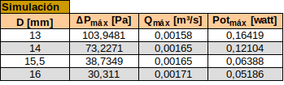
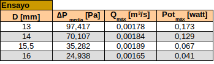
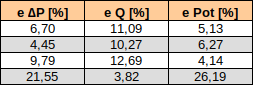
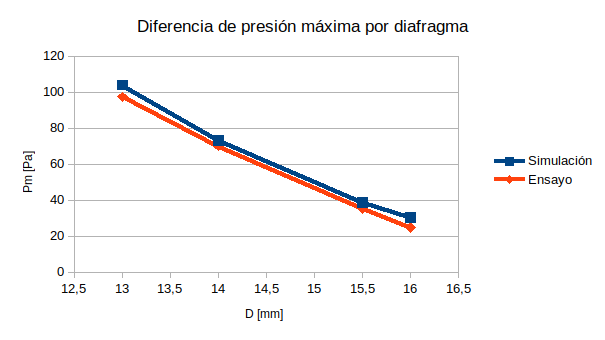
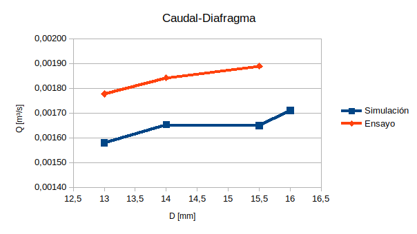
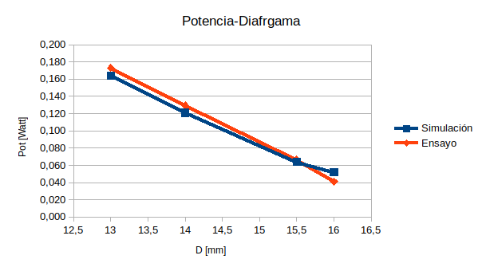

## 1. COMPARACIÓN DE RESULTADOS

En este apartado se lleva a cabo la comparación de resultados entre los obtenidos en las simulaciones CFD y los experimentales. Como ya se ha descrito, las limitaciones geométricas y de los aparatos de medida condicionarán los ensayos para el uso de los diafragmas de diámetros [13-14-15,5-16]mm. Es decir, por una parte el medidor de presión estática está limitado a 100Pa y el diámetro interior de la tubería que hace de chimenea es de 19,6mm. 

Por lo tanto, en las tablas de a continuación, se recopilan los valores obtenidos que se tendrán en cuenta para validar las simulaciones realizadas por ordenador con el canal 3-D del laboratorio:

**Tabla 1.1**: Resultados para la simulación de lo 4 últimos casos.

**Tabla 1.2**: Resultados hallados de la experimentación en el canal del laboratorio.

A partir de esto, se puede calcular el porcentaje de error para comparar cómo de exactos son los valores de las simulaciones por ordenador respecto del valor real medido experimentalmente: 

**Tabla 1.3**: Porcentajes de error entre el ensayo y las simulaciones

A continuación, se analizan los resultados para cada una de las variables:

- Altura del agua dentro de la cámara:

  El resultado obtenido de la altura del agua dentro de la cámara para cada caso, se extrae de la tabla, ya que este valor permanece prácticamente constante independientemente del diafragma que se utilice. 

  Por un lado, para todas las simulaciones, el máximo valor alcanzado es de $0,24m$, a este valor se le resta $0,075m$, valor correspondiente a la distancia desde el origen de coordenadas hasta el fondo del canal, quedando en una altura máxima de $0,165m$. Encambio, para las pruebas ensayadas se tiene una mayor incertidumbre en la exactitud de la medición, tomando como valor medio el rango de $(0,155-0,165)m$.

  Con estos valores, se concluye que los resultados obtenidos por ambas vías, prácticamente resultan iguales.

  ​

- Diferencia de presiones máximas a la salida de la chimenea:

  Por un lado, se comparan los máximos alcanzados por cada diafragma, comprobando que los valores hallados permanecen bastante parejos.

  

  **Gráfica 1.1**: Representación de la máxima presión hallada aguas arriba del diafragma

  ​

  Por otro lado, en la /R/[Gráfica X], además de representar los resultados del ensayo para cada diafragma, se añade la curva de las simulaciones correspondiente a ese mismo rango. Como se puede apreciar, los resultados son bastante satisfactorios, coincidiendo en gran medida, salvo para el caso del diafragma de $16mm$. 

  En este último caso, se supera el 20% del error en la medida. Esto puede ser porque, al ser el diámetro interior de la chimenea de $19,6mm$, el aire apenas se ve comprimido cuando el agua entra a la cámara. Dando lugar a una presión de flujo menos apreciable aún, en el caso de la experimentación.

  OK¿//Asimismo, en el apartado /R/[4.2.2.1 Placas de orificio] se define el rango límite que la normativa establece para la relación de diámetros de $\beta$, del cual, este diafragma, queda fuera. Es probable que para evitar errores en las mediciones, se preven/ía/ga dicho límite.

  ​

- Caudal a través del diafragma:

  Estos resultados son los que más difieren entre sí, aun así la escala es muy pequeña y el error que se da es de alrededor del 10%, esto puede deberse a que en el ensayo no fue posible garantizar un volumen de agua exacto para todas las pruebas. 

  ​

**Gráfica 1.2**: Representación del caudal máximo para cada diafragma

- Potencia en función del diafragma:

  Como para los valores anteriores, estos también se asemejan entre sí en gran medida.

**Gráfica 1.3**: Potencia máxima para cada diagrama

## 2. CONCLUSIÓN FINAL

Teniendo en cuenta los propósito establecidos al comienzo de este proyecto, las fases abordadas y los resultados obtenidos se concluye con lo siguiente:

1. Con este estudio se valida la representación del principio de funcionamiento del prototipo OWC computacional y experimentalmente. 
2. También se valida el uso de las técnicas numéricas por ordenador, mediante el código de OpenFOAM, logrando unos resultados similares a los del ensayo real. 
3. El estudio pretende ser didáctico, se reutiliza un canal del laboratorio de fluidos de (2000x80)mm, donde la generación de la ola aproximándose a la orilla se realiza con el colapso de una columna inicial de agua. Al llegar a la cámara se producen fuertes refracciones, luego la energía de las olas se reparte hasta llegar a estabilizarse. De esta forma, sólo se puede analizar un proceso de compresión del aire en la cámara.
4. Asimismo, se sustituye la turbina WELLS, utilizada en estos casos donde se tiene un flujo bidireccional, por un diafragma. Este se utiliza para hallar la potencia equivalente para el punto de funcionamiento de una turbina en concreto. 
5. Se realiza la caracterización de varios diafragmas, diseñando y fabricando la maqueta de ensayo para ello.
6. Se programa la captura de la presión estática aguas arriba del diafragma para procesarla por ordenador. Para ello, se varía la instalación, conectando el instrumento de medida a una tarjeta de adquisición *Labjack U3*.
7. Se resuelve computacionalmente el problema para flujos multifásicos y se reproduce la superficie libre de líquido para ambas casos, apreciando el movimiento de la interfase agua-aire.  
8. Debido a las herramientas de software de carácter libre utilizadas, se adquiere una idea de cómo funcionan los programas para el cálculo computacional de la Dinámica de Fluidos y se entienden las bases de la metodología numérica empleada. Es decir, se comprende cómo programar los casos y qué algoritmos se emplean para la resolución más adecuada de las ecuaciones de Navier-Stokes usando el método de Volumenes Finitos. 
9. Se comprenden las técnicas CFD, como una herramienta más dentro de la ingeniería asistida por ordenador (CAE, Computer-aided engineering). Mostrando una de entre las muchas posibilidades que ofrecen estos paquetes para simular todo tipo de fenómenos y flujos. Demostrando que los softwares CFD son parte indispensable en procesos de diseño o procesos productivos.  
10. Se abarca cada fase implicada en la resolución de problemas CFD, analizando las herramientas que mejor se adaptan a lo que se desea obtener. Afianzando el razonamiento crítico a la hora de implementar la más conveniente y mejorando las destrezas en el manejo de nuevas herramientas, lenguajes y en la resolución de problemas en general.
11. Se sintetiza y gestiona la información, ofreciendo un primer contacto con la simulación de la dinámica de los flujos por ordenador.
12. Se realiza un análisis de las tecnologías existentes para el aprovechamiento de la energía proveniente del mar. Ofreciendo un enfoque del punto de desarrollo en el que se encuentran y comprendiendo las berreras y aspectos positivos que les rodean.
13. //Se ofrece una visión general del cálculo de las olas y la forma de implementarlas a través del códico de ihFOAM, donde se definen las condiciones de contorno para la generación y absorción del oleaje. El código intenta acercarse al oleaje real con numerosas teorías incluyendo las de Stokes I,II y V, ondas regulares cnoidales y de funciones de corrientes continuas; ondas solitarias de Boussinesq, ondas aleatorias irregulares, de primer y segundo orden; y la réplica del perfil de velocidades para la generación del oleaje con ondas tipo pistón. Le Méhauté, define la teoría de ola más adecuada en función de la altura, profundidad y periodo de onda.

## FUTUROS PROYECTOS

Una vez alcanzada una visión global de las partes implicadas a la hora de simular un caso por ordenador y realizar una maqueta de ensayo, se adquiere una mayor perspectiva de las variantes que se podrían abordar:

1. Las mejoras que podrían aplicarse al experimento en cuestión, de forma que el principio de obtención de energía a partir del prototipo OWC, se aproximase más a la realidad, son:
   - Utilizar un caudalímetro para medir el volumen de agua, a establecer al comienzo de cada pruebas. 
   - Añadir porosidad en el extremo opuesto a la generación del oleaje, para reducir las refracciones producidas.
   - Si se cumplen estos dos puntos, sería posible analizar la succión del aire dentro de la cámara, pudiendo obtener un ciclo de trabajo para una turbina.
   - Teniendo en cuenta la fuerte implicación de los dispositivos electrónicos, necesarios para realizar las mediciones de forma apropiada y facilitar el control de las pruebas, se destaca la importancia de realizar proyectos en colaboración con otras ramas de ingeniería.
2. Dados los continuos avances desarrollados entorno a las maquetas de ensayo disponibles en la escuela, sería interestante validar el prototipo a escalas mayores y bajo diferentes condiciones. Implementando la generación del oleaje de forma continua, con la posibilidad de replicar diferentes teorías de olas.
3. Tras validar los resultados de las simulaciones por ordenador con el caso experimental, se propone el estudio computacional del prototipo OWC a escala real. Aumentando en gran medida los recursos computacionales necesarios y pudiendo ser necesaria la subdivisión del dominio para ejecutar el caso en paralelo. 
4. Ya que en las versiones estables más recientes de OpenFOAM se implementan las condiciones para mallas dinámicas, resultaría atractivo realizar el estudio de una turbina WELLS.   de diferentes formas: 
   - A escala real, con una turbina normalizada para analizar, bajo diferentes condiciones de oleaje, los puntos de funcionamiento óptimos y la potencia total extraída por horas. 
   - Realizar Teniendo como referencia las explicaciones del estudio  [P. González Ramos](https://repository.unimilitar.edu.co/bitstream/10654/6683/2/GonzalezRamosPaola2010.pdf), 

Añadir turbina

Escala real

Una vez validado el caso simulado con el ensayo real, se propone hacer el estudio en un canal de dimensiones mayores //aumentando,así, la escala del modelo y permitiendo experimentar con el prototipo OWC valores más altos de potencia extraída

Por otro lado, dado que OpenFOAM contempla la implementación de mallas dinámicas, también sería interesante, añadir una turbina WELLS en la salida. Sería recomendable, primero realizar el caso considerando, solamente, una turbina en un conducto, con un flujo de aire constante en las dos direcciones (succión y absorción). Los problemas de flujos de aire se resuelven con el código `icoFoam` para flujos transitorios laminares e incompresibles, o `simpleFoam` para flujos estacionarios turbulentos e incompresibles. Una vez validado el modelo, podría incluirse  

mallas dinamica turbina exige mechos recursos computacionales

Aparte de esto, visualización en el timepo 
