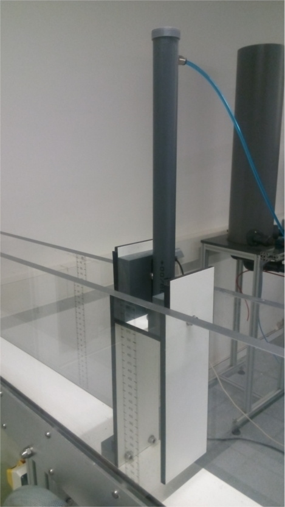

# 1. INTRODUCCIÓN

Una vez hallada una forma aproximada de representar el sistema de captación de energía a través del prototipo de columna oscilante de agua, mediante simulación por ordenador, se procede a idear cómo desarrollarlo en el laboratorio.

Se realiza una búsqueda por la red de los experimentos que se han llevado a cabo para el estudio del prototipo OWC, hallando varias formas para representar su principio de captación de energía. No obstante, para las características concretas que se desean replicar, no se encontraron referencias que se adaptasen completamente al caso. Por ello, se realizan varias modificaciones sobre la marcha y se repitien algunas fases de la experimentación, para lograr unos valores que se ajusten a lo deseado. 

Tal y como se ha mencionado anteriormente, en el laboratorio de Fluidos de la escuela de Ingeniería de Bilbao, se dispone de un tanque de olas y un canal. Ya que no se implementa la generación del oleaje (por su complejidad a la hora de modelarlo), se decide optar por adaptar el canal, dejando el tanque para futuros proyectos. 

En resumen, se requiere definir una columna de agua en el instante inicial (como el caso de referencia "damBreak" para flujos multifásicos) para obtener una ola que recorra un canal. En el otro extremo, una cámara abierta por el fondo, con una chimenea en la parte superior, para representar el principio de captación del sistema OWC.  

El objetivo general será obtener las siguientes variables en el transcurso del tiempo:

1. Altura del agua en el interior de la cámara.
2. Potencia extraida del flujo a la salida de la cámara.

El valor de la potencia, corresponde al caudal que atraviesa por una turbina WELLS, multiplicado por la perdida de presión a su paso. Debido a que /el cálculo de la turbina constituiría otro proyecto,/ se sustituye la turbina por un diafragma, de esta forma se hallará la potencia equivalente para el punto de funcionamiento de una turbina en concreto.

Para hallar el caudal, se descarta la posibilidad de usar un anemómetro, ya que la escala de velocidades es muy reducida como para que este aparato aprecie las variaciones del flujo. Además, al tratarse de un sólo impulso de una ola, no se garantiza la captura del valor máximo. 

Sin embargo, la norma **ISO 5167-2:2003** contempla la medición del caudal de fluidos mediante dispositivos de presión diferencial intercalados en conductos en carga de sección transversal circular. Además, en la **Parte 2** se describen las **placas de orificio**; los detalles sobre la geometria, método de empleo de placas y medición del caudal. También, se condiciona su aplicación para flujos subsónicos, monofásicos, de diámetros comprendidos entre 50mm - 1000mm y números de Reynolds superiores a 5000. Debido a que la salida de aire de la cámara a la chimenea es como máximo de un diámetro de 30mm, implicará realizar el experimento para caracterizar los diafragmas que se usarán.

Con todo esto, se adapta el canal, teniendo en cuenta las siguientes consideraciones y que para el caso particular del canal del laboratório, sólo se utilizará el montaje para esta ocasión, con lo que no se realizarán modificaciones permanentes:   

- Incluir mecanismo para la apertura de una compuerta. Deberá soportar la columna de agua del instante inicial y permitir una apertura lo mas limpia y rápida posible.
- Añadir una estructura que actúe como cámara. La anchura quedará delimitada por las paredes del canal, se debe permitir la entrada de agua por la parte inferior, la salida de aire por la parte superior y que soporte el impacto directo de la ola, pudiendo ser anidada al fondo del canal.
- Colocar una regla en el canal. Centrada en la cavidad de la cámara para captar la media de la altura del agua.
- Acoplar una tubería en la salida de la cámara que haga de chimenea. Perforada para poder realizar la lectura de la presión.
- Fabricación de diferentes diafragmas.

# 2. FUNDAMENTO TEÓRICO

Los instrumentos para medir caudales se llaman **caudalímetros**, caracterizados por medir el flujo instantáneo, que puede variar de un momento a otro, [C. Mataix](Libro: "Mecánica de Fluidos y Máquinas Hidráulicas"; Claudio Mataix; 2ª Edición; 1982; Madrid).

Para el ensayo se dispondrá un flujo cerrado, un **elemento deprimógeno**, es decir, un elemento que provoca una caída de presión, y un **manómetro diferencial** para medir la diferencia de presiones. Un fluido que circula por un conducto cerrado experimenta una caída de presión que es funcíon de la velocidad.

Lo característico de una constricción o estrechamiento es que la caída de presión en la misma $\Delta h$ es mayor que la pérdida de carga remanente $\Delta hr$.  Los caudalímetros de constricción más importantes y ya clásicos en la medida de caudales son: el Tubo de Venturi, las toberas y los diafragmas.

## 2.1 Medida de caudal: Diafragma con sensor de presión

El diafragma, es una placa con un orificio de diámetro *d* concéntrico con el eje de la tubería de diámetro *D*. Por su sencillez  de construcción son muy usados para medir caudales tanto en líquidos como en gases. Resultan muy económicos de instalación, pero producen una pérdida de carga que es el 50% de la presión diferencial.

Aplicando Bernoulli para el fluido real, con pérdidas, entre las secciones 0 y 2:
$$
\frac{p_{0}}{\rho g}+z_{0}+\frac{v_{0}^2}{2g}-Hr_{0-2}=\frac{p_{2}}{\rho g}+z_{2}+\frac{v_{2}^2}{2g}
$$
Agrupando los términos de presión estática y cotas, la ecuación anterior queda así:
$$
(\frac{p_{0}}{\rho g}+z{0})-(\frac{p_{2}}{\rho g}+z_{2})=h_{0}-h_{2}=Hr_{0-2}+\frac{v_{2}^2}{2g}-\frac{v_{0}^2}{2g}
$$
Donde $h_0-h_{2}$, es la diferencia de alturas piezométricas entre las secciones 0 y 2.

Las pérdidas $Hr_{0-2}$ pueden expresarse como fracción de la velocidad $v_1$:
$$
Hr_{0-2}=\zeta \frac{v_{1}^2}{2g}
$$
Donde $\zeta$, es el coeficiente de pérdidas.

Como el fluido es incompresible, por continuidad se sabe que el caudal permanece constante, conocidos los diámetros la ecuación de continuidad queda:

$$
v_{0} \frac{\pi D^2}{4}=v_{1} \frac{\pi d^2}{4}=v_{2} \frac{\pi d_{2}^2}{4}
$$
Donde $d_2$ es el diámetro de la *vena contracta*. Por tanto:
$$
v_{0}=v_{1}(d/D)^2
$$
y
$$
v_{2}=v_{1}(d/d_{2})^2
$$
Llamando para simplificar:
$$
\alpha = d/d_{2}, \beta =d/D
$$
Sustituyendo:
$$
h_{0}-h_{2}=(\zeta+\alpha^4-\beta^4)\frac{v_{1}^2}{2g}
$$
Y despejando:
$$
v_1=\frac{1}{\sqrt{\zeta + \alpha ^4-\beta ^4}}\sqrt{2g(h_{0}-h_{2})}
$$

$$
Q=\frac{\pi d^2}{4}\cdot \frac{1}{\sqrt{\zeta +\alpha ^4-\beta ^4}}\sqrt{2g(h_{0}-h_{2})}
$$

$$
Q= A_2 · Cq \sqrt{2g(h_0 -h_2)}
$$

Siendo $A_2$ el área del diafragma y $C_q$ el coeficiente de caudal en función de $m=A_2 /A_1$ y del número de Reynolds.

## 2.2 Fluido real por conductos

Un fluido real posee una determinada viscosidad y consecuentemente, la velocidad de desplazamiento de las partículas de fluido junto a las paredes del conducto es nula y empieza a aumentar a medida que se aleja de la pared hasta alcanzar un valor máximo, como se muestra en la figura:

 

**FiguraX**: Distribución de velocidades en un conducto. [Fuente: [Redes industriales de tubería, bombas para agua, ventiladores y compresores](https://books.google.es/books?id=1k3qRVvyFRcC&pg=PT15&lpg=PT15&dq=tipo+flujo+ventilador+vortices&source=bl&ots=larkAQYJKh&sig=rQpNk3dL46YCj8xKmy6cBY3cqTs&hl=es&sa=X&ved=0ahUKEwjS-frJ3_zWAhWKYVAKHYKhDREQ6AEIVjAM#v=onepage&q=tipo%20flujo%20ventilador%20vortices&f=false)] o [A. Luszczewski]

//[Antoni Luszczewski; "Redes industriales de tubería. Bombas para agua, ventiladores y compresores. Diseño y construcción"; p8; Ed: Reverte]//

Así mismo, el parámetro primario que afecta a la transición de un flujo turbulento es el número de Reynolds:

|      INTERVALO      | COMPORTAMIENTO DEL FLUJO                 |
| :-----------------: | ---------------------------------------- |
|     0 < Re < 1      | movimiento laminar "lento" altamente viscoso |
|    1 < Re < 100     | laminar, fuerte dependencia del número de Reynolds |
|   100 < Re < 10³    | laminar, es útil la teoría de capa límite |
|   10³ < Re < 10⁴    | transición a la turbulencia              |
|   10⁴ < Re < 10⁶    | turbulento, moderada dependencia del número de Reynolds |
| 10⁶ < Re < $\infty$ | turbulento, débil dependencia del número de Reynolds |

**TablaX**: Comportamientos de los flujos según el número de Reynolds [L.Mataix]

Estos son unos rangos indicativos que pueden variar con la geometría del flujo, la rugosidad de la superficie y los niveles de fluctuación de la corriente a la entrada. La mayoría de los análisis versarán sobre flujos laminares o turbulentos, no siendo recomendable diseñar flujos que operen en la región de transición.

# 3. DESCRIPCIÓN DE EQUIPOS

En este apartado se describen brevemente las partes implicadas en el desarrollo del experimento, así como las adaptaciones que se realizan.

## 3.1 Canal

Consta de una bomba para el llenado, *PUMP CPm 132A*, con un caudal de *20:120 l/min*; y una llave de paso que permitirá ajustar la condición inicial del nivel del agua.

[img canal]

## 3.2 Apertura de la compuerta
Se fabrica una estructura de madera con un acabado impermeable, que se anide al canal y a un cilindro hidráulico. Además se pondrán unas juntas de goma para minimizar las fugas de agua. El pistón, **serie 453** de doble vástago, carrera de 160 mm, **ISO 15552**. Con las características de este modelo se puede realizar un cálculo rápido para conocer la fuerza que sería capaz de realizar:

- Presión de operación: 10 bar.
- Diámetro de POM (polyacetal) de 32 mm a 80 mm, luego la fuerza que es capaz de realizar:

$$
P_G=10 bar\simeq1000kPa=1000kN/m^2 \\
F=P_G·A=1000kN/m^2·[(80^2-40^2)\pi]=20,1kN
$$

Así mismo, del cálculo de compuertas planas se obtiene la fuerza que haría el volumen del agua, considerando el nivel máximo de llenado del canal:

[img diagrama de presiones]
$$
F_P=P_G·A=\frac{h}{2}·\gamma·b·h=9810\frac{N}{m^3}·\frac{0,25^2}{2}m^2·0,08m=24,525N\\
y_{CP}=y_{CG}+\frac{I_{XG}}{y_{CG}·A}=\frac{h}{2}+\frac{\frac{1}{12}b·h^3}{\frac{h}{2}·b·h}=\frac{2h}{3}\\
\sum M_C=0 \xrightarrow{}F_P·y_{CP}=F·0,16\xrightarrow{}F=25,547N
$$
Estos resultados no son direcramente comparables, ya que la fuerza del agua implicaría un momento en el eje del pistón, luego habría que comprobar el esfuerzo de flexión de dicho eje. No obstante, vista su capacidad se considera que está sobredimensionado para la función que va a cumplir, garantizándose también la rápida subida de la compuerta.

[Img pistón]

El accionamiento del pistón se lleva a cabo a través de un programa desarrollado por un profesor del departamento con la herramienta *Ni LabVIEW 2015 SPI*. Para ello se conecta el accionamiento neumático del pistón a una tarjeta de adquisición LabJack U3-Lv (cables naranjas a la entrada VS y los azules a FIO2 y FIO3); se alimenta conectado a una placa con una salida de *24V y 1,1A*; y por último se conecta el inyector de aire a presión.

## 3.3 Cámara
Está fabricada con los mismos materiales que la estructura del pistón, se añaden algunos tacos para facilitar las uniones entre las piezas y aportar una mayor rigidez a la estructura. La longitud del canal queda condicionada por los dos puntos de conexión que se disponen en el fondo del canal, seleccionando el más alejado del origen, para así tener un mayor recorrido para que el agua colapse y se forme la ola.

Por otro lado, la apertura del paso del agua por el fondo, en un principio se definió de 25 mm pero como en caso de querer ajustarse a esa medida habría que reducir la altura total de la cámara, se posiciona dejando 32 mm de paso.

[img cámara]

## 3.4 Chimenea
Se diseña una pieza mediante la impresora 3D para acoplar la tubería, adaptada en el ensayo de caracterización de los diafragmas que a continuación se detalla, a la salida de la cámara. Así mismo, se aprovecha la toma de presión, detallada en el mismo ensayo, para medir la presión estática del aire dentro de la cámara. 

El aparato de medida utilizado para hallar la presión es un "Transductor de presión diferencial" marca *Setra*, **modelo 267**:

- Excitación: 24 VDC/VAC
- Salida: 0-10 VDC
- Serie: 1173078
- Rango: 0-100Pa

Se conecta la salida del aparato de medida y algunas resistencias, en los puertos indicados por un profesor del Dpto., a la misma tarjeta de adquisición LabJack utilizada para el accionamiento del pistón. A través de la herramienta *Ni LabVIEW 2015 SPI*, se adapta el programa para que capture los datos de la presión en el tiempo desde el ordenador.

## 3.5 Diafragmas
La normativa en el apartado **5.1.8 Diámetro del orificio *d*** indica que, éste debe ser en todos los casos mayor que o igual a **12,5mm**. Entonces, se toma el valor mínimo contemplado para el primer modelo de diafragma. 

No obstante, como se ha mencionado en la introducción, el diámetro de salida de la cámara es como máximo de 30mm, luego no se cumplen las condiciones (de diámetros *D* comprendidos entre 50mm - 1000mm) para tomar un coeficiente de descarga ya definido. Por ello, se procederá a la caracterización de diferentes diafragmas para hallar los *Coeficientes de Descarga* correspondientes. 

Aparte de esto, dado que el instrumento para medir la presión sólo puede dar lecturas de hasta 100Pa, se realiza la simulación del caso para comprobar a partir de que diámetro se supera dicha presión. Comprobando que para el diámetro de 12,5mm se superan los 120Pa, entonces, se decide aumentar dicho diámetro y realizar el experimento para los diafragmas: [13-14-15,5-16] mm. Estas piezas se frabrican a partir de una impresora 3-D y se diseñan mediante OpenSCAD.

**FiguraX**: Captura del modelo desde OpenSCAD y boceto del diseño. 

## 3.6 Impresora 3D

Modelo **Prusa i3**, características:
- Tipo de plástico utilizado: **PLA**, hecho a partir de materiales orgánicos y renovables, en el proceso de impresión se usa un diámetro de boquilla (*nozzle*) de 0.4 mm, el diámetro del filamento de 1.75 mm, anchura de capa de 0.2 mm (calidad normal) y densidad de relleno (*infill*) de 15%. Aunque se trate de mejorar la configuración de impresión, este material crea un paso visible entre las capas, luego el acabado superficial suele ser rugoso, pero es bastante resistente, apropiado para el prototipado y perfección de diseños finales.
- Margen de compensación: Para que las medidas resulten exactas a las establecidas y que las piezas encajen correctamente, se aumenta la dimensión de los diámetros interiores 0,4mm. 
- Margen de impresión: x = 215 mm, y = 210 mm, z = 180 mm.  
- Formato de entrada: para definir las características de impresión se utiliza el software CURA del que se obtiene un archivo *.gcode*. Además, este programa necesita que los modelos se importen en formato STL y de entre las alternativas existentes, se selecciona el software paramétrico OpenSCAD. 

# 4. CARACTERIZACION DEL DIAFRAGMA

Tal y como se ha mencionado en el apartado [3.5Diafragmas], el diámetro de salida de flujo de aire por la chimenea es como máximo de 30mm, por lo que no entra dentro de las condiciones contempladas por la normativa para aplicar un *coeficiente de caudal* normalizado.

Las pruebas realizadas hasta llegar al caso final se realizan con materiales reutilizados de otras maquetas del laboratorio, y con la ayuda de varios técnicos de laboratorio, los cuales colaboraron prestando material y realizando las perforaciones necesarias en las tuberías.

## 4.1 Objeto

La elección de un medidor de flujo se ve afectada por la exactitud requerida, el intervalo de medición, el costo, la complicación, la facilidad de lectura o reducción de datos, así como la vida de servicio. /X////Se trata de hallar la forma más simple para llevar a cabo este experimento, reutilizando los materiales disponibles en el laboratorio e incluso, prestado por otros departamentos.

Cuando se tiene una obstrucción en un tubo, aparece un diferencial de presión. Esta caída de presión se puede correlacionar con la descarga mediante una calibración, y después se puede utilizar la curva presión-descarga para determinar la descarga leyendo la presión diferencial. Para ello se necesitará un flujo estable, así la ecuación de Bernoulli y la ecuación de continuidad servirán para determinar la descarga, [C. Mataix].

En el caso del diafragma, las líneas de corriente convergen para formar un área de flujo mínimo, "vena contracta", debido a que se desconoce este área, conviene usar el área de la obstrucción de diámetro *d*. Para considerar el efecto de la contracción y un coeficiente de velocidad, se introduce un **coeficiente de descarga C**. Además, se emplea un **coeficiente de flujo K** que considera el coeficiente de descarga y la relación de áreas o diámetros de la obstrucción y la tubería. Un análisis dimensional revelaría que *C* y *K* dependen del número de Reynolds. 

La presión estática en la tubería se medirá instalando un **piezómetro**; con el **tubo de Prandtl** se obtendrá la diferencia entre la presión total y la estática, y de ahí obtener la presión dinámica. Entonces, será posible hallar la velocidad del flujo y con ello, el caudal, el coeficiente de descarga y el número de Reynolds serán valores conocidos/calculables.

## 4.2 Métodos previos 

### 4.2.1 Definición

En un comienzo se trató de obtener el *Coeficiente de Descarga* a partir de las maquetas de ensayo dispuestas en el laboratorio colocando a la salida del tubo de aire una tapa con el diafragma de 12,5mm fabricado con la impresora 3-D y realizado desde OpenSCAD [AnexoX: XX.stl].

Las primeras mediciones se realizan en un tubo horizontal de **113mm** de diámetro interior, con un ventilador de 12V DC 0,09A, al que se le pueden controlar las rpm. El flujo se encuentra una oposición muy brusca al reducirse hasta 12,5mm el diámetro de la salida; por ello, se produce un flujo muy turbulento y las mediciones de la presión dinámica resultan erróneas//a pesar de tratar de resolver el error aumentando la longitud de la tubería donde se encuentra el diafragma hasta 3m.

Se prosigue con la segunda prueba, realizada en un tubo de díámetro más pequeño, de **54mm**, con un ventilador centrífugo y donde el flujo de aire cambia de dirección 90º. Sin embargo, las mediciones de la *Pd*, hallada con el tubo de Prandtl, como en el caso anterior, seguian siendo demasiado inestables.

Para evitar estos rebotes del flujo, se procede a reducir la relación de diametros y, así, suavizar el paso del flujo por el diafragma. Se utiliza una tubería de diámetro interior **19,6mm** y un ventilador VEN003 de 12vcc, con un caudal de 8,53CFM (0,004m³/s). En primer lugar se trató de medir el caudal con un anemómetro, pero la resistencia que oponen los álabes frente al poco caudal de aire, hace que este instrumento no sea el más apropiado para apreciar variaciones pequeñas en la velocidad de flujo. Por tanto, se decide colocar un tubo de Prandtl, como para los casos anteriores. Se siguen los pasos de la normativa para diseñar las partes de unión entre la tubería y los diferentes aparatos. 

**FiguraX**: Métodos fallidos realizados, de izquierda a derecha y de arriba abajo [M1, M2, M3 y M4].

### 4.2.2 Consideraciones para el diseño: Norma UNE-EN ISO 5167-2.03H

#### 4.2.2.1 Placas de orificio

En el apartado 5.1 de la norma, se describe el diafragma como, la parte de la placa dentro del conducto, la cual, debe ser circular y concéntrica con el eje del conducto. Las caras de la placa deben ser planas y paralelas.

Además, el diámetro *d* debe ser en todos los casos mayor que o igual a **12,5 mm** y la relación de diámetros $\beta =d/D$, debe ser siempre mayor que o igual a **0,10**, y menor que o igual a **0,75**. Siendo *D* **19,6mm** la relación de diámetros queda dentro del rango con un valor de **0,64**.

En el apartado 5.1.9 se definen los requisitos a cumplir cuando se trabaja con **placas bidireccionales**, donde la placa de orificio se utilizará con flujos opuestos, como es el caso a estudio:

​	a) la placa no debe ser biselada,

​	b) las dos caras deben cumplir con las especificaciones para la cara aguas arriba (apartado 5.1.3 de la norma). Es decir, la placa puede considerarse plana cuando el máximo huelgo entre la placa y el canto recto de longitud *D*, tendido a través de cualquier diámetro de la placa, es menor de **0.005(D-d)/2**, es decir, la pendiente es menor de **0.5%** cuando la placa es examinada antes de intercalarla dentro de la línea de medida,

​	c) el espesor *E* de la placa debe ser igual al espesor *e* del orificio, (apartado 5.1.5) comprendido entre **0.005D y 0.02D** __(0.098 a 0.392mm)__, además la diferencia entre los valores de e, medidos en cualquier punto del orificio, no debe ser mayor de **0.001D** __(0.0196mm)__,

​	d) los dos cantos del orificio deben cumplir con las especificaciones para el canto aguas arriba (apartado 5.1.7). El canto aguas arriba no debe tener cantos rotos o protuberancias, debe estar bien marcado, se considera así si el radio del canto no es mayor de **0.0004d** __(0.005)__.

#### 4.2.2.2 Tomas de presión

Para cada placa de orificio, debe instalarse al menos una toma de presión aguas arriba y una toma de presión aguas abajo a **D y D/2** (apartado 5.2). Como el diafragma se coloca en un extremo de la tubería solo se considera la medida aguas arriba, ya que aguas abajo se tiene la presión atmosférica.

- *Aguas arriba*: l1 = D ± 0.1D __= **21.56mm**__

- *Aguas abajo*: l2 = 0.5D ± 0.01D __= 9,996mm__

El eje de la toma debe formar con el eje del conducto un ángulo tan próximo a 90º como sea posible. El orificio debe ser circular en el punto de perforación, los cantos deben estar al ras de la superficie interna de la pared del conducto y con acabado superficial lo más marcado posible. El diámetro de las tomas de presión debe ser menos de 0.13D (__2.548 mm__), y menor de 13 mm. Los ejes de las tomas de presión pueden situarse en cualquier plano axial de la tubería.

#### 4.2.2.3 Requisitos de instalación

En el apartado 6.2 se especifican las **longitudes rectas mínimas** aguas arriba y aguas abajo para instalaciones **entre diversos accesorios y la placa de orificio**:

- Estas longitudes para los accesorios especificados en la instalación, sin acondicionadores del flujo, se muestran en la tabla 3.

- Cuando no se utiliza un acondicionador del flujo, las longitudes especificadas en la tabla 3 deben considerarse como los valores mínimos. En particular, para trabajos de investigación y calibración, se recomienda que los valores aguas arriba especificados en la tabla 3 se incrementen por al menos un factor de 2, para minimizar la incertidumbre de medida.
- Cuando las longitudes rectas utilizadas son iguales a o mayores que los valores especificados en las columnas A de la tabla 3 para “incertidumbre adicional cero”, no es necesario aumentar la incertidumbre del coeficiente de descarga para tener en cuenta el efecto de la instalación particular.

Para el caso particular del ensayo, se debe adecuar el diámetro del ventilador al diámetro del tubo *D*, para ello se colocará un reductor a una distancia de la placa de orificio, tomando el valor de la relación entre diámetros 0,67 (**0,64**), con "incertidumbre adicional cero" : 

- *Aguas arriba*: L1 = 12xD = **235.2 mm**
- *Aguas abajo*: L2 = 7xD = 137.2 mm

Para que el reductor cumpla una instalación aceptable deberá fabricarse con una relación de 2D a D (**38mm a 19,6mm**) sobre una longitud de 1,5D a 3D (29,4<**50mm**< 58,8).

#### 4.2.2.4 Acondicionadores del flujo

Un acondicionador del flujo (apartado 6.3) puede utilizarse para reducir longitudes rectas aguas arriba, para el caso particular a ensayar, se utilizará para prevenir turbulencias aguas arriba. Dado que el diseño del ventilador produce un aire muy elicoidal (diseñados para disipar el calor, consta de un diámetro de eje grande en proporción al total), como para provocar vórtices en el flujo. 

Los acondicionadores del flujo sin patentar, que han cumplido el ensayo de conformidad de la Norma ISO 5167-1, son el enderezador del flujo de haz de 19 tubos (1998) y el acondicionador del flujo placa Zanker. Ya que no se dispone de un diámetro de tubo de gran dimensión, se fabrica el de 8 paletas, patentado y descrito en el Anexo B.

El espesor de la pared debe ser menor que 0,025D(**0,49mm**), para que exista una igualdad en cuanto a uniformidad, diámetro exterior y espesor de pared. Además la longitud indicada será de 2D (**39.2 mm**) o 3D. 

- Instalación aguas abajo de cualquier accesorio:
  En este caso, tras el reductor del ventilador, se tomará la medida para el enderezador del flujo de haz de 19 tubos, de modo que la distancia entre el extremo aguas abajo del acondicionador y la placa de orificio, sea igual a 13D ± 0,25D (254.8 ± 4.9 = **259.7 mm**).
  ​

### 4.2.3 Datos y lecturas

A continuación, se describen los resultados obtenidos del último método mencionado. El cual, se dispone con una fuente de alimentación para alimentar el ventilador VEN003, un tubo de Prandtl para medir la presión dinámica y un piezómetro colocado aguas arriba del diafragma.

Se conecta la salida superior del tubo de Prandtl, de donde se obtiene la presión total, al lado derecho del aparato de medición de la presión; y la otra salida (colocada en horizontal), se conecta a la izquierda para que el intrumento de medición realice la resta de: $P_d =P_T - P_e$. El valor de esta variable es muy pequeño, luego se mide entre el rango $\pm 25Pa$. 

Por otra parte, el valor de la diferencia de presiones a un lado y al otro del diafragma, se obtiene conectando esta salida al lado derecho del aparato de medida, dejando el lado izquierdo abierto a la atmósfera. La presión estática aguas arriba del diafragma también resulta muy pequeña, luego se halla del mismo rango de medida que para el caso anterior.

Una vez dispuesto el montaje, se prepara una ficha de excel con los siguientes datos:

- $\rho _ {\text{aire}} = 1,2 kg/m^3$
- $\nu _ {\text{aire}}=1,8 · 10^{-5} \frac{N·s}{m^2}$
- $g=9,81 m/s^2$
- $D=0,0196 m$
- $d=0,013$
- $\beta =d/D= 0,66$
- $A_D = 3,01719 · 10^4 m^2$
- $A_d = 1,32732 · 10^4 m^2$

Aparte de esto de define una tabla para anotar las mediciones y calcular:

-  La **velocidad**, se obtiene de la presión dinámica, medida con el tubo de Prandtl, siendo:
  $$
  P_d=\frac{v^2}{2}·\rho \to v=\sqrt{\frac{2·P_d}{\rho}}
  $$

- El **caudal**, con el valor de la velocidad conocido, se multiplica por el área del tubo *D* y, así, hallar el caudal de flujo de aire que circula por el interior:
  $$
  Q=v·A_D
  $$

- **Coeficiente de descarga**, de la ecuación (X.11) se aunan los términos constantes en un nuevo parámetro *K*, quedando la siguiente ecuación:
  $$
  Q=K\sqrt{\Delta P} = K·\sqrt{P_1-P_2}
  $$
  siendo $P_2$, la presión atmosferica, su valor corresponde a cero por estar trabajando con presiones manométricas, entonces:
  $$
  K=\frac{Q}{\sqrt{P_1}}
  $$

- El **número de Reynolds** se obtiene del valor calculado de la velocidad, a partir de la medición con el tubo de Prandtl;  luego, se multiplica por el diámetro del tubo y se divide por la viscosidad del flujo de aire:
  $$
  Re= \frac{v·D}{\nu _{aire}}
  $$

El flujo máximo que se consigue mediante este método, queda limitado por la máxima tensión que el ventilador es capaz de aguantar. Con lo cual, se irá reduciendo la tensión hasta que la medida de la presión se aproxime a cero.  

**TablaX**: Resultados del Método 4.

Finalmente se realiza una gráfica (x-y) de los valores del coeficiente de descarga equivalente respecto el número de Reynolds, para un valor de $m=A_2/A_1=0,41$. 

**GráficaX**: Caracterización del diafragma 12,5mm,/ representación del coeficiente de descarga

### 4.2.4 Conclusiones

A partir de esta gráfica se obtiene el *coeficiente de descarga equivalente* para cierto valor de *Re* y para los díametros del tubo de 19,6mm y del diafragma de 12,5mm. Junto con esto, si se toma el valor de la presión aguas arriba del diafragma del ensayo del canal se podrá obtener el caudal y la potencia de la siguiente manera:

- De la ecuación (X.17) despejada anteriormente: $Q=K\sqrt{P_1}$
- El resultado de la potencia se obtiene de sustituir la ecuación anterior de la siguiente forma:

$$
Pot= \rho g Q H = \Delta P · Q=P_1·Q=P_1K\sqrt{P_1}=K·P_1^{3/2}
$$

No obstante, tras simular el caso se obtienen los siguientes valores, para el máximo valor de la velocidad de flujo:

- $U=5,22 m/s$
- $P_d=16,37Pa$
- $Q=0,00158m^3/s$
- $Re=5684,71$

Luego, el método empleado no sirve, ya que no se alcanzan los valores de *Re* que se tendrán en el ensayo final. Se decide modificar la forma en la que se genera el flujo de aire, concluyendo que para evitar los errores anteriores, lo más eficaz será conectar un inyector de aire a presión. De este modo se podrá aumentar la velocidad del flujo, lo que afectará a un incremento en el número de *Re*. 

## 4.3 Método final

### 4.3.1 Definición

Reutilizando las partes ya creadas para los anteriores experimentos, se realiza una pieza para que encaje con la salida del inyector de aire a presión mediante OpenSCAD. Además, en el tubo de inyección se coloca un regulador de caudal para obtener diferentes caudales de aire.

**FiguraX**: Ensayo de la Caracterización del diafragma con inyector de aire a presión, [Método 5].

Se conectan las salidas del tubo de Prandtl, tal y como se ha detallado para el método anterior, al instrumento para medir la presión entre el rango $\pm 25Pa$. En cambio la presión estática se conecta al medidor de presión entre $(0-100)Pa$, siendo ésta la que alcanza un mayor valor. 

### 4.3.2 Datos y Lecturas

Los datos de entrada y los cálculos para obtener las variables desconocidas, corresponden a los definidos para el método anterior. En esta ocasión, al disponer de un regulador del caudal de entrada de aire a presión, manejado a mano, la intensidad máxima estará limitada por el rango de presiones que el instrumento de medida es capaz de ofrecer. Siendo para la presión manométrica medida aguas arriba del diafragma de $100Pa$ y de $\pm 25 Pa$, para la presión dinámica extraída del tubo de Prandtl. A partir de estos máximos, se reduce progresivamente hasta tener alrededor de 10 lecturas.

Se repiten estas pruebas para los diafragmas de [13-14-15,5-16]mm y se aunan los resultados en una misma gráfica obteniendo:

**TablaX**: Valores para el diafragma de 13mm, con una relación de áreas de m=0,44.

**TablaX**: Valores para el diafragma de 14mm, con una relación de áreas de m=0,51.

**TablaX**: Valores para el diafragma de 15,5mm, con una relación de áreas de m=0,63.

**TablaX**: Valores para el diafragma de 16 mm, con una relación de áreas de m=0,67.

**GráficaX**: valores de coeficiente de descarga equivalente respecto el número de Re, para los diafragmas [12,5-13-14-15,5-16].

### 4.3.3 Conclusiones

De la gráfica (X) hallada mediante este método, se podrá obtener el valor correspondiente del *coeficiente de descarga equivalente* para cada diafragma en función del número de Reynolds en el que se esté trabajando. 

A partir de la lectura de la presión aguas arriba del diafragma y con este coeficiente, se podrá hallar el caudal y la potencia del ensayo final en el canal, resolviendo las ecuaciones desccritas anteriormente (X.17) y (X.19):

- $Q=K\sqrt{P_1}$
- $Pot= K·P_1^{3/2}$

El valor del coeficiente permanece prácticamente constante, pero tras consultar las gráficas normalizadas para ciertas placas planas en los libros de [C.Mataix] o [**el del viernes?????**] //libross/// se aprecia que esta curva adquiere una mayor pendiente cuando el número de Re pasa de valores muy bajos a muy altos (del orden de 10³). No obstante, se puede mantener constante en un rango de valores de Re, como es el caso. Además, como se va a utilizar el mismo tubo para la chimenea del canal, con una presión estática comprendida en el rango capturado, los valores hallados del experimento con el tubo de Prandtl corresponderán a la velocidad de flujo que se obtendrá del ensayo final del canal.

# 5 ENSAYO FINAL

## 5.1 Definición

Se disponen los equipos descritos anteriormente para llevar a cabo la experimentación de la caída de una columna de agua, retenida por una compuerta anidada a un pistón hidráulico, montado en una estructura fijada al canal. Este colapso genera la ola que choca contra la pared de una cámara, abierta por el fondo y sumergida. De forma que el nivel del agua dentro de la cámara, se vea incrementada progresivamente. El incremento de agua crea una corriente de aire, la cual en la realidad se aprovecha para obtener energía con la colocación de unas turbinas WELLs. En este caso se sustituye por una placa plana de diámetros [13-14-15.5-16] mm. 

Las condiciones iniciales o puesta en marcha, implica los siguientes pasos:

1. Se ajusta la posición de la compuerta a $600mm$ del origen (el extremo del depósito de agua).
2. Colocar la parte de la tubería que contiene la toma piezométrica para la lectura de la presión estática aguas arriba del diafragma. 
3. Conectar la salida de la toma al transductor de presión diferencial y este, a su vez, al ordenador, para que a traves de una tarjeta de adquisición se capture la presión estática aguas arriba del diafragma, tal y como se explica en el apartado [3.4 Chimenea].
4. La pared del fondo de la cámara se atornilla al fondo y la frontal se fija con una apertura de $32mm$ para el paso del agua.
5. La condición incial del nivel de agua dentro del canal, se realiza con una bomba, regulando el caudal con una llave de paso, mencionado en el apartado [3.1 Canal] y se establece de la siguiente manera:
   - Llenado del canal entero hasta la altura de $45mm$ en 'y', medida desde el fondo del canal.
   - Tras cerrar la compuerta, se completa el llenado hasta la altura de $145mm$, desde el mismo punto de referencia que el anterior.

## 5.2 Datos y lecturas

Por un lado, se graba la altura del nivel de agua alcanzada en la cámara, con una regla colocada en el canal. Esta medida no varia en exceso de una prueba a otra, ya que la condición inicial del volumen de agua es la misma para todos los casos. Aunque, los diferentes diafragmas provocarán que el llenado y el vaciado no se rijan en tiempos exactos, en la siguiente imagen, se puede apreciar una altura media aproximada alcanzada, estando entre 15-16 cm.

**FiguraX**: Altura máxima alcanzada para el diafragma de diámetro de 13mm. 

Por otro lado, la captura de la presión se realiza mediante el transductor de presión, originalmente conectado a un *display*. Sin embargo, tal y como se explica en el apartado [3.4 Chimenea], el objetivo de procesar los datos por ordenador es, principalmente, porque por las simulaciones, se sabe que para captar el máximo valor de la presión, el paso del tiempo como mínimo debe ser de *0,05seg*, por tanto se debe definir la captura del valor cada [ms].  

El programa realizado desde *Ni LabVIEW 2015 SPI*, funciona de forma interactiva con el usuario. Es decir, como se puede ver en [Fig.X.PTrj], primero se selecciona "Adquirir datos", luego se activa la subida de la compuerta y, finalmente, se detiene y se guardan los resultados en un fichero ".xls". Estos archivos se exportan a formato ".csv" para manipularlos y graficarlos mediante *Octave*.

Dado que el control para la captura de los resultados de la presión estática se realiza a mano, no se garantiza un retardo constante, desde que empieza la lectura hasta accionar la apertura de la compuerta, para todos los experimentos. No obstante, se considera irrelevante para este proyecto, ya que el interés se centra en conocer el máximo valor alcanzado, el cual se da cuando el agua entra a la cámara. 

Luego se grafican los valores que incluyan la presión máxima alcanzada, hasta que el instrumento de medida no aprecie variaciones notables. Es decir, esta curva no representa la subida y bajada del agua, sino cuando se obtiene el mayor impulso, que ocurre en el momento en que la ola entra en la cámara (pasando p.e. de 75000 datos a 4000, en el caso del diafragma de diámetro 14mm). De las simulaciones, se obtiene que aproximadamente esto ocurre desde (1,2-2)seg, así que, esta variación de presiones, donde se encuentra el máximo, se representa en un tiempo de 0,8seg. 

**GráficaX**: Valores de la presión estática en el tiempo para los cuatro diafragmas.

También se realizan vídeos de la experimentación con cada diafragma, en la siguiente imagen se tratan de capturar los instantes representados en las simulaciones. De esta manera se puede comparar, de forma visible, la dinámica del flujo de agua hallada mediante ambas vías. Esta visualización podría mejorarse echando un tinte en el agua, o poniendo un material opaco (p.e. papel) en la pared lateral del canal, de forma que no se viera lo que hay detrás del canal y se apreciara mejor el volumen de agua.

**FiguraX**: Representación del movimiento del flujo en el canal del laboratorio

## 5.3 Conclusiones

Por un lado, tal y como se concluía en las simulaciones, no se aprecian diferencias significativas en la altura del agua dentro de la cámara de una prueba a otra. Asimismo, como se explica en el apartado [3.3 Cámara], está hallada con la vista y, aparte, la condición inicial del llenado de agua es muy improbable que haya sido exacta para todas las pruebas, por ello se toma una medida aproximada de 15-16 cm, para todos los casos.

Principalmente, los datos que se extraen del experimento, con el objeto de compararlos con los desarrollados computacionalmente, son los de la diferencia de presiones a un lado y al otro del diafragma. Siendo $P_1$ la presión estática medida aguas arriba del diafragma y $P_2$ la presión atmosférica.

Tal y como se ha mencionado, los valores capturados a partir del ensayo en el canal, no se han podido coger respetando el tiempo de simulación de 3seg. Esto podría solucionarse con un microcontrolador, para programar las señales y poder ejecutarlas en tiempo real (por un lado la apertura de la compuerta y, por otro, el tiempo de captura de datos). Aun así, se considera objeto de un proyecto de la rama de la electronica, además, como se obtiene el valor de la presión máxima, a partir de la caracterización del diafragma se podrán calcular las variables de interés, que son el caudal y la potencia máximas:

**TablaX**: Resultados del caudal y la potencia para cada diafragma.

 