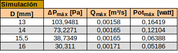
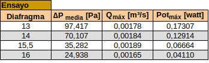
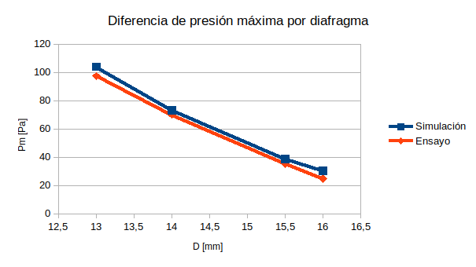
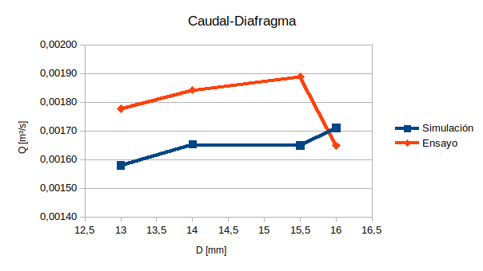
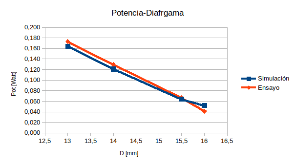

## COMPARACIÓN DE RESULTADOS

En este apartado se lleva a cabo la comparación de resultados entre los obtenidos en las simulaciones CFD y los experimentales. Como ya se ha descrito, las limitaciones geométricas y de los aparatos de medida condicionarán los ensayos para el uso de los diafragmas de diámetros [13-14-15,5-16]mm. Por lo tanto, en las tablas de a continuación, se recopilan los valores que se tendrán en cuenta para validar las simulaciones realizadas por ordenador con el Canal en 3-D del laboratorio. 

**Tabla X**: Resultados para la simulación de lo 4 últimos casos.

**TablaX**: Resultados hallados del ensayo final del canal en el laboratorio.

El resultado obtenido de la altura del agua dentro de la cámara para cada caso, se extrae de la tabla ya que este valor permanece prácticamente constante. Por un lado, para todas las simulaciones, el máximo valor alcanzado es de, $0,24m$; en cambio, para las pruebas ensayadas se tiene una mayor incertidumbre 

se mide con la vista

Al valor de la altura máxima que alcanza el agua dentro de la cámara se le resta 0,12m, ya que es la altura a la que está situado el canal respecto al origen.

experimentación 0,15m

**Gráfica X**: Representación de la máxima presión hallada aguas arriba del diafragma

**Gráfica X**: Representación del caudal máximo para cada diafragma

**Gráfica X**: Potencia máxima para cada diagrama

más pruebas para el mismo diafragma para obtener un menor error en los resultados obtenidos

## CONCLUSIÓN FINAL

No habia mucho margen para experimentar con diferentes diafragmas

La energía extraída de los océanos y mares son una fuente limpia e inagotable del recurso. Resulta una opción viable para paliar los problemas de la contaminación que se dan con otras fuentes de energía no renovables, sobre todo por la combustión de materiales fósiles que producen anhídrido carbónico.

Sin embargo, su desarrollo aún está limitado, en gran medida por la fuerte inversión económica que supone la creación de una central, los impactos ambientales que podría causar, alterando el ecosistema de los lugares donde se ubique. Por ello, buena perte de las investigaciones deberían centrarse, aparte de en cuestiones técnicas, en minimizar los costes financieros y rebajar el impacto medioambiental.

Una posible solución a estos inconvenientes sería utilizar sistemas de pequeña producción energética

