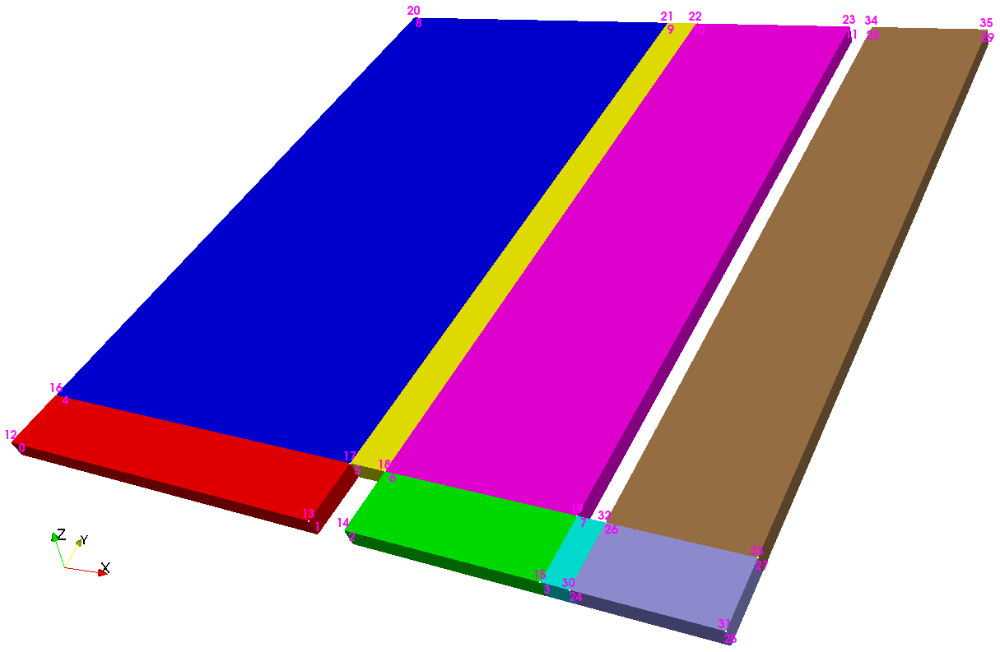

# 2. CASOS DIDÁCTICOS

##2.1 damBreak


Colapso de una columna de agua en un tanque que representa la rompiente contra un dique, como ya se ha mencionado se trata de un tutorial de OpenFOAM [User Guide: 2.3 Breaking of a dam](http://cfd.direct/openfoam/user-guide/dambreak/), ubicado en <$FOAM_RUN/tutorials/multiphase/interFoam/laminar>.  


### 2.1.1 Definición del caso

- Objetivos planteados: 
  - Simular la caida de una columna de agua, la cual choca contra un obstáculo (colocado en la parte central de la base) lo suficientemente pequeño como para que el volumen de agua lo sobrepase y golpee contra las paredes de un tanque hasta su estabilización. 
  - Analizar el comportamiento de la Superficie Libre de Líquido (SLL), para ello se prestará especial atención al cálculo de la fracción de volumen relativo a las dos fases del flujo en cada celda.

- Condiciones iniciales: 
  - Caso en 2D, multifásico, laminar, incompresible, Newtoniano.   
  - Mediante la aplicación **"interFoam"** se resuelven las ecuaciones de RANS (Reynold-average Navier-Stokes) para dos fases inmiscibles de flujos y se consigue monitorizar el movimiento de la SLL usando la técnica de Volúmenes Finitos (*Volume of Fluid*, VOF). 
  - La discretización de las ecuaciones se lleva a cabo con el método [MULES](http://www.openfoam.org/version2.3.0/multiphase.php) (Multidimensional Universal Limiter with Explicit Solution) creado por OpenCFD, donde se resuelve la Ecuación de Transporte, determinando la fracción de volumen relativo a las dos fases, o **fracción de fase**, en cada celda (estableciendo como condición inicial para la fracción de fase 1 para la fase de agua y 0 para la fase del aire).
  - Abierto a la atmosfera, permitiendo la entrada y salida del flujo de aire. Usando el método de acoplamiento **PIMPLE**, se implementa una combinación de condiciones para hallar la presión y la velocidad y se resuelve simultáneamente la continuidad y conservación de momento.

- Condiciones de contorno:

  - Las condiciones de contorno se determinan para *leftWall, rightWall, lowerWall, atmosphere* y *defaultFaces*.
  - Se especifica el tipo *zeroGradient* a las paredes; y como está abierto a la atmósfera se emplean las condiciones *totalPressure, inletOutlet* y *pressureInletOutletVelocity*.

- Propiedades físicas y fuerzas exteriores

  - Para el agua se establece una *viscosidad cinemática (nu)* de $1\times10^{-6} m^2/s$ y una *densidad (rho)* de $1000 kg/m^3$.
  - En cambio, el aire se define con una $\nu=1,48 \times ^{-5} m^2/s$ y una $\rho=1kg/m^3$.
  - Como fuerza exterior se define la gravedad, con un valor en *y* de $g=-9,81m/s^2$.

- Modelo de turbulencia: 

  - Laminar, sin turbulencia. 
  - También se ejecutó el caso para implementar la turbulencia del tipo RAS, disponible entre los ejemplos de OpenFOAM v4, con el modelo $k-\epsilon$ (*kEpsilon*).

- Esquema de discretización:

  - El esquema de discretización para la primera derivada del tiempo `ddtSchemes`: **Euler**, adecuado para problemas transitorios, implícito de primer orden, estable.
  - El siguiente subdiccionario `gradSchemes` contiene los términos gradientes. Se emplea el esquema de discretización más común: **Gauss linear**, esta entrada especifica la discretización estandar de volúmenes finitos, la integración Gaussiana, la cual requiere la interpolación de los valores centrados en las celdas a los centrados en las caras.
  - El subdiccionario `divSchemes` contiene los términos divergentes. El tratamiento de los términos advectivos es uno de los mayores retos en CFD numérico y por ello las opciones son más extensas. La forma más usual de los términos advectivos suele ser `div(phi,...)`, donde *phi* indica generalmente el flujo (volumétrico) de velocidad en las caras de las celdas, para flujos de densidad constante y el flujo másico para flujos compresibles, por ejemplo `div(phi,U)` para la advección de la velocidad, `div(phi,k)` para la energía cinética de la turbulencia, etc.
  - El subdiccionario `laplacianSchemes` contiene términos de Laplace. Por ejemplo, el término de difusión de la ecuación del momento, el cual se corresponde con `laplacian(nu,U)`. El esquema de Gauss es la única opción para la discretización y requiere una selección tanto de un esquema de interpolación para el coeficiente de difusión, viscosidad, como de un esquema del gradiente de la normal a la superficie.

- Procedimiento de resolución:

  - Para cada una de las variables (p y U) se define el tipo de resolvedor, junto con los parámetros necesarios. El utilizado para la *p* y la *U* es: **PCG** (*preconditioned conjugate gradient*), para matrices simétricas.
  - Por otro lado, el precondicionamiento de las matrices viene dado por **DIC** (*diagonal incomplete-Cholesky*), para matrices simétricas.
  - Para la fracción de fase se especifica un suavizado `smoothSolver` del tipo `symGaussSeidel`.

  Además se usa **PIMPLE**, versión mejorada de PISO (*Pressure Implicit with Splitting of Operators*), combinado con SIMPLE (*Semi-Implicit Method for Pressure- Linked Equations*), permite garantizar la convergencia de las ecuaciones en cada paso del tiempo.

- Control del paso del tiempo:

  Cuando se presenta en un caso la condición de capa libre, el algorítmos es considerablemente más sensible al número de Courant, para este caso el máximo valor de `maxCo` se fija en 1. Donde la propagación de la velocidad sea difícil de predecir, se especifica un paso del tiempo más ajustado, además, *interFoam* ofrece un ajuste automático de un paso de tiempo predeterminado `adjustableRunTime`. Aparte de esto, los valores que determinarán el guardado de la solución son:

  - Tiempo de simulación: de 0 a 5 segundos.
  - Paso del tiempo: 0,001.
  - Intervalo de escritura: 0,025.


### 2.1.2 Ejecución del caso

Los pasos para ejecutar este caso son:

1. Desde la ubicación del caso, introducir la orden: `blockMesh`. La cual genera los ficheros *boundary, faces, neighbour, owner* y *points*, que definen el modelo (geometría y mallado) en <./constant/polyMesh>. Para visualizar estos resultados, ejecutar `paraFoam` y para mostrar los bloques del modelo se puede utilizar la orden: `paraFoam -block` dando como resultado la siguiente imagen:

   

   **Figura 2.1**: Bloque del modelo con los vértices enumerados [Fuente: FOAM_run/multiphase/interFoam/laminar/damBreak]

   **NOTA**: Esta orden implicará volver a ejecutar `blockMesh`, ya que los ficheros generados son eliminados.

2. La definición de la condición inicial del agua se da mediante la orden `setFields`, pero antes, se debe comprobar que en la carpeta <./0> existan dos ficheros: *alpha.water* y *alpha.water.orig*. El segundo, corresponde a una copia de seguridad, puesto que, al ejecutar `setFields` se reescribe el fichero para definir la fracción de volumen por cada celda. 

   En caso de querer volver a ejecutar el caso, eliminar el contenido de *alpha.water* y copiar el de *alpha.water.orig* en el mismo. También se puede realizar esta acción, introduciendo la orden: `cp 0/alpha.water.orig 0/alpha.water`.  

3. Procesar el caso introduciendo la orden `interFoam`. Se puede añadir el argumento `interFoam > log.interFoam` para ejecutar la orden y registrar la solución en el fichero "*log.application*" (también funciona para las órdenes anteriormente mencionadas). Asimismo, la orden `interFoam | tee log.interFoam` permite visualizar los resultados por terminal además de guardarlos. Por último, si el caso ya ha sido ejecutado y terminado, pero se quiere volver a ejecutar, guardando los resultados a continuación de los anteriores, se añade el argumento *-a* en la orden: `interFoam | tee -a log.interFoam`, de este modo, el programa sabrá que el archivo donde se registrará la solución ya existe.

   ​


**Figura 2.2**: Imágenes de la ejecución del caso, obtenidas desde ParaView. [Fuente: FOAM_run/multiphase/interFoam/laminar/damBreak]


##2.2 damBreakFine


Se trata de una continuación del caso anterior, mostrando cómo aumentar la resolución de la malla y ejecutar el caso en paralelo. La información detallada sobre las ejecuciones de los casos en paralelo, se dan en  [User Guide: 3.4 Running applications in parallel](http://cfd.direct/openfoam/user-guide/running-applications-parallel).


### 2.2.1 Definición del caso

- Objetivos planteados: 

  - Realizar cambios en la geometría del mallado desde el directorio <./constant/polyMesh/blockMeshDict>. Modificando el *radio de expansión* `simpleGrading (1 2 1)`, hace que se refine el fondo, disminuyendo el tamaño de celdas a la mitad en proporción a las celdas superiores en el eje *y*.
  - Correr el caso en paralelo.

- Condiciones iniciales:

  - La velocidad y la presión se mantienen uniformes, ya que son independientes del número de elementos por capa.

- Control de la solución:

  - En este tutorial, el método de descomposición del dominio es `simple` y los coeficientes (*SimpleCoeff*) deben editarse en base a los siguientes critérios: 

    - El número de subdominios a especificar (en *x, y, z*) suele corresponder con el número de procesadores disponibles. 
    - Aunque también se puede determinar en función del dominio, como es el caso, donde el número de subdominios se define con el vector **n**. 
    - Como se trata de una geometría bidimensional, en la dirección *z*, no se divide el dominio, por tanto, $nz=1$.
    - Será beneficioso conservar el número de celdas por caras colindante con la descomposición, por ello, para una descomposición cúbica, es recomendable mantener la división en las direcciones *x* e *y* equitativa. Es decir, $n_xn_y= numberOfSubdomains$.

    ​

### 2.2.2 Ejecución del caso

1. Modificar el *radio de expansión* `simpleGrading (1 2 1)`, lo que hace que se refine el fondo, disminuyendo el tamaño de celdas a la mitad en proporción a las celdas superiores en el eje *y*. Ejecutar `blockMesh`.

   

   **Figura 2.3**: Mallado del caso. [Fuente: FOAM_run/multiphase/interFoam/laminar/damBreak/damBreakFine]

2. Comprobar que la malla no de errores: `checkMesh`.

3. Reinicializar la fase *alpha.water*: `cp 0/alpha.water.orig 0/alpha.water` y ejecutar `setFields`. Las variables *U* y *p_rgh* son independientes de los cambios en el mallado, ya que se especifican como valores uniformes. 

4. Se emplea la utilidad de `descomposePar`, para descomponer el dominio. Como otras utilidades de OpenFOAM, se puede encontrar el directorio asociado en el código fuente `<$FOAM_UTILITIES/parallelProcessing/decomposePar>`. En este caso, se ejecuta con 4 procesadores (o *numberOfSubdomains*), luego *n= (2 2 1)* y la entrada *delta* debe establecerse en 0,001.

5. El caso muestra un ejemplo de ejecución en paralelo, donde se utiliza la implementación *openMPI* de interfaz estándar de traspaso de información (*message-passing interface*, MPI). La siguiente orden, permite al usuario ejecutar el caso en paralelo, en un solo nodo (el ordenador local solamente): `mpirun -np 4 interFoam -parallel > log &`.

6. Por ultimo se revierte el proceso de descomposición mediante la orden: `reconstructPar`

   

   **Figura 2.4**: Imágenes de la ejecución del caso, obtenidas desde ParaView. [Fuente: FOAM_run/multiphase/interFoam/laminar/damBreakFine]


##2.3 damBreakMod


En este caso, se modifican los vértices del modelo desde el fichero blockMeshDict y se añade un nuevo contorno, para asemejar el modelo al principio de captación de energía OWC. Además se añade la turbulencia del caso ejemplo <$FOAM_run/tutorials/multiphase/interFoam/RAS/damBreak>, se recomienda partir por este caso ya que, la adición de la turbulencia, conlleva cambios en el esquema de discretización y en el procedimiento para alcanzar la solución.


### 2.3.1 Definición del caso

- Objetivos planteados:
  - Comenzar a realizar cambios en la geometría que permitan ir viendo como llegar a la solución final.
  - Implementar el modelo de turbulencia $k-\epsilon$, para observar los cambios en la representación del movimiento del flujo.
  - Aumentar el volumen inicial de agua, ya que se necesita representar una  columna oscilante de agua en la parte de la cámara (representada a la derecha, abierta por el fondo).

- Modelo del caso:

  - Se modifica y se añaden vértices a mano desde el diccionario dedicado para ello <./system/blockMeshDict>, esto implicará la adición de nuevos bloques y variar la composición de algunos contornos. Las dimensiones se calculan como múltiplos de la anchura de las celdas. Se pueden comparar los cambios con el caso original, mediante alguna herramienta diseñada para ello, para este caso se utiliza: `meld damBreak damBreakMod`.

- Condiciones iniciales:

  - La condición inicial del agua, se define en <./system/setFieldsDict>, detallado en el tutorial de [User Guide: 2.3 Breaking of a dam](http://cfd.direct/openfoam/user-guide/dambreak/). En este caso, la función `boxToCell` crea un volumen delimitado por un vector mínimo (0 0 -1) y otro máximo (1.75 2 1) que definen la diagonal del prisma, para definir el conjunto de celdas que corresponda a la región del agua (la fracción de fase del agua se define como $\alpha=1$).
  - La adición del modelo de turbulencia implicará definir las siguientes variables en la carpeta <./0>: *epsilon, k, nut* y *nuTilda*. Extraidas del ejemplo de tutorial <$FOAM_run/multiphase/interFoam/ras/damBreak>. 

- Condiciones de contorno:

  - Dentro del diccionario <./system/blockMeshDict>, se añade un nuevo contorno *topWall*, en la parte derecha donde se representa una cámara, por el momento cerrada a la atmósfera. 

- Modelo de turbulencia:
  - Ubicado en <./constant/turbulenceProperties>, para el tipo de simulación RAS se define el modelo *kEpsilon* y se activa la turbulencia, así como la escritura de los coeficientes. 

- Esquema de discretización:

  - Se añade el esquema para la divergencia para las variables añadidas por la turbulencia:

        div(phi,k)      Gauss upwind;
        div(phi,epsilon) Gauss upwind;

- Procedimiento para la solución:

  - De forma análoga al punto anterior, se incluyen las variables para la solución, dentro de los mismos parámetros establecidos para la velocidad *U*, con la adición de la última línea:

        "(U|k|epsilon).*"
        {
            solver          smoothSolver;
            smoother        symGaussSeidel;
            tolerance       1e-06;
            relTol          0;
            minIter         1;
        }


### 2.3.2 Ejecución del caso

1. Desde la carpeta del caso, se ejecuta: `blockMesh > log.blockMesh`.

2. Comprobar la ausencia de errores en el modelo: `checkMesh | tee log.checkMesh`.

3. Se ejecuta `paraFoam -block` para analizar el modelo generado y se vuelve a ejecutar `blockMesh`.

   

   **Figura 2.5**: Bloques y vértices del modelo del caso. [Fuente: gea-waves/of-run/damBreakMod] 

4. La utilidad `setFields` lee los campos del diccionario, recalculando y reescribiendo el archivo. Como ya se ha mencionado, se recomienda hacer una copia de seguridad de este archivo antes de ejecutar esta orden, debido a que el proceso anulará lo establecido: `cp 0/alpha.water.orig 0/alpha.water`. Ejecutar `paraFoam` para ver el resultado:

   

   **Figura 2.6**: Condición inicial del agua. [Fuente: gea-waves/of-run/damBreakMod]

5. Procesado del caso mediante la orden: `interFoam | tee log.interFoam` y visualizarlo con `paraFoam`.

   

   **Figura 2.7**: Imágenes del caso procesados gráficamente desde ParaView. [Fuente: gea-waves/of-run/damBreakMod]


##2.4 damBreakSnappy

Se parte por el caso base "*damBreak*" <FOAM_run/multiphase/interFoam/laminar/damBreak> y, para llevar a cabo el proceso de generación del modelo con la utilidad *snnappyHexMesh*, se tiene en cuenta el caso <$FOAM_run/incompressible/simpleFoam/motorBike> y las explicaciones contenidas en [User Guide: 5.4 Mesh generation with snappyHexMesh](https://cfd.direct/openfoam/user-guide/snappyhexmesh/).


### 2.4.1 Definición del caso

Por un lado se describe la malla base con *blockMeshDict* (el tamaño de las celdas deberá ser proximo a la unidad del ratio de aspecto para un comportamiento óptimo de la solución) y los parámetros de refinado se definen en *snappyHexMeshDict*, utilidad que permite generar el modelo a partir de un programa de CAD. Por tanto, para ejecutar esta utilidad, se requiere la siguiente estructura básica:

```
- <caso>
-+ constant
--+ triSurface
---- damBreakSnappy.stl
-+ system
--- snappyHexMeshDict
--- blockMeshDict
```

- Objetivos planteados: 
  - Implementar geometrías creadas desde un programa de CAD. 
  - Comprender cómo ejecutar un caso con la utilidad `snappyHexMesh` para generar la discretización del dominio de forma automatizada.
  - Visualizar la altura de la SLL en la cámara. 
- Definición de *snappyHexMeshDict:*
  - El refinado de las superficies se define de nivel (0 0), debido a que el caso de referencia que se está utilizando para realizar pruebas, "*damBreak*", está definido en 2D, y si snappyHexMesh realiza divisiones en el eje Z, las simulaciones resultan en errores de cálculo. Es decir, como solución inicial, se incrementa la resolución desde *blockMeshDict* y se utiliza `snappyHexMesh` únicamente para implementar la geometría generada en STL.
  - El contenido del campo `features` se comenta, ya que en la prueba inicial no se ha utilizado la aplicación para extraer características.
  - Para reducir el número de ficheros, la línea `#include "meshQualityDict"` se ha sustituido por las opciones contenidas en `caseDicts/mesh/generation/meshQualityDict.cfg`.
- Condiciones iniciales:
  - Se modifican los contornos de las variables principales contenidas en <./0>, haciendo que correspondan con las definidas en el modelo.
- Preparación del fichero STL:
  - El modelo que corresponde al espacio de simulación se ha creado mediante *OpenSCAD* y exportado directamente en formato STL ascii.
  - Como OpenSCAD no permite diferenciar regiones al exportar el sólido, se ha utilizado *Blender*. Para trabajar con ficheros STL en Blender, se debe comprobar que el add-on correspondiente está activado, accediendo a las opciones de usuario (Ctrl+Alt+U) y buscando `Import-Export: STL format` en la pestaña `Add-ons`. Tras importar el fichero `/of-dsgn/STL/damBreakMod.stl`, se puede trabajar con cada punto, vértice y cara. Las tareas de escalado/rotación/traslación del objeto es recomendable realizarlas en *OpenSCAD*, pero se pueden utilizar filtros para mejorar el mallado resultante desde *Blender*. Como se va a utilizar `snappyHexMesh`, se mantiene la estructura compuesta por el número mínimo de tetraedros.


- Definición de contornos con Blender:

  - Cambiar a `Edit Mode` y activar la selección por caras.

  - Seleccionar todas las que correspondan al mismo contorno y darle a la tecla `p` y a `selection`, agrupando las caras seleccionadas en un nuevo objeto. 

    **Nota**: se pueden seleccionar todas las caras que corresponden al mismo plano, pulsando `Ctrl+Alt+Shift+F` y botón derecho sobre una de las caras.

  - Renombrar las regiones de forma apropiada (tanto los objetos como la estructura interna), en este caso se definen: *allwall, atmosphere* y *defaultFaces*.

  - Se exporta cada objeto a un fichero STL, escogiendo el formato Ascii.

  - Cambiar la primera y última línea de los ficheros nombrando debidamente cada contorno y unirlos en uno solo.

  ​

### 2.4.2 Ejecución del caso

Se pueden ejecutar todas las tareas de forma automatizada mediante la orden `./RunCase damBreakSnappy` desde el directorio donde se encuentra el *script*. En este archivo se incluyen los pasos:

1. Generar la geometría desde OpenSCAD y exportar a STL.
2. Utilizar Blender para definir las regiones (*patches*) y exportar a un nuevo STL.
3. Se ejecuta `blockMesh`.
4. Se ejecuta `snappyHexMesh`.
5. Se mueven los ficheros correspondientes a la malla creada por blockMesh del directorio <./constant> a un nuevo directorio <./constant.bm>.
6. Se mueven los ficheros contenidos en la carpeta <./0.002>, creados por snappyHexMesh, a la carpeta <./constant>.
7. Se eliminan los directorios 0.001 y 0.002.
8. Se ejecuta `checkMesh` para comprobar que la malla es válidad.
9. Se copia 0/alpha.water.org a 0/alpha.water
10. Se ejecuta `setFields`. Si se muestra algún error, se debe comprobar que las regiones indicadas en <./constant/polyMesh/boundary> coinciden con los condornos de los ficheros de la carpeta <./0>.
11. Se ejecuta `interFoam`.
12. Se ejecuta paraFoam para visualizar los resultados.
13. Se borra `0/alpha.water` al cerrar paraFoam.


**Figura 2.8**: Procesado de la solución desde ParaView. [Fuente: of-run/damBreakSnappy]

De la forma descrita, se pueden visualizar los pasos intermedios que se crean con la orden `snappyHexMesh`, ayudando a su comprensión. No obstante, se puede añadir el argumento `-overwrite` al ejecutar `snappyHexMesh`, para que se sobreescriba el contenido del directorio <./constant> creado por `blockMesh`, en vez de guardarse únicamente en la carpeta <./0.002>.


**Figura 2.9**: Proceso de generación del modelo. [Fuente: of-run/damBreakSnappy]


## 2.5 damBreak3d 

En esta ocasión se aumenta la dimensión en el eje *z* y se realizan los cambios oportunos al caso base *"damBreak"* para ejecutarlo en 3-D. Para ello, se consideran las pautas descritas en la referencia: [Calum Duglas explications of damBreak example modified to 3d](http://www.calumdouglas.ch/openfoam-example-3d-dambreak/).


### 2.5.1 Definición del caso

- Objetivos planteados:
  - Convertir un caso de 2-D a 3-D.
  - Observar las direcciones que toma el flujo de agua en las tres direcciones.
- Definición del modelo:
  - Definir una anchura de $z=2*0,146=0,292 m$ (donde 0,146 corresponde al valor definido en `convertToMeters`, en *blockMeshDict* las dimensiones definidas por cada vértice son sin escala, se multiplican por este número para convertirlas a metros).
  - Descomponer el dominio de manera proporcional al eje *x* e *y*, luego el número de celdas correspondiente al eje *z* se establece a 8.
  - Definir el contorno *"frontback"* como pared (*wall*), para obtener la solución, también, en el eje *z*.
- Condiciones iniciales
  - El agua se define sin ocupar todo el ancho (en *z*) para analizar cómo se comporta en sus tres ejes. Los valores mínimo y máximo que determinan el prisma correspondiente al volumen ocupado por agua son: `box (0 0 0) (0.1461 0.292 0.15);`
- Condiciones de contorno:
  - Modificar el campo correspondiente al contorno *frontback* de cada variable principal de forma afin a la descripción de un contorno de las mismas características (p.e. *leftWall*).


### 2.5.2 Ejecución del caso

Para ejecutar el caso se siguen los pasos básicos:

1. Generar el modelo con la orden: `blockMesh > log.blockMesh`.

2. Comprobar la ausencia de errores: `checkMesh > log.checkMesh`.

3. Comprobar que existen los archivos *alpha.water* y *alpha.water.orig*, ejecutar: `setFields > log.setFields`. 

   

   **Figura 2.10**: Visualización desde ParaView de la condición inicial del volumen del agua. [Fuente: of-run/damBreak3d]

4. Procesar el caso con la orden: `interFoam > log.interFoam`.

5. Visualizar el resultado: `paraFoam`

   

   **Figura 2.11**: Imágenes de la solución visualizada desde ParaView. [Fuente: of-run/damBreak3d]